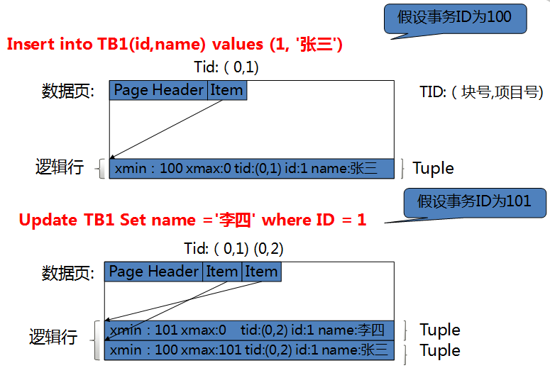
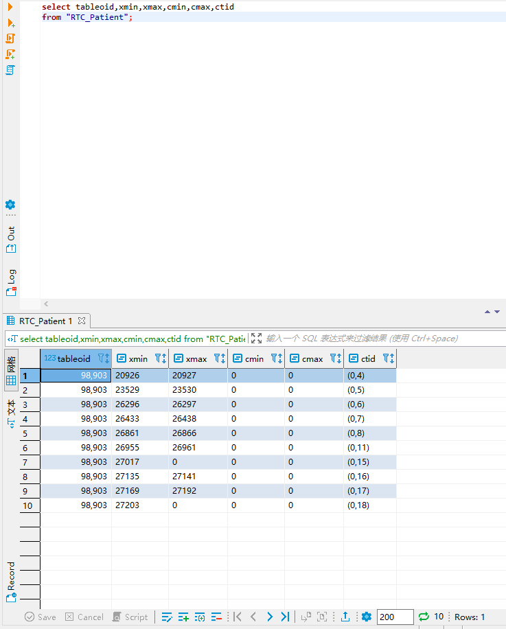
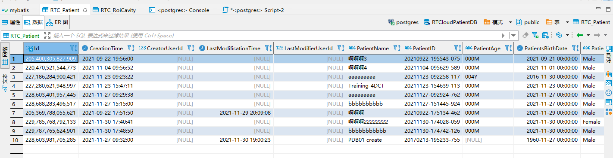
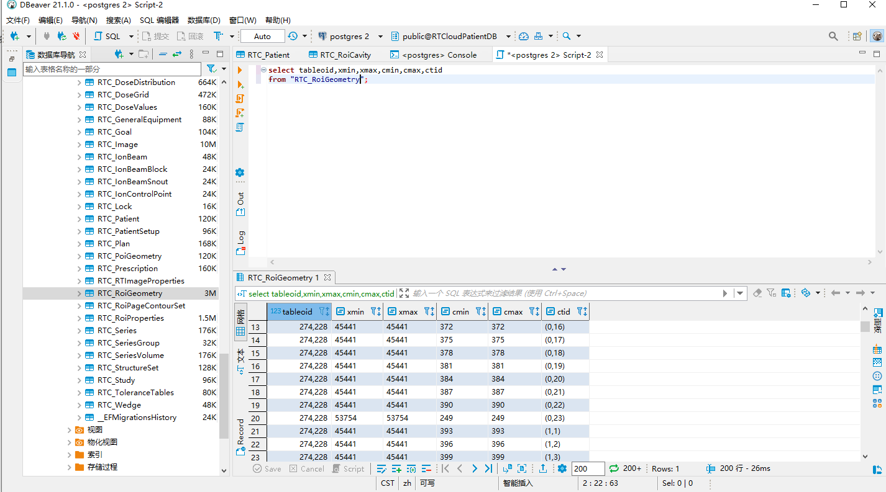
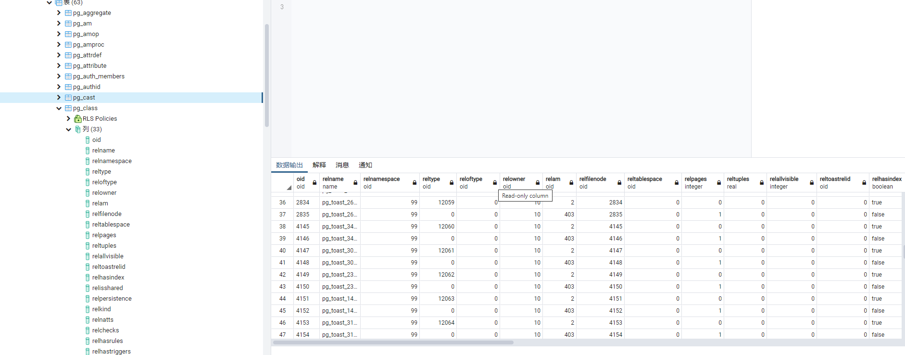
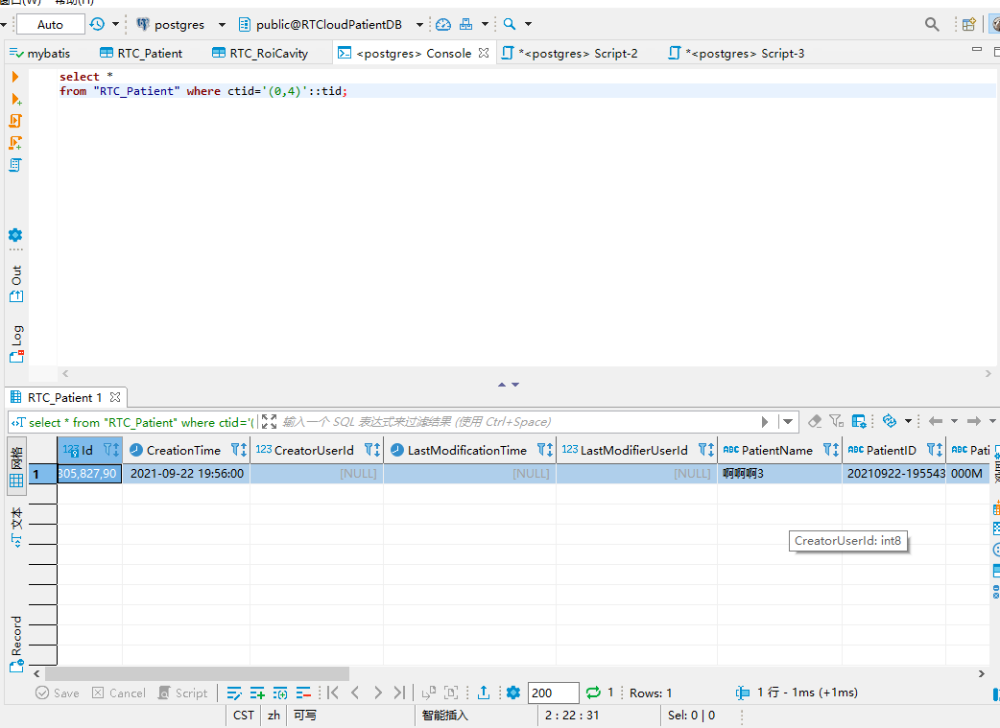
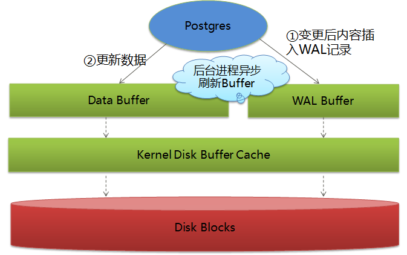
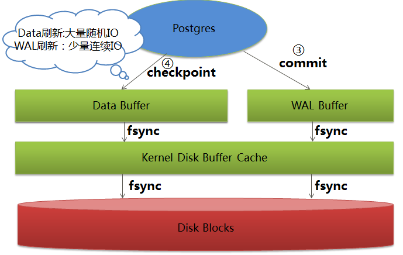

参考来源：

https://www.yisu.com/zixun/256654.html

# 概述

| ACID   | 实现技术                                   |
| ------ | ------------------------------------------ |
| 原子性 | MVCC                                       |
| 一致性 | 约束（主键，外键等）和其他三个特性共同保证 |
| 隔离性 | MVCC                                       |
| 持久性 | WAL                                        |

可以看到PostgreSQL中支撑ACID的主要是MVCC和WAL两项技术。MVCC和WAL是两个比较成熟的技术，通常的关系数据库中都有相应的实现，但每个数据库具体的实现方式又存在很大差异。下面介绍一下PostgreSQL中MVCC和WAL的基本实现原理。

# MVCC

MVCC(Multiversion Concurrency Control)即多版本并发控制，它可以避免读写事务之间的互相阻塞，相比通常的锁技术可极大的提高业务的并发性能。PostgreSQL中的MVCC实现原理可简单概括如下：

1）数据文件中存放同一逻辑行的多个行版本（称为Tuple）

2）每个行版本的头部记录创建以及删除该行版本的事务的ID（分别称为xmin和xmax）

3）每个事务的状态（运行中，中止或提交）记录在pg_clog文件中

4）根据上面的数据并运用一定的规则每个事务只会看到一个特定的行版本

通过MVCC读写事务可以分别在不同的行版本上工作，因此能够在互不冲突的情况下并发执行。

图1:基于MVCC的数据更新举例



## Postgresql的系统隐藏字段

官方文档：[系统字段 (postgres.cn)](http://postgres.cn/docs/9.4/ddl-system-columns.html)

在 PostgreSQL 中，当我们创建一个数据表时，数据库会隐式增加几个系统字段，这些字段由系统进行维护，用户一般不会感知它们的存在。

### 介绍

- **oid**：oid是object identifier（对象标识符）的简写,生成的值是全局唯一的，表、索引、视图都带有oid, 其相关的参数设置default_with_oids设置**一般默认是false**,或者创建表时指定with (oids=false)，其值长度32bit,**实际的数据库系统应用中并不能完全保证其唯一性**。

- **tableoid**  是**表对象的一个唯一标识符**，可以和pg_class中的oid联合起来查看 
- **xmin**    插入该行版本的事务标识(事务ID)。注意：在这个环境里，一个行版本是一行的一个状态； 一行的每次更新都为同一个逻辑行创建一个新的行版本。
- **xmax**  删除事务的标识(事务ID)，如果不是被删除的行版本，那么是零。在一个可见行版本里， 这个字段有可能是**非零**。这通常**意味着删除事务还没有提交，或者是一个删除的企图被回滚掉了**。
- **cmin**   在插入事务**内部的ID(**从零开始)。
- **cmax**   **删除操作**的事务的内部ID，或者为0 。如果该值不为0，则说明该行数据当前还未提交或回滚
- **ctid**   **是每行数据在表中的一个物理位置标识符**，由一对数值组成（**块编号和行索引**），数据块从0开始编号，行号从1开始编号
  - ctid 类似于 Oracle 中的伪列 ROWID
  - 当表被**vacuum** full或该行值被update时该值可能会改变。
  - 所以定义表值的唯一性最好还是自己创建一个序列值的主键列来标识比较合适，言外之意：表没有主键时，就靠这个字段**充当主键**。
  - ctid 可以用于快速查找表中的数据行，也可以用于修复数据损坏。另外，它也可以用于查找并删除表中的重复数据。


### 查看隐藏字段

**如何查看隐藏字段**

首先，select * from xxx是查不出来的，要这样：

```sql
select tableoid,xmin,xmax,cmin,cmax,ctid
from "RTC_Patient";
```





为啥是10条数据呢，因为表中就有10条数据，对应的：



再来看另一个表的隐藏字段：



**很多系统表中有oid字段：**




### 根据ctid查询数据

效率极高，直接定位block和item



注意：要使用tid进行快速的行扫描，必须开启参数enable_tidscan。否则就会走全表扫描的，那是非常慢的。

```
postgres=# set enable_tidscan=off;
SET
postgres=# explain select * from t_bit2 where ctid='(0,10)'::tid;
                         QUERY PLAN                          
-------------------------------------------------------------
 Seq Scan on t_bit2  (cost=0.00..3587783.60 rows=1 width=30)
   Filter: (ctid = '(0,10)'::tid)
(2 rows)
```

### vacuum：垃圾回收器

文档：http://www.postgres.cn/docs/9.4/sql-vacuum.html


可以看出ctid并不连续，因为删除一条数据后，（0，9）的空间就不会存放数据了，空在那里了，想在（0，9）的空间再存放数据，postgresql里面有AUTOVACUUM进程；当然我们也可以手动回收这段空间；

**根据MVCC机制，更新和删除的记录都不会被实际删除，操作频繁的表会积累大量的过期数据，占用磁盘空间，当扫描查询数据时，需要更多的IO，降低查询效率。PostgreSQL的解决方法是提供vacuum命令操作来清理过期的数据。**

VACUUM回收死行占据的存储空间。在一般的PostgreSQL 操作里，**那些已经 DELETE 的行或者被 UPDATE 过后过时的行并没有从它们所属的表中物理删除**； 在完成VACUUM之前它们仍然存在。因此有必要周期地运行VACUUM， 特别是在经常更新的表上。

如果没有参数，`VACUUM`处理当前用户有权限vacuum的当前数据库里的每个表， 如果有参数，`VACUUM`只处理那个表。

`VACUUM ANALYZE`先执行一个`VACUUM` 然后是给每个选定的表执行一个`ANALYZE`。对于日常维护脚本而言， 这是一个很方便的组合。参阅[ANALYZE](http://www.postgres.cn/docs/9.4/sql-analyze.html)获取更多有关其处理的细节。

简单的`VACUUM`(没有`FULL`)只是简单地回收空间并且令其可以再次使用。 这种形式的命令可以和对表的普通读写并发操作，因为没有请求排他锁。然而， 额外的空间并不返回到操作系统（在大多数情况下）；仅保持在相同的表中可重用。 `VACUUM FULL`将表的全部内容重写到一个没有任何多余空间的新磁盘文件中， 允许未使用的空间返回到操作系统中。这种形式要慢许多并且在处理的时候需要在表上施加一个排它锁。

当选项列表被括号括起来时，该选项可以任意顺序来写。没有圆括号，选项必须按以上显示的顺序指定。 加圆括号的语法在PostgreSQL 9.0中添加；不加括号的语法已经废弃了。


[postgresql之ctid的浅谈 - lottu - 博客园 (cnblogs.com)](https://www.cnblogs.com/lottu/p/5613098.html)

```
mydb=> delete from test where name = 'ak';
DELETE 1
mydb=> vacuum test;          
VACUUM
mydb=> insert into test values (1001,'ak');
INSERT 0 1
mydb=> select ctid,* from test;
 ctid  |  id  |  name  
-------+------+--------
 (0,1) | 1001 | lottu
 (0,2) | 1002 | rax
 (0,3) | 1003 | xuan
 (0,4) | 1004 | li0924
 (0,5) | 1001 | ak
(5 rows)
```


语法：

```
VACUUM [ ( { FULL | FREEZE | VERBOSE | ANALYZE } [, ...] ) ] [ table_name [ (column_name [, ...] ) ] ]
VACUUM [ FULL ] [ FREEZE ] [ VERBOSE ] [ table_name ]
VACUUM [ FULL ] [ FREEZE ] [ VERBOSE ] ANALYZE [ table_name [ (column_name [, ...] ) ] ]
```


#### 参数


- `FULL`

  选择"完全"清理，这样可以恢复更多的空间，但是花的时间更多并且在表上施加了排它锁。 该方法也需要额外的磁盘空间，因为它写了一个表的新拷贝并且不释放旧的拷贝，直到操作完成。 通常这应该只用于当一个大量的空间需要在这个表中回收时。

- `FREEZE`

  选择激进的行"冻结"。指定`FREEZE`相当于执行 `VACUUM`时将[vacuum_freeze_min_age](http://www.postgres.cn/docs/9.4/runtime-config-client.html#GUC-VACUUM-FREEZE-MIN-AGE) 和[vacuum_freeze_table_age](http://www.postgres.cn/docs/9.4/runtime-config-client.html#GUC-VACUUM-FREEZE-TABLE-AGE)参数设为零。 当在重写表时总是执行积极冻结，所以当声明了`FULL`时， 这个选项是多余的。

- `VERBOSE`

  为每个表打印一份详细的清理工作报告。

- `ANALYZE`

  更新用于优化器的统计信息，以决定执行查询的最有效方法。

- `*table_name*`

  要清理的表的名称(可以有模式修饰)。缺省时是当前数据库中的所有表。

- `*column_name*`

  要分析的具体的字段名称。缺省是所有字段。若指定一个字段列表，就暗含`ANALYZE`。

#### 注意

要清空一个表，一个人必须通常是表的所有者或是一个超级用户。然而， 数据库所有者允许清空他们的数据库中的所有表，除了共享目录。 （对共享目录的限制意味着一个真正的数据库范围的`VACUUM`仅能由超级用户执行。） `VACUUM`将跳过调用用户没有权限清空的任何表。

`VACUUM`不能在事务块内执行。

对于有GIN索引的表，`VACUUM`（以任何形式） 也完成任何挂起索引插入内容，通过移动挂起索引条目到主GIN索引结构中的相应位置。 参阅[第 58.4.1 节](http://www.postgres.cn/docs/9.4/gin-implementation.html#GIN-FAST-UPDATE)获取详细信息。

建议**生产数据库经常清理(至少每晚一次)**，以保证不断地删除死行。尤其是在增删了大量记录之后， 对受影响的表执行`VACUUM ANALYZE`命令是一个很好的习惯。 这样做将更新系统目录为最近的更改，并且允许PostgreSQL 查询优化器在规划用户查询时有更好的选择。

不建议日常使用`FULL`选项，但是可以在特殊情况下使用。 一个例子就是在你删除或更新了一个表的大部分行之后， 希望从物理上缩小该表以减少磁盘空间占用并且允许更快的表扫描。`VACUUM FULL` 通常要比单纯的`VACUUM`收缩更多的表尺寸。

`VACUUM`导致 I/O 流量增加，可能会导致其它活动会话的性能恶劣。因此， 有时候会建议使用基于开销的 vacuum 延迟特性。 参阅[第 18.4.4 节](http://www.postgres.cn/docs/9.4/runtime-config-resource.html#RUNTIME-CONFIG-RESOURCE-VACUUM-COST)获取细节。

PostgreSQL包含一个"**autovacuum**"设施， 它可以自动进行日常的 vacuum 维护。关于手动和自动清理的更多细节， 参见[第 23.1 节](http://www.postgres.cn/docs/9.4/routine-vacuuming.html)。


注：SQL 标准里没有`VACUUM`语句。

### xmin、xmax、cmin、cmax

[PostgreSQL 中的系统字段：tableoid、xmin、xmax、cmin、cmax、ctid_Tony.Dong的专栏-CSDN博客](https://blog.csdn.net/horses/article/details/106400379)

```sql
create table test(col integer);

insert into test(col)
values (1),(2),(3);
```

从定义上来看，表 test 中只有一个字段；但是当我们查询数据字典表 **pg_attribute** 时，结果却不是如此：

```
hrdb=> select version();
                                                 version                                                 
---------------------------------------------------------------------------------------------------------
 PostgreSQL 12.3 on x86_64-pc-linux-gnu, compiled by gcc (GCC) 4.8.5 20150623 (Red Hat 4.8.5-39), 64-bit
(1 row)

hrdb=> select attname, attnum, atttypid::regtype 
hrdb-> from pg_attribute
hrdb-> where attrelid = 'test'::regclass;
 attname  | attnum | atttypid 
----------+--------+----------
 tableoid |     -6 | oid
 cmax     |     -5 | cid
 xmax     |     -4 | xid
 cmin     |     -3 | cid
 xmin     |     -2 | xid
 ctid     |     -1 | tid
 col      |      1 | integer
(7 rows)

```

查询结果显示，表 test 中一共包含 7 个字段。PostgreSQL 为我们增加了 6 个额外的系统字段，它们的 attnum **属性都是负数**。

下面让我们分别看看这些系统字段的作用。

#### tableoid

tableoid 字段代表了数据所在表的对象 id（OID），也就是数据字典表 pg_class 中与该表信息相关的数据行。

```sql
hrdb=> select oid, relname from pg_class where relname = 'test';
  oid  | relname 
-------+---------
 90277 | test
(1 row)

hrdb=> select t.tableoid, t.col, c.relname
hrdb-> from test t
hrdb-> join pg_class c on (c.oid = t.tableoid);
 tableoid | col | relname 
----------+-----+---------
    90277 |   1 | test
    90277 |   2 | test
    90277 |   3 | test
(3 rows)
```

tableoid 的另一个用途就是在涉及分区表查询或者 UNION 操作时标识数据行所在的具体表。例如存在以下分区表：

```sql
create table part_t
(id integer) partition by hash (id);
create table part_t_p1
partition of part_t for values with (modulus 4, remainder 0);
create table part_t_p2
partition of part_t for values with (modulus 4, remainder 1);
create table part_t_p3
partition of part_t for values with (modulus 4, remainder 2);
create table part_t_p4
partition of part_t for values with (modulus 4, remainder 3);

insert into part_t select generate_series(1,100);
```

我们可以通过以下查询返回每行数据所在的分区：

```sql
hrdb=> select tableoid::regclass, id
hrdb-> from part_t
hrdb-> order by id
hrdb-> limit 10;
 tableoid  | id 
-----------+----
 part_t_p1 |  1
 part_t_p3 |  2
 part_t_p2 |  3
 part_t_p4 |  4
 part_t_p2 |  5
 part_t_p4 |  6
 part_t_p4 |  7
 part_t_p2 |  8
 part_t_p2 |  9
 part_t_p4 | 10
(10 rows)
```

对于集合操作 UNION、INTERSECT、EXCEPT 也是如此：

```sql
hrdb=> select tableoid::regclass, col from test
hrdb-> union all
hrdb-> select tableoid::regclass, id from part_t where id < 4
hrdb-> order by 2;
 tableoid  | col 
-----------+-----
 test      |   1
 part_t_p1 |   1
 test      |   2
 part_t_p3 |   2
 test      |   3
 part_t_p2 |   3
(6 rows)
```

#### ctid

ctid 字段代表了数据行在表中的物理位置，也就是行标识（tuple identifier），由一对数值组成（块编号和行索引）。ctid 类似于 Oracle 中的伪列 ROWID。

ctid 可以用于快速查找表中的数据行，也可以用于修复数据损坏。另外，它也可以用于查找并删除表中的重复数据。例如：

```sql
insert into test(col)
values (1),(2),(3);

hrdb=> select ctid, * from test;
 ctid  | col 
-------+-----
 (0,1) |   1
 (0,2) |   2
 (0,3) |   3
 (0,4) |   1
 (0,5) |   2
 (0,6) |   3
(6 rows)

```

我们为 test 表插入了 3 条重复的数据。接下来利用 ctid 删除重复的数据：

```sql
=> delete from test where ctid not in(
 select max(ctid) from test group by col
 );
 
=> DELETE 3
```

需要注意的是，ctid 的值有可能会改变（例如 VACUUM FULL）；因此，ctid 不适合作为一个长期的行标识，应该使用主键作为行的逻辑标识。

**执行更新某一条数据的操作时，这条数据的cid会+1，后面的全部数据也会+1**

#### xmin 

xmin 代表了**该行**版本（row version ）的**插入**事务 ID（XID）。行版本是数据行的具体状态，每次更新操作都会为相同的逻辑行创建一个新的行版本（多版本并发控制，MVCC）。事务 ID 是一个 32 bit 数字。

```sql
hrdb=> insert into test(col) values(4);
INSERT 0 1
hrdb=> insert into test(col) values(5);
INSERT 0 1

hrdb=> select xmin,col from test;
 xmin | col 
------+-----
 2852 |   1
 2852 |   2
 2852 |   3
 2854 |   4
 2855 |   5
(5 rows)
```

xmin 字段可以用于查看数据行的插入时间：

```sql
hrdb=> select col,
hrdb->        to_char(pg_xact_commit_timestamp(xmin) ,'YYYY-MM-DD HH24:MI:SS') AS insert_time
hrdb-> from test;
 col |     insert_time     
-----+---------------------
   1 | 2020-05-28 16:52:08
   2 | 2020-05-28 16:52:08
   3 | 2020-05-28 16:52:08
   4 | 2020-05-28 17:03:33
   5 | 2020-05-28 17:03:35
(5 rows)
```

注意，系统函数 pg_xact_commit_timestamp 需要将配置参数 track_commit_timestamp 设置为 on 才能使用。

#### xmax

xmax 字段代表了删除改行的事务 ID，对于**未删除的行**版本显示为 0。非零的 xmax 通常意味着删除事务还没有提交，或者删除操作被回滚。

我们查看一下 test 表中的 xmax：

```sql
hrdb=> select txid_current();
 txid_current 
--------------
         2858
(1 row)

hrdb=> select xmax, col from test;
 xmax | col 
------+-----
    0 |   1
    0 |   2
    0 |   3
    0 |   4
    0 |   5
(5 rows)

```

然后打开另一个会话，在事务中修改 test 表中的数据：

```sql
-- 会话 2
hrdb=> update test set col= col*2;
UPDATE 5

```

回到第一个会话，再次查看 xmax：

```sql
hrdb=> select xmax, col from test;
 xmax | col 
------+-----
 2858 |   1
 2858 |   2
 2858 |   3
 2858 |   4
 2858 |   5
(5 rows)

```

2858 是第二个会话的事务 ID，它是删除这些行版本的事务。PostgreSQL 中的 UPDATE 相当于 DELETE 加 INSERT。

将第二个事务回滚：

```sql
-- 会话 2
hrdb=> rollback;
ROLLBACK

```

如果再次查询 test 表中的 xmax，仍然返回 2858。

xmax 还有可能表示当前正在占用行锁的事务 ID，利用 PostgreSQL 扩展插件 pageinspect 可以获取详细信息：


```sql
create extension pageinspect;

select t.col,
       t.xmax
       case
         when (t_infomask & 128)::boolean then 'LOCK'
         when (t_infomask & 1024)::boolean then 'COMMITTED'
         when (t_infomask & 2048)::boolean then 'ROLLBACKED'
         when (t_infomask & 4096)::boolean then 'MULTI XACT'
       end as xmax_info
from test t 
left outer join heap_page_items(get_raw_page('test', 0)) hp on (t.ctid = hp.t_ctid)
where hp.t_xmax = t.xmax;

```

#### cmin

cmin 代表了插入事务中的命令标识符（从 0 开始）。命令标识符是一个 32 bit 数字。

#### cmax

cmax 代表了删除或更新事务中的命令标识符，或者 0。

我们先查看一下 test 表中的

```sql
hrdb=> select cmin, cmax, col from test;
 cmin | cmax | col 
------+------+-----
    0 |    0 |   1
    0 |    0 |   2
    0 |    0 |   3
    0 |    0 |   4
    0 |    0 |   5
(5 rows)
```

然后在事务中修改数据：

```sql
hrdb=> begin;
BEGIN
hrdb=> select txid_current();
 txid_current 
--------------
         2859
(1 row)

hrdb=> insert into test(col) values(6);
INSERT 0 1
hrdb=> insert into test(col) values(7);
INSERT 0 1
hrdb=> insert into test(col) values(8);
INSERT 0 1

hrdb=> select cmin, cmax, col from test;
 cmin | cmax | col 
------+------+-----
    0 |    0 |   1
    0 |    0 |   2
    0 |    0 |   3
    0 |    0 |   4
    0 |    0 |   5
    0 |    0 |   6
    1 |    1 |   7
    2 |    2 |   8
(8 rows)

```

然后删除一条记录：

```sql
hrdb=> delete from test where col=1;
DELETE 1

```

此时，从另一个会话中查看：

```sql
-- 会话 2
hrdb=> select cmin, cmax, col from test;
 cmin | cmax | col 
------+------+-----
    3 |    3 |   1
    0 |    0 |   2
    0 |    0 |   3
    0 |    0 |   4
    0 |    0 |   5
(5 rows)

```

#### oid

如果使用 PostgreSQL 11 或者更早版本，还有一个隐藏的系统字段：oid。它代表了数据行的对象 ID，只有当创建表时使用了 WITH OIDS 选项或者配置参数 default_with_oids 设置为 true 时才会创建这个字段。

从 PostgreSQL 12 开始，不再支持 WITH OIDS 选项，oid 只用于系统内部。

# WAL

当系统意外宕机后，恢复时需要回退未完成事务所做的更改并确保已提交事务所作的更改均已生效。在PostgreSQL中通过前面提到的MVCC很容易做到的第一点，只要把所有pg_clog文件中记录的所有“运行中”的事务的状态置为“中止”即可，这些事务在宕机时都没有结束。对于第二点，必须确保事务提交时修改已真正写入到永久存储中。但是直接刷新事务修改后的数据到磁盘是很费时的，为解决这个问题于是引入了WAL(Write-Ahead Log)。

WAL的基本原理如下：

1）更新数据页前先将更新内容记入WAL日志

2）异步刷新数据Buffer的脏页和WAL Buffer到磁盘

3）Buffer管理器确保绝不会先于对应的WAL记录刷新脏数据到磁盘

4）事务提交时，将WAL日志同步刷新到磁盘

5）Checkpoint发生时，将数据Buffer的所有脏页刷新到磁盘

数据更新时的Buffer修改：




更新提交和Checkpoint时的磁盘同步：



