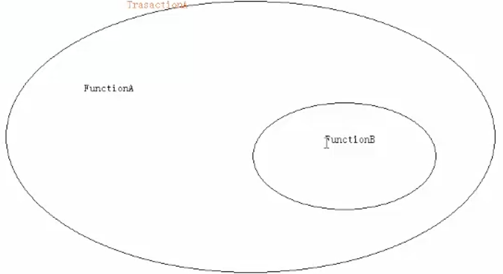

参考：

[Spring Data JPA事务管理_春风化雨-CSDN博客_jpa 事务 ](https://blog.csdn.net/jiahao1186/article/details/90604813) 

[Spring Data JPA 事务 - ihic11 - 博客园 (cnblogs.com)](https://www.cnblogs.com/gsyun/p/6833553.html)

**Spring Data JPA事务分为：JTA事务（分布式事务，多种数据库）、RESOURCE_LOCAL事务（本地事务，数据库级别，仅支持一种数据库）**

**数据库事务并发带来的问题**

脏读：一句话表达事务读取了其他并发事务未提交的数据

事务B读取了事务A未提交的数据，事务B按未提交的数据进行执行并提交。而事务A又对数据进行修改后再提交。这样事务B读取的数据与事务A提交的数据不一致。

不可重复读：同一个事务先后两次或两次以上读取同一数据，结果不一样。

事务C读取了数据，事务还没有提交。

事务D修改了数据，并提交事务。随后，事务C再次读取时，发现数据变了。

幻读：跟不可重复读类似，侧重记录的数量（行数），不可重复读侧重于数据的值。

**事务的传播特性**

\1. PROPAGATION_REQUIRED: 如果存在一个事务，则支持当前事务。如果没有事务则开启
\2. PROPAGATION_SUPPORTS: 如果存在一个事务，支持当前事务。如果没有事务，则非事务的执行
\3. PROPAGATION_MANDATORY: 如果已经存在一个事务，支持当前事务。如果没有一个活动的事务，则抛出异常。
\4. PROPAGATION_REQUIRES_NEW: 总是开启一个新的事务。如果一个事务已经存在，则将这个存在的事务挂起。
\5. PROPAGATION_NOT_SUPPORTED: 总是非事务地执行，并挂起任何存在的事务。
\6. PROPAGATION_NEVER: 总是非事务地执行，如果存在一个活动事务，则抛出异常
\7. PROPAGATION_NESTED：如果一个活动的事务存在，则运行在一个嵌套的事务中. 如果没有活动事务, 则按TransactionDefinition.PROPAGATION_REQUIRED 属性执行

 

**事务的隔离级别：**

\1. ISOLATION_DEFAULT： 这是一个PlatfromTransactionManager默认的隔离级别，使用数据库默认的事务隔离级别.另外四个与JDBC的隔离级别相对应
\2. ISOLATION_READ_UNCOMMITTED： 这是事务最低的隔离级别，它充许令外一个事务可以看到这个事务未提交的数据。这种隔离级别会产生脏读，不可重复读和幻像读。
\3. ISOLATION_READ_COMMITTED： 保证一个事务修改的数据提交后才能被另外一个事务读取。另外一个事务不能读取该事务未提交的数据
\4. ISOLATION_REPEATABLE_READ： 这种事务隔离级别可以防止脏读，不可重复读。但是可能出现幻像读。它除了保证一个事务不能读取另一个事务未提交的数据外，还保证了避免下面的情况产生(不可重复读)。
\5. ISOLATION_SERIALIZABLE 这是花费最高代价但是最可靠的事务隔离级别。事务被处理为顺序执行。除了防止脏读，不可重复读外，还避免了幻像读。

**通常使用数据库的默认隔离级别即可，基本不需要进行设置**

**MYSQL: 默认为REPEATABLE_READ级别**
**SQLSERVER: 默认为READ_COMMITTED**