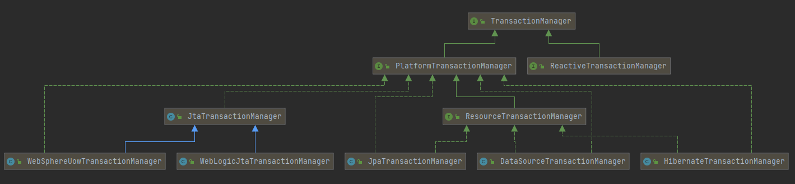
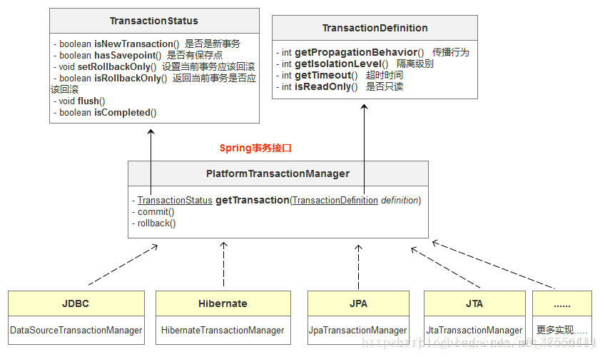

文档：https://docs.spring.io/spring-framework/docs/current/reference/html/data-access.html#transaction

# Spring提供了许多内置事务管理器实现

Spring只是个容器，因此它并不做任何事务的具体实现。他只是提供了事务管理的接口**PlatformTransactionManager**，具体内容由就由各个事务管理器来实现。

图片来源：IDEA中生成

**DataSourceTransactionManager**：位于org.springframework.jdbc.datasource包中，数据源事务管理器，提供对**单个javax.sql.DataSource事务管理**，用于Spring **JDBC**抽象框架、**iBATIS或MyBatis**框架的事务管理；

**HibernateTransactionManager**：位于org.springframework.orm.hibernate3包中，提供对单个org.hibernate.SessionFactory事务支持，用于集成Hibernate框架时的事务管理；该事务管理器只支持Hibernate3+版本，且Spring3.0+版本只支持Hibernate3.2+版本；

**JpaTransactionManager**：位于org.springframework.orm.jpa包中，提供对单个javax.persistence.EntityManagerFactory事务支持，用于集成**JPA**实现框架时的事务管理；

**JtaTransactionManager**：位于org.springframework.transaction.jta包中，提供对**分布式事务管理**的支持，并将事务管理委托给Java EE应用服务器事务管理器；

**JdoTransactionManager**：位于org.springframework.orm.jdo包中，提供对单个javax.jdo.PersistenceManagerFactory事务管理，用于集成JDO框架时的事务管理；

**OC4JjtaTransactionManager**：位于org.springframework.transaction.jta包中，Spring提供的对OC4J10.1.3+应用服务器事务管理器的适配器，此适配器用于对应用服务器提供的高级事务的支持；

**WebSphereUowTransactionManager**：位于org.springframework.transaction.jta包中，Spring提供的对WebSphere 6.0+应用服务器事务管理器的适配器，此适配器用于对应用服务器提供的高级事务的支持；

**WebLogicJtaTransactionManager**：位于org.springframework.transaction.jta包中，Spring提供的对WebLogic8.1+应用服务器事务管理器的适配器，此适配器用于对应用服务器提供的高级事务的支持。

图片来源：https://blog.csdn.net/m0_37556444/article/details/83146804

注意点

事务，Spring AOP只在抛出RuntimeException时才回滚，不能try catch了异常
