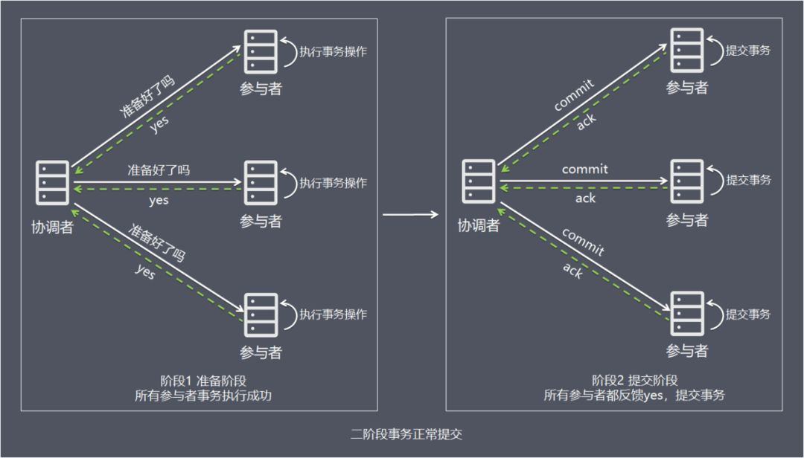
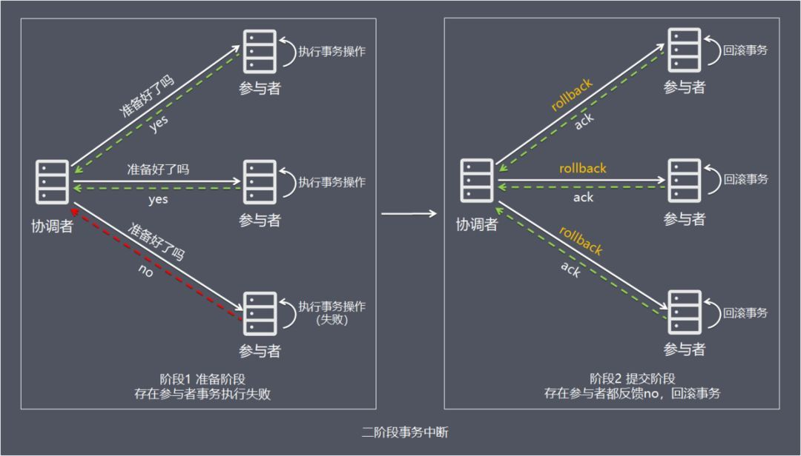
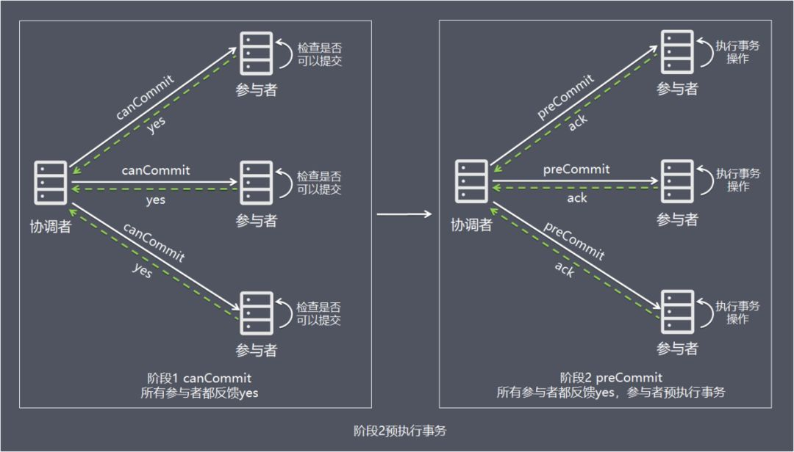
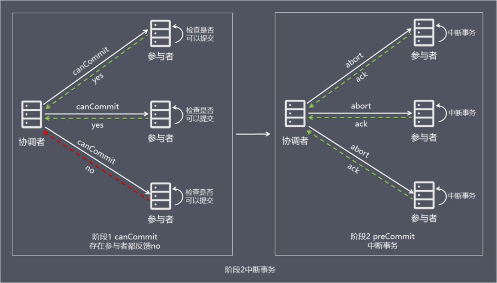
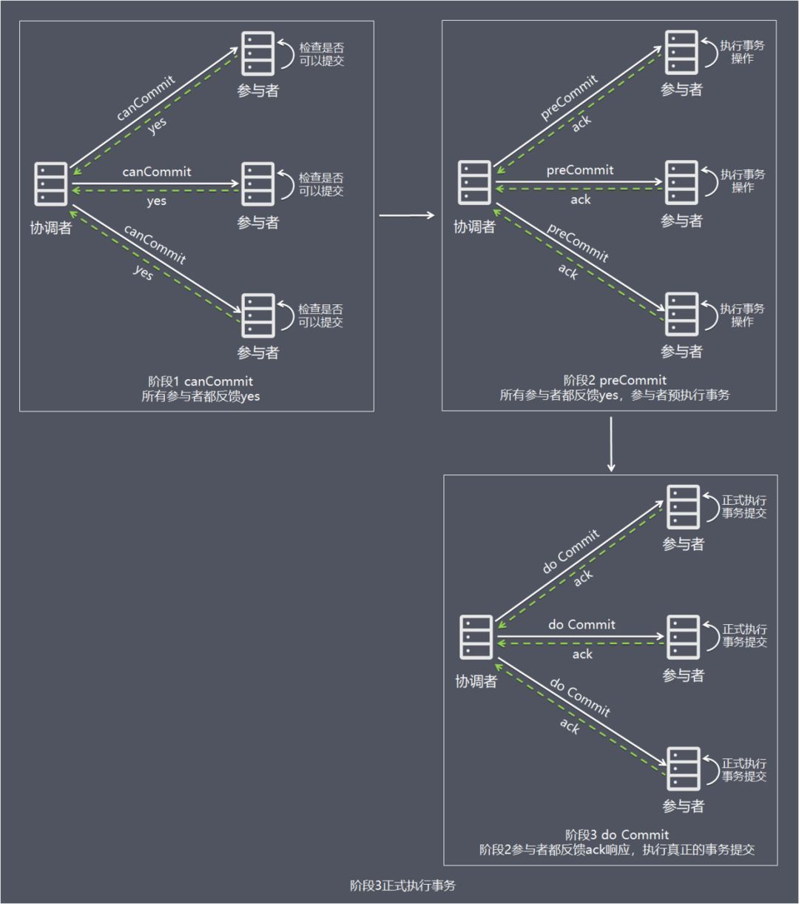
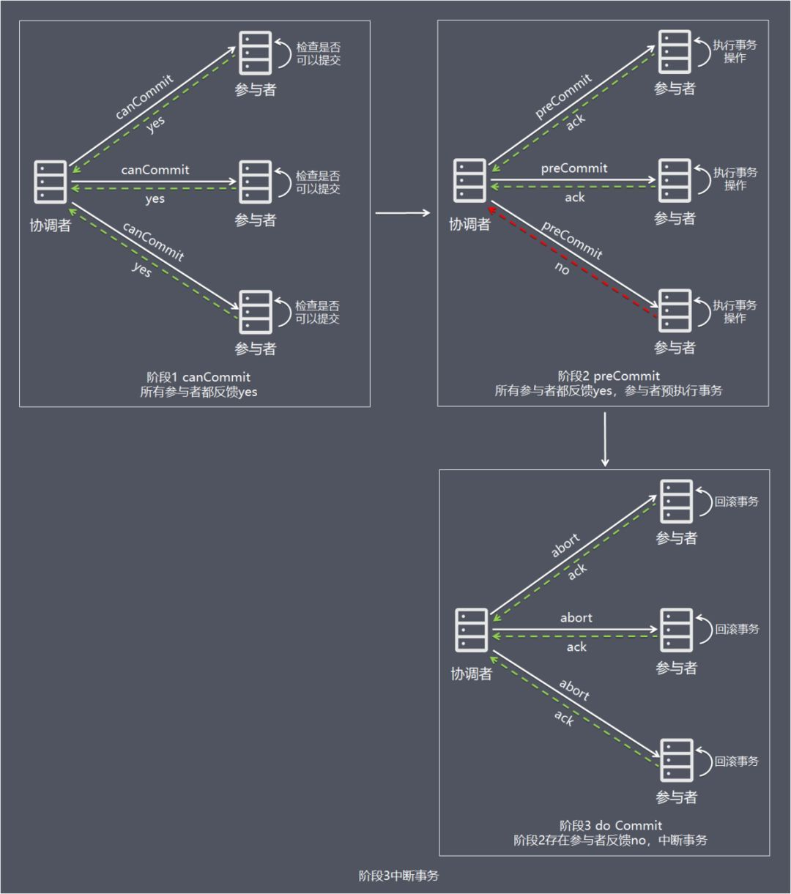

来源：https://www.cnblogs.com/monkeyblog/p/10449363.html

XA分布式事务协议，包含二阶段提交（2PC），三阶段提交（3PC）两种实现。

# 二阶段提交

**二阶段提交方案：强一致性**

事务的发起者称协调者，事务的执行者称参与者。

处理流程：

　　1、准备阶段

　　　　事务协调者，向所有事务参与者发送事务内容，询问是否可以提交事务，并等待参与者回复。

　　　　事务参与者收到事务内容，开始执行事务操作，讲 undo 和 redo 信息记入事务日志中（但此时并不提交事务）。

　　　　如果参与者执行成功，给协调者回复yes,表示可以进行事务提交。如果执行失败，给协调者回复no,表示不可提交。

　　2、提交阶段

　　　　如果协调者收到了参与者的失败信息或超时信息，直接给所有参与者发送回滚（rollback）信息进行事务回滚，否则，发送提交（commit）信息。

　　　　参与者根据协调者的指令执行提交或者回滚操作，释放所有事务处理过程中使用的锁资源。(注意：必须在最后阶段释放锁资源) 接下来分两种情况分别讨论提交阶段的过程。

## 正常情况

简单一点理解，可以把协调者节点比喻为带头大哥，参与者理解比喻为跟班小弟，带头大哥统一协调跟班小弟的任务执行。

简单一点理解，可以把协调者节点比喻为带头大哥，参与者理解比喻为跟班小弟，带头大哥统一协调跟班小弟的任务执行。

阶段 1：准备阶段

准备阶段有如下三个步骤：

- 协调者向所有参与者发送事务内容，询问是否可以提交事务，并等待所有参与者答复。
- 各参与者执行事务操作，将 undo 和 redo 信息记入事务日志中（但不提交事务）。
- 如参与者执行成功，给协调者反馈 yes，即可以提交；如执行失败，给协调者反馈 no，即不可提交。

阶段 2：提交阶段

如果协调者收到了参与者的失败消息或者超时，直接给每个参与者发送回滚(rollback)消息；否则，发送提交(commit)消息。

参与者根据协调者的指令执行提交或者回滚操作，释放所有事务处理过程中使用的锁资源。(注意：必须在最后阶段释放锁资源) 接下来分两种情况分别讨论提交阶段的过程。

情况 1，当所有参与者均反馈 yes，提交事务，如上图：

- 协调者向所有参与者发出正式提交事务的请求（即 commit 请求）。
- 参与者执行 commit 请求，并释放整个事务期间占用的资源。
- 各参与者向协调者反馈 ack(应答)完成的消息。
- 协调者收到所有参与者反馈的 ack 消息后，即完成事务提交。

## 异常情况

情况 2，当任何阶段 1 一个参与者反馈 no，中断事务，如上图：

- 协调者向所有参与者发出回滚请求（即 rollback 请求）。
- 参与者使用阶段 1 中的 undo 信息执行回滚操作，并释放整个事务期间占用的资源。
- 各参与者向协调者反馈 ack 完成的消息。
- 协调者收到所有参与者反馈的 ack 消息后，即完成事务中断。

方案总结

2PC 方案实现起来简单，实际项目中使用比较少，主要因为以下问题：

- 性能问题：所有参与者在事务提交阶段处于同步阻塞状态，占用系统资源，容易导致性能瓶颈。
- 可靠性问题：如果协调者存在单点故障问题，如果协调者出现故障，参与者将一直处于锁定状态。
- 数据一致性问题：在阶段 2 中，如果发生局部网络问题，一部分事务参与者收到了提交消息，另一部分事务参与者没收到提交消息，那么就导致了节点之间数据的不一致。

## 小结

方案总结

2PC 方案实现起来简单，实际项目中使用比较少，主要因为以下问题：

- 性能问题：所有参与者在事务提交阶段处于同步阻塞状态，占用系统资源，容易导致性能瓶颈。
- 可靠性问题：如果协调者存在单点故障问题，如果协调者出现故障，参与者将一直处于锁定状态。
- 数据一致性问题：在阶段 2 中，如果发生局部网络问题，一部分事务参与者收到了提交消息，另一部分事务参与者没收到提交消息，那么就导致了节点之间数据的不一致。

# 三阶段提交

　三阶段提交是在二阶段提交上的改进版本，**主要是加入了超时机制**。同时在协调者和参与者中都引入超时机制。

　　三阶段将二阶段的准备阶段拆分为2个阶段，插入了一个preCommit阶段，以此来处理原先二阶段，参与者准备后，参与者发生崩溃或错误，导致参与者无法知晓是否提交或回滚的不确定状态所引起的延时问题。

处理流程

## 阶段 1：canCommit

协调者向参与者发送 commit 请求，参与者如果可以提交就返回 yes 响应(参与者不执行事务操作)，否则返回 no 响应：

- 协调者向所有参与者发出包含事务内容的 canCommit 请求，询问是否可以提交事务，并等待所有参与者答复。
- 参与者收到 canCommit 请求后，如果认为可以执行事务操作，则反馈 yes 并进入预备状态，否则反馈 no。

## 阶段 2：preCommit

协调者根据阶段 1 canCommit 参与者的反应情况来决定是否可以进行基于事务的 preCommit 操作。根据响应情况，有以下两种可能。

### 正常情况

情况 1：阶段 1 所有参与者均反馈 yes，参与者预执行事务，如上图：

- 协调者向所有参与者发出 preCommit 请求，进入准备阶段。
- 参与者收到 preCommit 请求后，执行事务操作，将 undo 和 redo 信息记入事务日志中（但不提交事务）。
- 各参与者向协调者反馈 ack 响应或 no 响应，并等待最终指令。

### 异常或超时情况

情况 2：阶段 1 任何一个参与者反馈 no，或者等待超时后协调者尚无法收到所有参与者的反馈，即中断事务，如上图：

- 协调者向所有参与者发出 abort 请求。
- 无论收到协调者发出的 abort 请求，或者在等待协调者请求过程中出现超时，参与者均会中断事务。

## 阶段 3：do Commit

该阶段进行真正的事务提交，也可以分为以下两种情况。

### 正常情况

情况 1：阶段 2 所有参与者均反馈 ack 响应，执行真正的事务提交，如上图：

- 如果协调者处于工作状态，则向所有参与者发出 do Commit 请求。
- 参与者收到 do Commit 请求后，会正式执行事务提交，并释放整个事务期间占用的资源。
- 各参与者向协调者反馈 ack 完成的消息。
- 协调者收到所有参与者反馈的 ack 消息后，即完成事务提交。

### 异常或超时情况

注意：进入阶段 3 后，无论协调者出现问题，或者协调者与参与者网络出现问题，都会导致参与者无法接收到协调者发出的 do Commit 请求或 abort 请求。此时，参与者都会在等待超时之后，继续执行事务提交。

## 小结

优点：相比二阶段提交，**三阶段提交降低了阻塞范围**，在等待超时后协调者或参与者会中断事务。避免了协调者单点问题，阶段 3 中协调者出现问题时，参与者会继续提交事务。

缺点：

- 数据不一致问题依然存在，当在参与者收到 preCommit 请求后等待 do commite 指令时，此时如果协调者请求中断事务，而协调者无法与参与者正常通信，会导致参与者继续提交事务，造成数据不一致。

- 同时却多了一次网络通信，性能上反而变得更差

1

