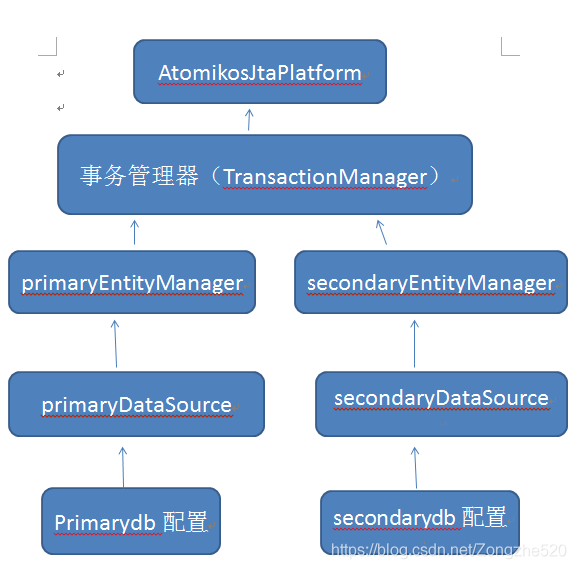

# 问题

由于 spring 事务的机制，在开启事务之前spring 会去创建当前数据源的 事务object，直到事务提交，spring 都不会在乎你是否切换了数据源。这就导致了，使用 AbstractRouting DataSource 方式开启事务时，切换数据源不生效。

# atomikos

官网：

https://www.atomikos.com/

# JPA+atomikos

## **依赖**

```xml
<dependency>
  <groupId>org.springframework.boot</groupId>
  <artifactId>spring-boot-starter-jta-atomikos</artifactId>
</dependency>
```

还有JPA，数据库驱动等

## 配置文件

```yaml
server:
  port: 8888
spring:
  datasource:
    primary:
      url: jdbc:mysql://127.0.0.1:3306/testdb?useUnicode=true&characterEncoding=utf-8&useSSL=false
      username: root
      password: root
      driver-class-name: com.mysql.cj.jdbc.Driver
    secondary:
      url: jdbc:mysql://127.0.0.1:3306/testdb2?useUnicode=true&characterEncoding=utf-8&useSSL=false
      username: root
      password: root
      driver-class-name: com.mysql.cj.jdbc.Driver
  jpa:                           #添加SpringDataJPA配置
    database-platform: org.hibernate.dialect.MySQL5InnoDBDialect
    hibernate:
      ddl-auto: update
    database: mysql
    show-sql: true
  jta:                                 #添加分布式JTA配置
    atomikos:
      datasource:
        max-pool-size: 20
        borrow-connection-timeout: 60
      connectionfactory:
        max-pool-size: 20
        borrow-connection-timeout: 60
```


## 实体类和Repository

```java
@Data
@Builder
@Entity     //表示当前类是一个实体类，并表示接受SpringDataJPA的控制管理
//如果不特定指哪个表，就默认  类名对应的表
//反之，用注解@Table指定对应特定的表
@Table(name = "article")
public class Article {
  @Id
  @GeneratedValue(strategy = GenerationType.IDENTITY)
  private Long id;   //id是唯一的主键并且是自增的类型是IDENTITY，所以加如上两个注解
  @Column(nullable = false,length=32)
  private String author;
  @Column(nullable = false,unique = true,length=32)
  private String title;
  @Column(length=512)
  private String content;
  private Date createTime;
}
```


```java
public interface ArticleRepository extends JpaRepository<Article,Long> {
    //<Article,Long>  Article表示要操作的数据库表对应实体PO,Long  是id属性实体主键的类型
 
    //注意这个方法的名称，JPA会根据方法名自动生成SQL语句
    Article findByAuthor(String author);    //可以所很智能了
}
```


```java

@Data
@Entity
@Builder
@NoArgsConstructor
@AllArgsConstructor
public class Message {
    @Id
    @GeneratedValue
    private int id;
    @Column(nullable = false)
    private String name;
    @Column(nullable = false)
    private String content;
}
```


```java
public interface MessageRepository extends JpaRepository<Message,Long> {
 
}
```


## JPAPrimaryConfig


```java

import com.atomikos.jdbc.AtomikosDataSourceBean;
import com.mysql.cj.jdbc.MysqlXADataSource;
import org.springframework.beans.factory.annotation.Autowired;
import org.springframework.boot.autoconfigure.jdbc.DataSourceProperties;
import org.springframework.boot.context.properties.ConfigurationProperties;
import org.springframework.context.annotation.Bean;
import org.springframework.context.annotation.Configuration;
import org.springframework.context.annotation.DependsOn;
import org.springframework.context.annotation.Primary;
import org.springframework.data.jpa.repository.config.EnableJpaRepositories;
import org.springframework.orm.jpa.JpaVendorAdapter;
import org.springframework.orm.jpa.LocalContainerEntityManagerFactoryBean;
import javax.sql.DataSource;
import java.sql.SQLException;
import java.util.HashMap;
/**
 * @author ZEShart
 * @create 2021-03-27-20:23
 */
@Configuration
@DependsOn("transactionManager")
@EnableJpaRepositories(basePackages = "com.example.jpamultipledatasource.Dao.testdb",  //注意这里
        entityManagerFactoryRef = "primaryEntityManager",
        transactionManagerRef = "transactionManager")
public class JPAPrimaryConfig {
    @Autowired
    private JpaVendorAdapter jpaVendorAdapter;
 
    //primary
    @Primary
    @Bean(name = "primaryDataSourceProperties")
    @ConfigurationProperties(prefix = "spring.datasource.primary")     //注意这里
    public DataSourceProperties primaryDataSourceProperties() {
        return new DataSourceProperties();
    }
 
    @Primary
    @Bean(name = "primaryDataSource", initMethod = "init", destroyMethod = "close")
    @ConfigurationProperties(prefix = "spring.datasource.primary")
    public DataSource primaryDataSource() throws SQLException {
        MysqlXADataSource mysqlXaDataSource = new MysqlXADataSource();
        mysqlXaDataSource.setUrl(primaryDataSourceProperties().getUrl());
        mysqlXaDataSource.setPinGlobalTxToPhysicalConnection(true);
        mysqlXaDataSource.setPassword(primaryDataSourceProperties().getPassword());
        mysqlXaDataSource.setUser(primaryDataSourceProperties().getUsername());
        AtomikosDataSourceBean xaDataSource = new AtomikosDataSourceBean();
        xaDataSource.setXaDataSource(mysqlXaDataSource);
        xaDataSource.setUniqueResourceName("primary");
        xaDataSource.setBorrowConnectionTimeout(60);
        xaDataSource.setMaxPoolSize(20);
        return xaDataSource;
    }
 
    @Primary
    @Bean(name = "primaryEntityManager")
    @DependsOn("transactionManager")
    public LocalContainerEntityManagerFactoryBean primaryEntityManager() throws Throwable {
 
        HashMap<String, Object> properties = new HashMap<String, Object>();
        properties.put("hibernate.transaction.jta.platform", AtomikosJtaPlatform.class.getName());
        properties.put("javax.persistence.transactionType", "JTA");
        LocalContainerEntityManagerFactoryBean entityManager = new LocalContainerEntityManagerFactoryBean();
        entityManager.setJtaDataSource(primaryDataSource());
        entityManager.setJpaVendorAdapter(jpaVendorAdapter);
        //这里要修改成主数据源的扫描包
        entityManager.setPackagesToScan("com.example.jpamultipledatasource.Dao.testdb");
        entityManager.setPersistenceUnitName("primaryPersistenceUnit");
        entityManager.setJpaPropertyMap(properties);
        return entityManager;
    }
}
```

## JPASecondaryConfig

```java

import com.atomikos.jdbc.AtomikosDataSourceBean;
import com.mysql.cj.jdbc.MysqlXADataSource;
import org.springframework.beans.factory.annotation.Autowired;
import org.springframework.boot.autoconfigure.jdbc.DataSourceProperties;
import org.springframework.boot.context.properties.ConfigurationProperties;
import org.springframework.context.annotation.Bean;
import org.springframework.context.annotation.Configuration;
import org.springframework.context.annotation.DependsOn;
import org.springframework.data.jpa.repository.config.EnableJpaRepositories;
import org.springframework.orm.jpa.JpaVendorAdapter;
import org.springframework.orm.jpa.LocalContainerEntityManagerFactoryBean;
import javax.sql.DataSource;
import java.sql.SQLException;
import java.util.HashMap;
/**
 * @author ZEShart
 * @create 2021-03-27-20:34
 */
@Configuration
@DependsOn("transactionManager")
@EnableJpaRepositories(basePackages = "com.example.jpamultipledatasource.Dao.testdb2",   //注意这里
        entityManagerFactoryRef = "secondaryEntityManager",
        transactionManagerRef = "transactionManager")
public class JPASecondaryConfig {
 
    @Autowired
    private JpaVendorAdapter jpaVendorAdapter;
 
 
    @Bean(name = "secondaryDataSourceProperties")
    @ConfigurationProperties(prefix = "spring.datasource.secondary")    //注意这里
    public DataSourceProperties masterDataSourceProperties() {
        return new DataSourceProperties();
    }
 
 
    @Bean(name = "secondaryDataSource", initMethod = "init", destroyMethod = "close")
    @ConfigurationProperties(prefix = "spring.datasource.secondary")
    public DataSource masterDataSource() throws SQLException {
        MysqlXADataSource mysqlXaDataSource = new MysqlXADataSource();
        mysqlXaDataSource.setUrl(masterDataSourceProperties().getUrl());
        mysqlXaDataSource.setPinGlobalTxToPhysicalConnection(true);
        mysqlXaDataSource.setPassword(masterDataSourceProperties().getPassword());
        mysqlXaDataSource.setUser(masterDataSourceProperties().getUsername());
        AtomikosDataSourceBean xaDataSource = new AtomikosDataSourceBean();
        xaDataSource.setXaDataSource(mysqlXaDataSource);
        xaDataSource.setUniqueResourceName("secondary");
        xaDataSource.setBorrowConnectionTimeout(60);
        xaDataSource.setMaxPoolSize(20);
        return xaDataSource;
    }
 
    @Bean(name = "secondaryEntityManager")
    @DependsOn("transactionManager")
    public LocalContainerEntityManagerFactoryBean masterEntityManager() throws Throwable {
 
        HashMap<String, Object> properties = new HashMap<String, Object>();
        properties.put("hibernate.transaction.jta.platform", AtomikosJtaPlatform.class.getName());
        properties.put("javax.persistence.transactionType", "JTA");
        LocalContainerEntityManagerFactoryBean entityManager = new LocalContainerEntityManagerFactoryBean();
        entityManager.setJtaDataSource(masterDataSource());
        entityManager.setJpaVendorAdapter(jpaVendorAdapter);
        //这里要修改成主数据源的扫描包
        entityManager.setPackagesToScan("com.example.jpamultipledatasource.Dao.testdb2");
        entityManager.setPersistenceUnitName("secondaryPersistenceUnit");
        entityManager.setJpaPropertyMap(properties);
        return entityManager;
    }
}
```

## AtomikosTransactionConfig

```java
package com.example.jpamultipledatasource.config;
 
import com.atomikos.icatch.jta.UserTransactionImp;
import com.atomikos.icatch.jta.UserTransactionManager;
import org.springframework.context.annotation.Bean;
import org.springframework.context.annotation.ComponentScan;
import org.springframework.context.annotation.Configuration;
import org.springframework.context.annotation.DependsOn;
import org.springframework.context.support.PropertySourcesPlaceholderConfigurer;
import org.springframework.orm.jpa.JpaVendorAdapter;
import org.springframework.orm.jpa.vendor.Database;
import org.springframework.orm.jpa.vendor.HibernateJpaVendorAdapter;
import org.springframework.transaction.PlatformTransactionManager;
import org.springframework.transaction.annotation.EnableTransactionManagement;
import org.springframework.transaction.jta.JtaTransactionManager;
 
import javax.transaction.TransactionManager;
import javax.transaction.UserTransaction;
 
/**
 * @author ZEShart
 * @create 2021-03-28-22:02
 */
@Configuration
@ComponentScan
@EnableTransactionManagement
public class JPAAtomikosTransactionConfig {
    @Bean
    public PropertySourcesPlaceholderConfigurer propertySourcesPlaceholderConfigurer() {
        return new PropertySourcesPlaceholderConfigurer();
    }
    //设置JPA特性
    @Bean
    public JpaVendorAdapter jpaVendorAdapter() {
        HibernateJpaVendorAdapter hibernateJpaVendorAdapter = new HibernateJpaVendorAdapter();
        //显示sql
        hibernateJpaVendorAdapter.setShowSql(true);
        //自动生成/更新表
        hibernateJpaVendorAdapter.setGenerateDdl(true);
        //设置数据库类型
        hibernateJpaVendorAdapter.setDatabase(Database.MYSQL);
        return hibernateJpaVendorAdapter;
    }
 
    @Bean(name = "userTransaction")
    public UserTransaction userTransaction() throws Throwable {
        UserTransactionImp userTransactionImp = new UserTransactionImp();
        userTransactionImp.setTransactionTimeout(10000);
        return userTransactionImp;
    }
 
    @Bean(name = "atomikosTransactionManager", initMethod = "init", destroyMethod = "close")
    public TransactionManager atomikosTransactionManager() throws Throwable {
        UserTransactionManager userTransactionManager = new UserTransactionManager();
        userTransactionManager.setForceShutdown(false);
        AtomikosJtaPlatform.transactionManager = userTransactionManager;
        return userTransactionManager;
    }
 
    @Bean(name = "transactionManager")
    @DependsOn({"userTransaction", "atomikosTransactionManager"})
    public PlatformTransactionManager transactionManager() throws Throwable {
        UserTransaction userTransaction = userTransaction();
        AtomikosJtaPlatform.transaction = userTransaction;
        TransactionManager atomikosTransactionManager = atomikosTransactionManager();
        return new JtaTransactionManager(userTransaction, atomikosTransactionManager);
    }
}
```

## AtomikosJtaPlatform

```java
package com.example.jpamultipledatasource.config;
import org.hibernate.engine.transaction.jta.platform.internal.AbstractJtaPlatform;
import javax.transaction.TransactionManager;
import javax.transaction.UserTransaction;
/**
 * @author ZEShart
 * @create 2021-03-28-11:00
 */
public class AtomikosJtaPlatform extends AbstractJtaPlatform{
    private static final long serialVersionUID = 1L;
 
    static TransactionManager transactionManager;
    static UserTransaction transaction;
 
    @Override
    protected TransactionManager locateTransactionManager() {
        return transactionManager;
    }
 
    @Override
    protected UserTransaction locateUserTransaction() {
        return transaction;
    }
}
```

## 业务代码

```java

public class ArticleJPAServiceImpl implements ArticleService{
    //将JPA仓库对象注入
    @Resource
    private ArticleRepository articleRepository;
    //将JPA仓库对象注入
    @Resource
    private MessageRepository messageRepository;
    @Resource
    private Mapper dozerMapper;//dtoz
 
    @Transactional
    public void saveArticle(ArticleVO articleVO) {
        //将articleVO转换为articlePO，使用dozer或者springUtils
        Article articlePO=dozerMapper.map(articleVO,Article.class);
        articleRepository.save(articlePO);
        messageRepository.save(new Message(1,"zimug","爱学习"));
    }
 
    @Override
    public void deleteArticle(Long id) {
        articleRepository.deleteById(id);
    }
 
 
    @Override
    public void updateArticle(ArticleVO articleVO) {
        //将articleVO转换为articlePO，使用dozer或者springUtils
        Article articlePO=dozerMapper.map(articleVO,Article.class);
        articleRepository.save(articlePO);//新增和保存使用的是同一个函数方法save()
        //articleJDBCDAO.updateById(article,secondaryJdbcTemplate);
    }
 
    @Override
    public ArticleVO getArticle(Long id) {
        Optional<Article> article=articleRepository.findById(id);
        return dozerMapper.map(article.get(),ArticleVO.class);
    }
 
 
    @Override
    public List<ArticleVO> getAll() {
        List<Article> articleLis=articleRepository.findAll();
        return DozerUtils.mapList(articleLis,ArticleVO.class);
    }

```


## 原理

JTA操作多数据源，并实现分布式事务原理，就是给定一个总的管理类，来进行一个统一的管理



