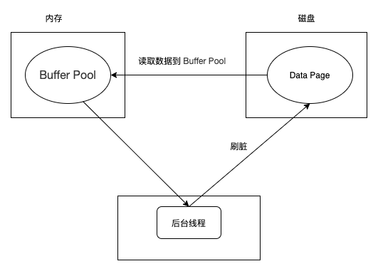
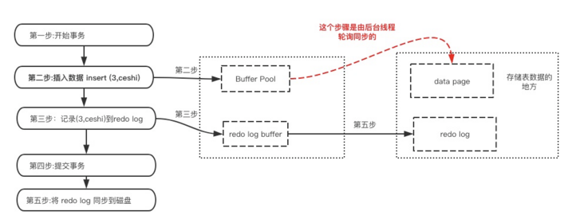

# 概念回顾

来源：https://cloud.tencent.com/developer/article/1708499

很重要的概念，得反复提

## **事务的四个特性：ACID**

A(原子性Atomicity)：原子性指的是事务是一个不可分割的，要么都执行要么都不执行。

C(一致性Consistency)：事务必须使得数据库从一个一致性状态，到另外一个一致性状态。

I(隔离性Isolation)：指的是一个事务的执行，不能被其他的事务所干扰。

D(持久性Durability)：持久性指的是一个事务一旦提交了之后，对数据库的改变就是永久的。

## **并发操作会出现的问题**

脏读：有俩事务T1,T2。如果T1读了一条数据，这条数据是T2更新的但是还没提交，突然T2觉得不合适进行事务回滚了，也就是不提交了。此时T1读的数据就是无效的数据。

不可重复读：有俩事务T1,T2。如果T1读了一条数据，之后T2更新了这条数据，T1再次读取就发现值变了。

幻读：有俩事务T1,T2。如果T1读了一条数据，之后T2插入了一些新的数据，T1再次读取就会多出现一些数据。

## 隔离级别对应解决的问题

| **隔离级别**（+:会出现，-:不会出现）              | **脏读** | **不可重复读** | **幻读** |
| :------------------------------------------------ | :------- | :------------- | :------- |
| 读未提交    read-uncommitted                      | +        | +              | +        |
| 读已提交  read-committed (Oracle、PostgreSQL默认) | -        | +              | +        |
| 可重复读  repeatable-read (mysql默认)             | -        | -              | +        |
| 序列化读  serializable                            | -        | -              | -        |

## 加锁实现隔离级别

**读未提交**： 

- 事务对当前被读取的数据不加锁；
- 事务在更新某数据的瞬间（就是发生更新的瞬间），必须先对其加**行级共享锁**，直到事务结束才释放

**读已提交 ：**

- 事务对当前被读取的数据加行级共享锁（当读到时才加锁），一旦读完该行，立即释放该行级共享锁；

- 事务在更新某数据的瞬间（就是发生更新的瞬间），必须先对其加**行级排他锁**，直到事务结束才释放。

**可重复读：**

- 事务在读取某数据的瞬间（就是开始读取的瞬间），必须先对其加**行级共享锁**，直到事务结束才释放；

- 事务在更新某数据的瞬间（就是发生更新的瞬间），必须先对其加**行级排他锁**，直到事务结束才释放。

**序列化读：**

- 事务在读取数据时，必须先对其加**表级共享锁** ，直到事务结束才释放；
- 事务在更新数据时，必须先对其加**表级排他锁** ，直到事务结束才释放。

## InnoDB事务隔离级别实现原理

在往下分析之前，我们有几个概念需要先了解下：

**1、锁定读和一致性非锁定读**

**锁定读**：在一个事务中，主动给读加锁，如SELECT ... LOCK IN SHARE MODE 和 SELECT ... FOR UPDATE。分别加上了行共享锁和行排他锁。锁的分类可见我以前的分析文章：你应该了解的MySQL锁分类。

> [](https://dev.mysql.com/doc/refman/8.0/en/innodb-locking-reads.html)

**一致性非锁定读**：InnoDB使用MVCC向事务的查询提供某个时间点的数据库快照。查询会看到在该时间点之前提交的事务所做的更改，而不会看到稍后或未提交的事务所做的更改（本事务除外）。也就是说在开始了事务之后，事务看到的数据就都是事务开启那一刻的数据了，其他事务的后续修改不会在本次事务中可见。

Consistent read是InnoDB在RC和RR隔离级别处理SELECT语句的默认模式。一致性非锁定读不会对其访问的表设置任何锁，因此，在对表执行一致性非锁定读的同时，其它事务可以同时并发的读取或者修改它们。

> [](https://dev.mysql.com/doc/refman/8.0/en/innodb-consistent-read.html)

**2、当前读和快照读**

**当前读**

读取的是最新版本，像**UPDATE、DELETE、INSERT、SELECT ...  LOCK IN SHARE MODE、SELECT ... FOR UPDATE**这些操作都是一种当前读，为什么叫当前读？就是它读取的是记录的最新版本，读取时还要保证其他并发事务不能修改当前记录，会对读取的记录进行加锁。

**快照读**

读取的是快照版本，也就是历史版本，像不加锁的**SELECT**操作就是快照读，即不加锁的非阻塞读；**快照读的前提是隔离级别不是未提交读和序列化读级别，因为未提交读总是读取最新的数据行，而不是符合当前事务版本的数据行，而序列化读则会对表加锁**。

**3、隐式锁定和显式锁定**

**隐式锁定**

InnoDB在事务执行过程中，使用两阶段锁协议（不主动进行显示锁定的情况）：

- 随时都可以执行锁定，InnoDB会根据隔离级别在需要的时候自动加锁；
- 锁只有在执行commit或者rollback的时候才会释放，并且所有的锁都是在同一时刻被释放。

**显式锁定**

- InnoDB也支持通过特定的语句进行显示锁定（存储引擎层）

```js
select ... lock in share mode //共享锁

select ... for update //排他锁
```

- My[SQL Server](https://cloud.tencent.com/product/sqlserver?from=10680)层的显示锁定：

```js
lock table

unlock table
```

了解完上面的概念后，我们来看下InnoDB的事务具体是怎么实现的（下面的读都指的是非主动加锁的select）

| 事务隔离级别   | 实现方式                                                     |
| :------------- | :----------------------------------------------------------- |
| 未提交读（RU） | 事务对当前被读取的数据不加锁，都是**当前读**； 事务在更新某数据的瞬间（就是发生更新的瞬间），必须先对其加**行级共享锁**，直到事务结束才释放。 |
| 提交读（RC）   | 事务对当前被读取的数据不加锁，且是**快照读**； 事务在更新某数据的瞬间（就是发生更新的瞬间），必须先对其加**行级排他锁（Record）**，直到事务结束才释放。 **通过快照，在这个级别MySQL就解决了不可重复读的问题** |
| 可重复读（RR） | 事务对当前被读取的数据不加锁，且是**快照读**； 事务在更新某数据的瞬间（就是发生更新的瞬间），必须先对其加**行级排他锁（Record，GAP，Next-Key）**，直到事务结束才释放。 **通过间隙锁，在这个级别MySQL就解决了幻读的问题** |
| 序列化读（S）  | 事务在读取数据时，必须先对其加**表级共享锁** ，直到事务结束才释放，都是**当前读**； 事务在更新数据时，必须先对其加**表级排他锁** ，直到事务结束才释放。 |

可以看到，InnoDB通过MVCC很好的解决了读写冲突的问题，而且提前一个级别就解决了标准级别下会出现的幻读和不可重复读问题，大大提升了数据库的并发能力。

### 一些常见误区

#### 幻读到底包不包括了delete的情况?

不可重复读：前后多次读取一行，数据内容不一致，针对其他事务的update和delete操作。为了解决这个问题，使用行共享锁，锁定到事务结束（也就是RR级别，当然MySQL使用MVCC在RC级别就解决了这个问题）

幻读：当同一个查询在不同时间生成不同的行集合时就是出现了幻读，针对的是其他事务的insert操作，为了解决这个问题，锁定整个表到事务结束（也就是S级别，当然MySQL使用间隙锁在RR级别就解决了这个问题）

网上很多文章提到幻读和提交读的时候，有的说幻读包括了delete的情况，有的说delete应该属于提交读的问题，那到底真相如何呢？我们实际来看下MySQL的官方文档（如下）

> The so-called phantom problem occurs within a transaction when the same query produces different sets of rows at different times. For example, if a `SELECT` is executed twice, but returns a row the second time that was not returned the first time, the row is a “phantom” row. [](https://dev.mysql.com/doc/refman/5.7/en/innodb-next-key-locking.html)

可以看到，幻读针对的是结果集前后发生变化，所以看起来delete的情况应该归为幻读，但是我们实际分析下上面列出的标准SQL在RR级别的实现原理就知道，标准SQL的RR级别是会对查到的数据行加行共享锁，所以这时候其他事务想删除这些数据行其实是做不到的，所以在RR下，不会出现因delete而出现幻读现象，也就是幻读不包含delete的情况。

#### MVCC能解决了幻读问题?

网上很多文章会说MVCC或者MVCC+间隙锁解决了幻读问题，实际上MVCC并不能解决幻读问题。如以下的例子：

```js
begin;

#假设users表为空，下面查出来的数据为空

select * from users; #没有加锁

#此时另一个事务提交了，且插入了一条id=1的数据

select * from users; #读快照，查出来的数据为空

update users set name='mysql' where id=1;#update是当前读，所以更新成功，并生成一个更新的快照

select * from users; #读快照，查出来id为1的一条记录，因为MVCC可以查到当前事务生成的快照

commit;
```

可以看到前后查出来的数据行不一致，发生了幻读。所以说只有MVCC是不能解决幻读问题的，解决幻读问题靠的是间隙锁。如下：

```js
begin;

#假设users表为空，下面查出来的数据为空

select * from users lock in share mode; #加上共享锁

#此时另一个事务B想提交且插入了一条id=1的数据，由于有间隙锁，所以要等待

select * from users; #读快照，查出来的数据为空

update users set name='mysql' where id=1;#update是当前读，由于不存在数据，不进行更新

select * from users; #读快照，查出来的数据为空

commit;

#事务B提交成功并插入数据
```

**注意，RR级别下想解决幻读问题，需要我们显式加锁，不然查询的时候还是不会加锁的**。

# MySQL事务的实现原理

来源：https://segmentfault.com/a/1190000037671950

## InnoDB读写数据原理

我们知道数据库的数据都是存放在磁盘中的，然后我们也知道磁盘I/O的成本是很大的，如果每次读写数据都要访问磁盘，数据库的效率就会非常低。为了解决这个问题，InnoDB提供了 Buffer Pool 作为访问数据库数据的缓冲。

Buffer Pool 是位于内存的，包含了磁盘中部分数据页的映射。当需要读取数据时，InnoDB会首先尝试从Buffer Pool中读取，读取不到的话就会从磁盘读取后放入Buffer Pool；当写入数据时，会先写入Buffer Pool的页面，并把这样的页面标记为dirty，并放到专门的flush list上，这些修改的数据页会在后续某个时刻被刷新到磁盘中（这一过程称为刷脏，由其他后台线程负责） 。如下图所示：



这样设计的好处是可以把大量的磁盘I/O转成内存读写，并且把对一个页面的多次修改merge成一次I/O操作（刷脏一次刷入整个页面），避免每次读写操作都访问磁盘，从而大大提升了数据库的性能。

## 持久性定义

持久性是指事务一旦提交，它对数据库的改变就应该是永久性的，接下来的其他操作或故障不应该对本次事务的修改有任何影响。

通过前面的介绍，我们知道InnoDB使用 Buffer Pool 来提高读写的性能。但是 Buffer Pool 是在内存的，是易失性的，如果一个事务提交了事务后，MySQL突然宕机，且此时Buffer Pool中修改的数据还没有刷新到磁盘中的话，就会导致数据的丢失，事务的持久性就无法保证。

为了解决这个问题，InnoDB引入了 **redo log**来实现数据修改的持久化。当数据修改时，InnoDB除了修改Buffer Pool中的数据，还会在redo log 记录这次操作，并保证redo log早于对应的页面落盘（一般在事务提交的时候），也就是常说的WAL。若MySQL突然宕机了且还没有把数据刷回磁盘，重启后，MySQL会通过已经写入磁盘的redo log来恢复没有被刷新到磁盘的数据页。

## 实现原理：redo log

为了提高性能，和数据页类似，redo log 也包括两部分：一是内存中的日志缓冲(redo log buffer)，该部分日志是易失性的；二是磁盘上的重做日志文件(redo log file)，该部分日志是持久的。redo log是物理日志，记录的是数据库中物理页的情况 。

当数据发生修改时，InnoDB不仅会修改Buffer Pool中的数据，也会在redo log buffer记录这次操作；当事务提交时，会对redo log buffer进行刷盘，记录到redo log file中。如果MySQL宕机，重启时可以读取redo log file中的数据，对数据库进行恢复。这样就不需要每次提交事务都实时进行刷脏了。

### 写入过程



注意点：

- 先修改Buffer Pool，后写 redo log buffer。
- redo日志比数据页先写回磁盘：事务提交的时候，会把redo log buffer写入redo log file，写入成功才算提交成功（也有其他场景触发写入，这里就不展开了），而Buffer Pool的数据由后台线程在后续某个时刻写入磁盘。
- 刷脏的时候一定会保证对应的redo log已经落盘了，也即是所谓的WAL（预写式日志），否则会有数据丢失的可能性。

### 好处

事务提交的时候，写入redo log 相比于直接刷脏的好处主要有三点：

- 刷脏是随机I/O，但写redo log 是顺序I/O，顺序I/O可比随机I/O快多了，不需要。
- 刷脏是以数据页（Page）为单位的，即使一个Page只有一点点修改也要整页写入；而redo log中只包含真正被修改的部分，数据量非常小，无效IO大大减少。
- 刷脏的时候可能要刷很多页的数据，无法保证原子性（例如只写了一部分数据就失败了），而redo log buffer 向 redo log file 写log block，是按512个字节，也就是一个扇区的大小进行写入，扇区是写入的最小单位，因此可以保证写入是必定成功的。

### 先写redo log还是先修改数据

一次DML可能涉及到数据的修改和redo log的记录，那它们的执行顺序是怎么样的呢？网上的文章有的说先修改数据，后记录redo log，有的说先记录redo log，后改数据，那真实的情况是如何呢？

首先通过上面的说明我们知道，redo log buffer在事务提交的时候就会写入redo log file的，而刷脏则是在后续的某个时刻，所以可以确定的是**先记录redo log，后修改data page**（WAL当然是日志先写啦）。

那接下来的问题就是先写redo log buffer还是先修改Buffer Pool了。要了解这个问题，我们先要了解InnoDB中，一次DML的执行过程是怎么样的。一次DML的执行过程涉及了数据的修改，加锁，解锁，redo log的记录和undo log的记录等，也是需要保证原子性的，而InnoDB通过MTR(Mini-transactions)来保证一次DML操作的原子性。

> https://link.segmentfault.com/?enc=fI96MKU5Fzcc5opra1g8UA%3D%3D.u%2BEFSbI0WSBEP2U23F1nK0WDlumzv%2BXtSuKZd2SsnIYHGUg382zEOiZqrbfEUZ59Cdei1uO4UftHGZ5R4RV1Nw%3D%3D)

MTR 是一个短原子操作，不能回滚，因为它本身就是原子的。数据页的变更必须通过MTR，MTR 会把DML操作对数据页的修改记录到 redo log里。

下面来简单看下MTR的过程：

- MTR初始化的时候会初始化一份 mtr_buf
- **当修改数据时，在对内存Buffer Pool中的页面进行修改的同时，还会生成redo log record，保存在mtr_buf中**。
- 在执行mtr_commit函数提交本MTR的时候，会将mtr_buf中的redo log record更新到redo log buffer中，同时将脏页添加到flush list，供后续刷脏使用。在log buffer中，每接收到496字节的log record，就将这组log record包装一个12字节的block header和一个4字节的block tailer，成为一个512字节的log block，方便刷盘的时候对齐512字节刷盘。

由此可见，InnoDB是先修改Buffer Pool，后写redo log buffer的。

## 恢复数据的过程

在任何情况下，InnoDB启动时都会尝试执行recovery操作。在恢复过程中，需要redo log参与，而如果还开启了binlog，那就还需要binlog、undo log的参与。因为有可能数据已经写入binlog了，但是redo log还没有刷盘的时候数据库就奔溃了（事务是InnoDB引擎的特性，修改了数据不一定提交了，而binlog是MySQL服务层的特性，修改数据就会记录了），这时候就需要redo log，binlog和undo log三者的参与来判断是否有还没提交的事务，未提交的事务进行回滚或者提交操作。

下面来简单说下仅利用redo log恢复数据的过程：

- 启动InnoDB时，找到最近一次Checkpoint的位置，利用Checkpoint LSN去找大于该LSN的redo log进行日志恢复。
- 如果中间恢复失败了也没影响，再次恢复的时候还是从上次保存成功的Checkpoint的位置继续恢复。

> Recover过程：
>
> 故障恢复包含三个阶段：Analysis，Redo和Undo。Analysis阶段的任务主要是利用Checkpoint及Log中的信息确认后续Redo和Undo阶段的操作范围，通过Log修正Checkpoint中记录的Dirty Page集合信息，并用其中涉及最小的LSN位置作为下一步Redo的开始位置RedoLSN。同时修正Checkpoint中记录的活跃事务集合（未提交事务），作为Undo过程的回滚对象；Redo阶段从Analysis获得的RedoLSN出发，重放所有的Log中的Redo内容，注意这里也包含了未Commit事务；最后Undo阶段对所有未提交事务利用Undo信息进行回滚，通过Log的PrevLSN可以顺序找到事务所有需要回滚的修改。
>
> 具体见 [http://catkang.github.io/2019...](https://link.segmentfault.com/?enc=DCfjlNAaL4AXrN1uSi%2FWjw%3D%3D.31FBVBdMziCsrpMN4px3J361QgJiabRb8mz2qZZY7XlLfKoCAHAVR9%2Bmy0wtHkZwpOdWJe4prGAUXDqu5EAikA%3D%3D)

**什么是LSN?**

LSN也就是log sequence number，也日志的序列号，是一个单调递增的64位无符号整数。redo log和数据页都保存着LSN，可以用作数据恢复的依据。LSN更大的表示所引用的日志记录所描述的变化发生在更后面。

**什么是Checkpoint？**

Checkpoint表示一个保存点，在这个点之前的数据页的修改（log LSN<Checkpoint LSN）都已经写入磁盘文件了。InnoDB每次刷盘之后都会记录Checkpoint，把最新的redo log LSN 记录到Checkpoint LSN 里，方便恢复数据的时候作为起始点的判断。

