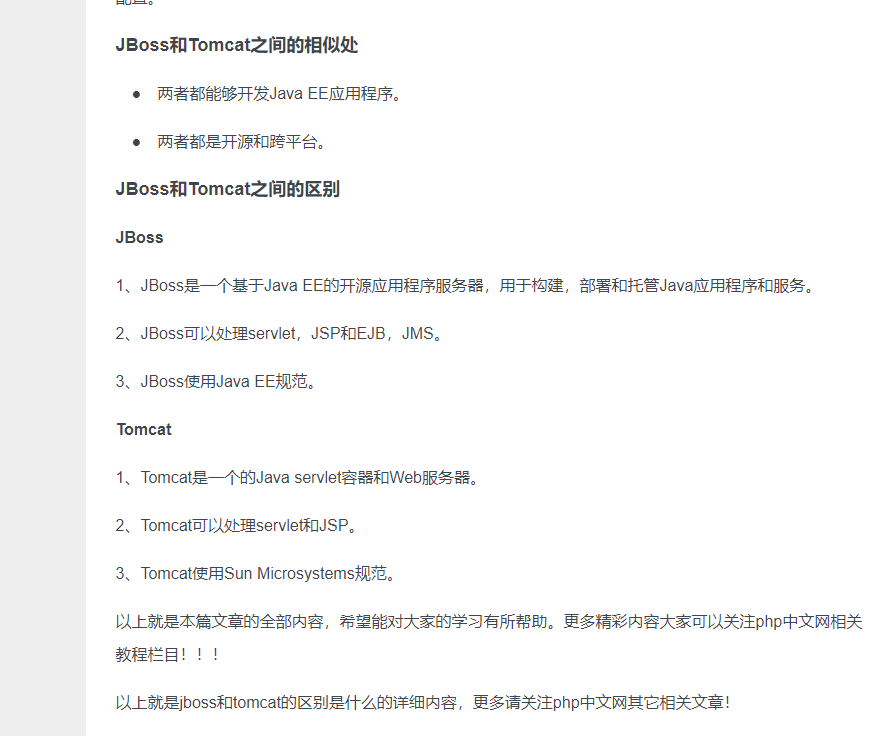
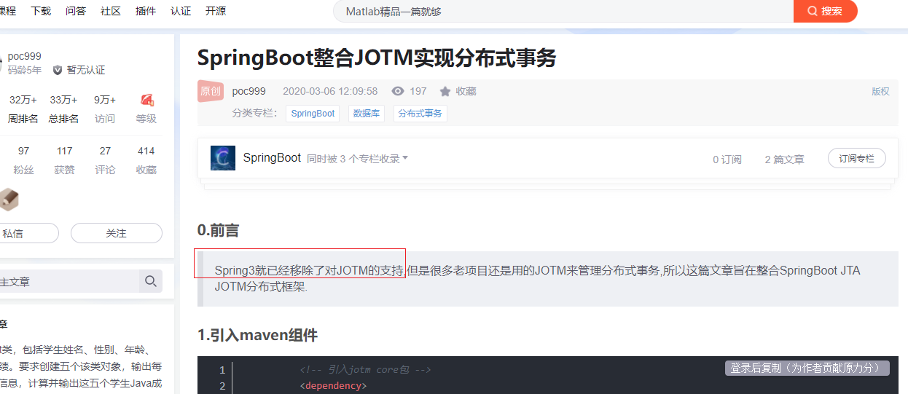
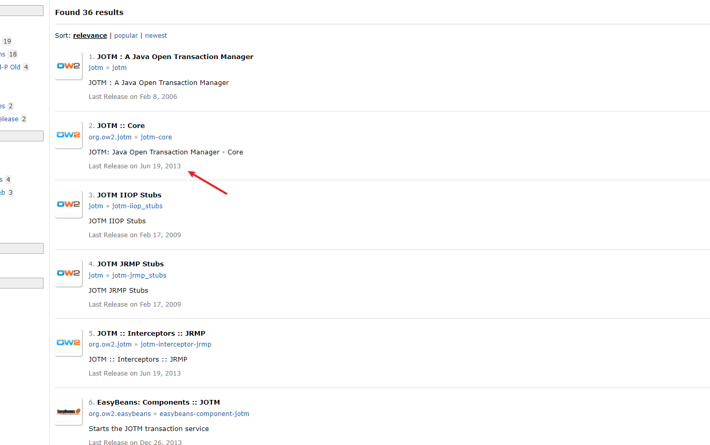
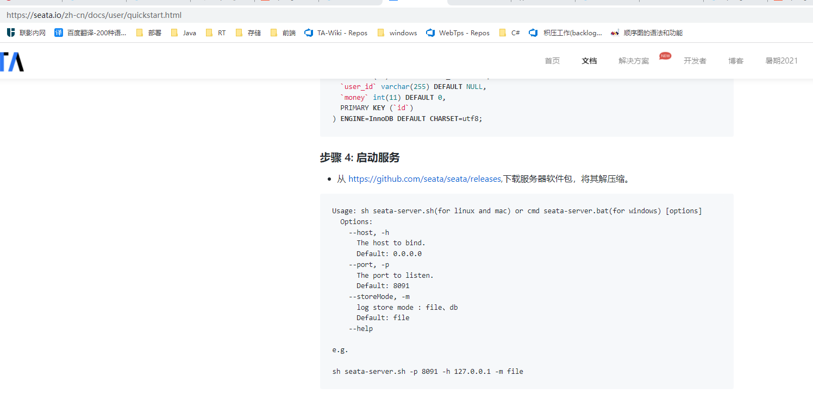

## JBossTS  

JBOSS和Tomcat一个级别的，JBossTS  需要在JBOSS服务上使用

## JTOM

  JOTM(Java Open Transaction Manager)是ObjectWeb的一个开源JTA实现，它本身也是开源应用程序服务器JOnAS(Java Open Application Server)的一部分，为其提供JTA分布式事务的功能。
    存在的问题：使用中不能自动rollback，无论什么情况都commit。注：**spring3开始已经不再支持jotm**

https://blog.csdn.net/weixin_38179324/article/details/104693137

## Seata

Seata是阿里开源的分布式事务框架，是一个分布式事务中间件

注意点：需要单独启动Seata服务

Seata是一个分布式事务中间件，使用它必须要启动服务，然后微服务中的服务，也就是Seata的客户端会向Seata的服务端进行注册，注册的时候会有携带该客户端的一些相关信息

https://seata.io/zh-cn/docs/user/quickstart.html

