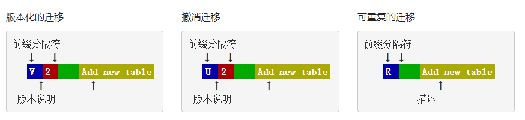
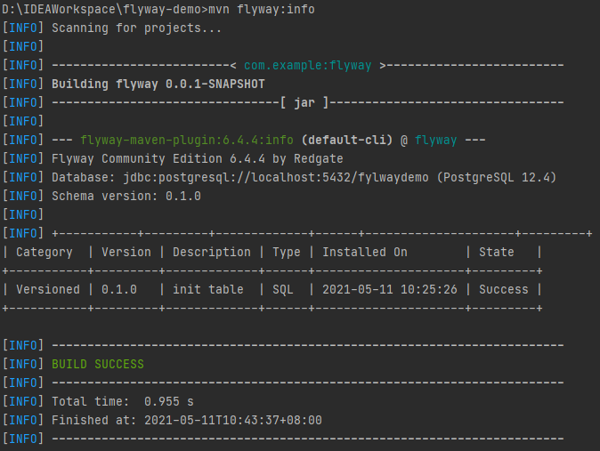
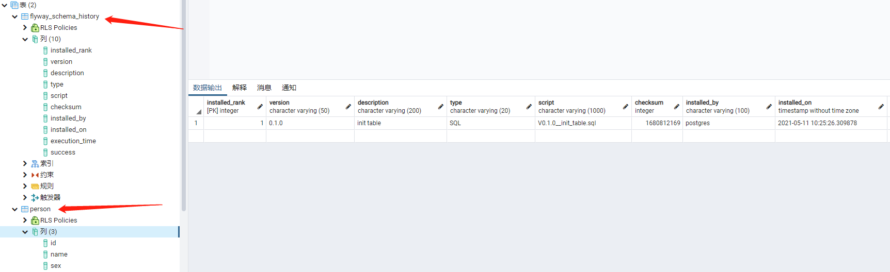
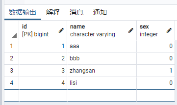
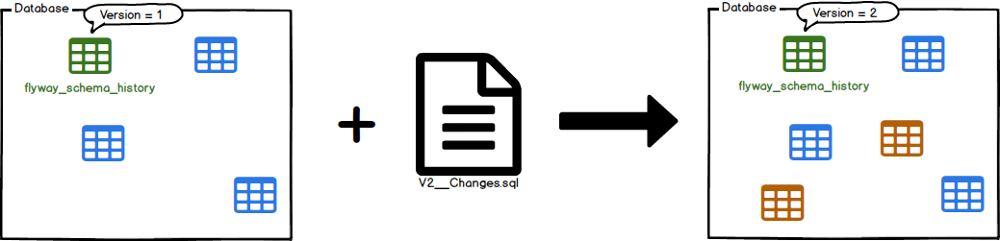
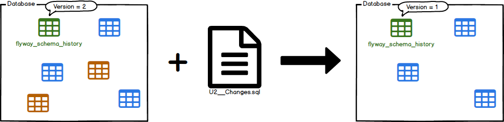
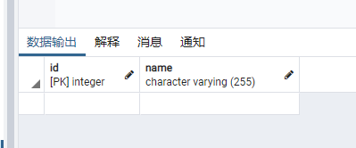
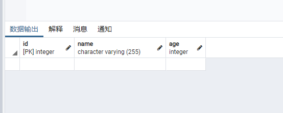
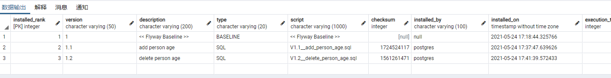

# 概述

flyway是一个数据库的版本控制工具，可以更改数据库表结构，对其进行版本控制，类似于项目代码的git

官网https://flywaydb.org/

数据库的所有更改都称为**迁移（migration）**  https://flywaydb.org/documentation/concepts/migrations

**迁移**具有版本号，描述和校验和等信息。**版本号**必须是唯一的，可以通过提供相同版本来进行撤销迁移。**描述**提供了信息，这此迁移做了啥。**校验和**用于检测意外更改。

迁移分类：版本迁移、重复迁移

基于SQL的迁移、基于Java的迁移

sql文件命名要求：



## 版本化迁移

最常见的迁移类型是**版本迁移**。**迁移**具有版本号，描述和校验和等信息。**版本号**必须是唯一的，可以通过提供相同版本来进行撤销迁移。**描述**提供了信息，这此迁移做了啥。**校验和**用于检测意外更改。

版本化迁移通常用于：

- 创建/更改/删除表/索引/外键/枚举/ UDT /…
- 参考数据更新
- 用户数据更正

例子：

```sql
-- 创建表 car
CREATE TABLE car (
    id INT NOT NULL PRIMARY KEY,
    license_plate VARCHAR NOT NULL,
    color VARCHAR NOT NULL
); 
-- owner表新增字段
ALTER TABLE owner ADD driver_license_id VARCHAR;
-- brand 表插入数据
INSERT INTO brand (name) VALUES ('DeLorean');
```

## 撤销迁移

**撤消迁移**与版本化迁移相反。撤消迁移负责撤消**相同版本号**迁移影响。撤消迁移是可选的，不是必须的

撤销迁移的例子：这个sql文件的版本号要和上面的例子中的相同

```sql
DELETE FROM brand WHERE name='DeLorean'; --brand表删除某条数据
ALTER TABLE owner DROP driver_license_id; -- 删除owner表中的某个字段
DROP TABLE car; -- 删除car表
```

## 可重复迁移

**可重复迁移**有描述和校验和，但没有版本号。每次校验和更改时，都（重新）应用它们，而不是仅运行一次。

由于：

- （重新）创建视图/过程/功能/包/…
- 重新插入批量参考数据

例子：

```sql
CREATE OR REPLACE VIEW blue_cars AS 
    SELECT id, license_plate FROM cars WHERE color='blue';
```

## 基于SQL的迁移

迁移最常见的是用**SQL语句**编写。

基于SQL的迁移通常用于

- DDL更改（CREATE / ALTER / DROP语句用于TABLES，VIEWS，TRIGGERS，SEQUENCES等）
- 简单的参考数据更改（参考数据表中的CRUD）
- 简单的批量数据更改（常规数据表中的CRUD）

支持常规sql语法，以及占位符替换，比如${myplaceholder}

占位符文档https://flywaydb.org/documentation/configuration/placeholder

## 基于Java的迁移

为了由Flyway接管，基于Java的迁移必须实现 [`JavaMigration`](https://flywaydb.org/documentation/usage/api/javadoc/org/flywaydb/core/api/migration/JavaMigration)接口，通常我们去继承[`BaseJavaMigration`](https://flywaydb.org/documentation/usage/api/javadoc/org/flywaydb/core/api/migration/BaseJavaMigration) 这个基类，这个基类实现了JavaMigration接口，我们的**类名**必须符合以下命名模式：


如果需要对类名的更多自定义的修改，则可以通过[`JavaMigration`](https://flywaydb.org/documentation/usage/api/javadoc/org/flywaydb/core/api/migration/JavaMigration)直接实现接口来覆盖默认约定 。

用于

- BLOB和CLOB的更改
- 高级批量数据更改（重新计算，高级格式更改，…）

**校验和与验证**

与SQL迁移不同，Java迁移默认情况下没有校验和，因此不参与Flyway验证的更改检测。可以通过实现该`getChecksum()`方法来补救，然后可以使用该 方法提供自己的校验和，然后将其存储并验证更改。

基于Java的迁移例子：

```java
package db.migration;

import org.flywaydb.core.api.migration.BaseJavaMigration;
import org.flywaydb.core.api.migration.Context;
import java.sql.PreparedStatement;

/**
 * Example of a Java-based migration.
 */
public class V1_2__Another_user extends BaseJavaMigration {
    public void migrate(Context context) throws Exception {
        try (PreparedStatement statement = 
                 context
                     .getConnection()
                     .prepareStatement("INSERT INTO test_user (name) VALUES ('Obelix')")) {
            statement.execute();
        }
    }
}
```

Spring  JDBC JdbcTemplate 中例子：

```java
import org.flywaydb.core.api.migration.BaseJavaMigration;
import org.flywaydb.core.api.migration.Context;
import java.sql.PreparedStatement;

/**
 * Example of a Java-based migration using Spring JDBC.
 */
public class V1_2__Another_user extends BaseJavaMigration {
    public void migrate(Context context) {
        new JdbcTemplate(new SingleConnectionDataSource(context.getConnection(), true))
                .execute("INSERT INTO test_user (name) VALUES ('Obelix')");
    }
}
```

# 生命周期回调

https://flywaydb.org/documentation/concepts/callbacks

[基于Java的回调](https://flywaydb.org/documentation/usage/api/hooks#callsbacks)

实现CallBack接口

# SpringBoot集成flyway

https://docs.spring.io/spring-boot/docs/current/reference/html/howto.html#howto-execute-flyway-database-migrations-on-startup

请注意，如果您使用的是Spring Boot的依赖项管理功能，则无需为Flyway指定版本号

## 依赖和maven插件

创建项目时勾选：Flyway Migration,加入的依赖就是：

```xml
<dependency>
    <groupId>org.flywaydb</groupId>
    <artifactId>flyway-core</artifactId>
</dependency>
```

flyway的maven插件：需要配置sql的url，用户名和密码.

```xml
<plugin>
    <groupId>org.flywaydb</groupId>
    <artifactId>flyway-maven-plugin</artifactId>
    <configuration>
        <url>jdbc:postgresql://localhost:5432/fylwaydemo</url>
        <user>postgres</user>
        <password>hsq123456</password>
    </configuration>
</plugin>
```

这个插件提供了一些maven的命令，比如：

```cmd
mvn flyway:info
```

显示的结果：



中间显示了创建的表的信息

## 创建migration

初始化表：

作用：flyway可以直接由sql语句生成表结构

application.properties 配置好sql连接

默认在 resources/db/migration目录下创建sql文件：

V0.1.0__init_table.sql 文件名格式有要求

- V 必须写
- 0.1.0版本号
- __ 两个下划线
- init_table 表述信息，单词用下划线分割

```sql
CREATE TABLE person
(
    id bigint NOT NULL,
    name character varying COLLATE pg_catalog."default",
    sex int,
    CONSTRAINT product_pkey PRIMARY KEY (id)
);
insert into person(id, name, sex) VALUES (1,'aaa',0);
insert into person(id, name, sex) VALUES (2,'bbb',0);
```

直接启动SpringBoot或者执行命令**mvn flyway:migrate**，就生成了数据库表：flyway_schema_history记录数据库表的状态变更信息，person是我们项目用到的表





**在表中添加数据**

db/migration目录下再创建文件 V0.1.1__add_person.sql

注意版本号要变动一下下，比之前的新

```sql
insert into person(id, name, sex) VALUES (3,'zhangsan',1);
insert into person(id, name, sex) VALUES (4,'lisi',0);
```

执行命令mvn flyway:migrate 或者启动SpringBoot,查询数据库，可以看到了：



## flyway的maven插件

还是看这个：

```xml
<plugin>
    <groupId>org.flywaydb</groupId>
    <artifactId>flyway-maven-plugin</artifactId>
    <configuration>
        <url>jdbc:postgresql://localhost:5432/fylwaydemo</url>
        <user>postgres</user>
        <password>hsq123456</password>
    </configuration>
</plugin>
```

这个configuration可以配置一大堆东西：https://flywaydb.org/documentation/configuration/parameters/

```xml
<configuration>
    <driver>org.hsqldb.jdbcDriver</driver>
    <url>jdbc:hsqldb:file:${project.build.directory}/db/flyway_sample;shutdown=true</url>
    <user>SA</user>
    <password>mySecretPwd</password>
    <connectRetries>10</connectRetries>
    <initSql>SET ROLE 'myuser'</initSql>
    <schemas>
        <schema>schema1</schema>
        <schema>schema2</schema>
        <schema>schema3</schema>
    </schemas>
    <createSchemas>true</createSchemas>
    <table>schema_history</table>
    <tablespace>my_tablespace</tablespace>
    <locations>
        <location>classpath:migrations1</location>
        <location>migrations2</location>
        <location>filesystem:/sql-migrations</location>
        <location>s3:migrationsBucket</location>
        <location>gcs:migrationsBucket</location>
    </locations>
    <sqlMigrationPrefix>Migration-</sqlMigrationPrefix>
    <undoSqlMigrationPrefix>downgrade</undoSqlMigrationPrefix>
    <repeatableSqlMigrationPrefix>RRR</repeatableSqlMigrationPrefix>
    <sqlMigrationSeparator>__</sqlMigrationSeparator>
    <sqlMigrationSuffixes>
        <sqlMigrationSuffix>.sql</sqlMigrationSuffix>
        <sqlMigrationSuffix>.pkg</sqlMigrationSuffix>
        <sqlMigrationSuffix>.pkb</sqlMigrationSuffix>
    </sqlMigrationSuffixes>
    <stream>true</stream>
    <batch>true</batch>
    <encoding>ISO-8859-1</encoding>
    <placeholderReplacement>true</placeholderReplacement>
    <placeholders>
        <aplaceholder>value</aplaceholder>
        <otherplaceholder>value123</otherplaceholder>
    </placeholders>
    <placeholderPrefix>#[</placeholderPrefix>
    <placeholderSuffix>]</placeholderSuffix>
    <resolvers>
        <resolver>com.mycompany.project.CustomResolver</resolver>
        <resolver>com.mycompany.project.AnotherResolver</resolver>
    </resolvers>
    <skipDefaultResolvers>false</skipDefaultResolvers>
    <callbacks>
        <callback>com.mycompany.project.CustomCallback</callback>
        <callback>com.mycompany.project.AnotherCallback</callback>
    </callbacks>
    <skipDefaultCallbacks>false</skipDefaultCallbacks>
    <target>1.1</target>
    <outOfOrder>false</outOfOrder>
    <outputQueryResults>false</outputQueryResults>
    <validateOnMigrate>true</validateOnMigrate>
    <cleanOnValidationError>false</cleanOnValidationError>
    <mixed>false</mixed>
    <group>false</group>
    <ignoreMissingMigrations>false</ignoreMissingMigrations>
    <ignoreIgnoredMigrations>false</ignoreIgnoredMigrations>
    <ignoreFutureMigrations>false</ignoreFutureMigrations>
    <cleanDisabled>false</cleanDisabled>
    <baselineOnMigrate>false</baselineOnMigrate>
    <baselineVersion>5</baselineVersion>
    <baselineDescription>Let's go!</baselineDescription>
    <installedBy>my-user</installedBy>
    <skip>false</skip>
    <configFiles>
        <configFile>myConfig.conf</configFile>
        <configFile>other.conf</configFile>
    </configFiles>
    <workingDirectory>/my/working/dir</workingDirectory>
    <errorOverrides>
        <errorOverride>99999:17110:E</errorOverride>
        <errorOverride>42001:42001:W</errorOverride>
    </errorOverrides>
    <dryRunOutput>/my/sql/dryrun-outputfile.sql</dryRunOutput>
    <lockRetryCount>10</lockRetryCount>
    <oracle.sqlplus>true</oracle.sqlplus>
    <oracle.sqlplusWarn>true</oracle.sqlplusWarn>
    <jdbcProperties>
      <myProperty>myValue</myProperty>
      <myOtherProperty>myOtherValue</myOtherProperty>
    </jdbcProperties>
</configuration>
```

## flyway maven命令

这些命令都有对应的Java API

**mvn flyway:migrate**

迁移数据库表




 **mvn flyway:clean**

清理所有的表，包括flyway_schma_history


**mvn flyway:info**

打印表各个版本的信息


**mvn flyway:validate**

验证sql文件


**mvn flyway:undo**

撤销




**mvn flyway:baseline**


**mvn flyway:repair**

- 在没有DDL事务的数据库上删除所有失败的迁移
  （留下的用户对象仍必须手动清除）
- 将可用迁移的校验和，描述和类型与可用迁移重新对齐


# flyway集成到已有的数据库项目

针对项目中已经有数据库了，之前没有用flyway的情况

使用[Spawn](https://spawn.cc/)快速配置开发和生产环境的数据库的示例。

[安装Spawn](https://spawn.cc/docs/howto-installation)

执行命令进行创建开发和生产环境spawn容器实例

```sh
> spawnctl create data-container \
  --image postgres:flyway-existing-database \
  --name flyway-container-dev \
  --lifetime 24h
```


```sh
> spawnctl create data-container \
  --image postgres:flyway-existing-database \
  --name flyway-container-prod \
  --lifetime 24h
```

获取数据容器信息

```sh
spawnctl get data-containers -o yaml
```


https://blog.csdn.net/weixin_33816611/article/details/88535948

已有项目改造


# JPA+flyway

```properties
# jpa 生成SQL文件
spring.jpa.properties.javax.persistence.schema-generation.scripts.action=create
spring.jpa.properties.javax.persistence.schema-generation.scripts.create-target=db/migration/create.sql
```

除了create，还有none,drop,drop-and-create


Flyway.migrate()  执行迁移


# flyway增加、删除字段

Person表现在有2个字段：



现在在实体类中增加了一个属性：

```java
@Entity
@Data
@NoArgsConstructor
@AllArgsConstructor
@ToString

@Table(name = "person",schema = "public")
public class Person {
    @Id
    @GeneratedValue
    private Integer id;
    private String name;
    private Integer age; //新增的
}
```

**手动编写**V1.1__add_person_age.sql文件

```sql
ALTER TABLE "person" add "age" integer;
```

**执行命令：flyway:migrate**  ,发现已经多了一个字段



想要**回滚：执行flyway:undo ，报错：只有企业版才有回滚功能**，社区版没有！

那就手动写sql来删除上述的age字段吧：

编写：

V1.2__delete_person_age.sql

```sql
ALTER TABLE "person" DROP "age";
```

执行命令：flyway:migrate,结果如下，age字段已经没了：


看看flyway自动生成的flyway_schema_history这个表，记录了每次migrate的日志



**注意**：即使是在application.yml配置了 ddl-auto: update，也不能实现对实体类删除属性时，数据库的字段也跟着删除这个情况，只能新增字段

