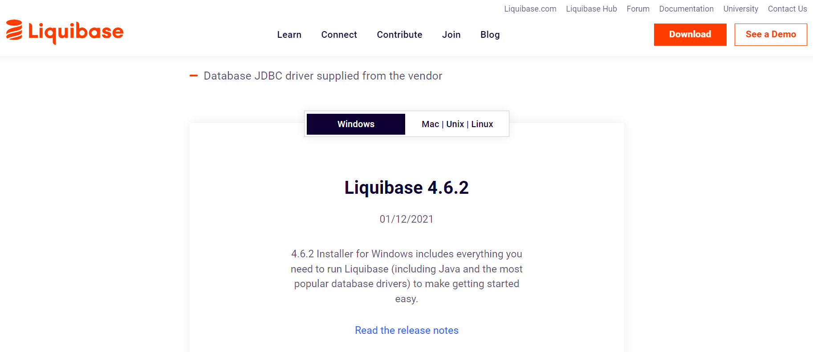
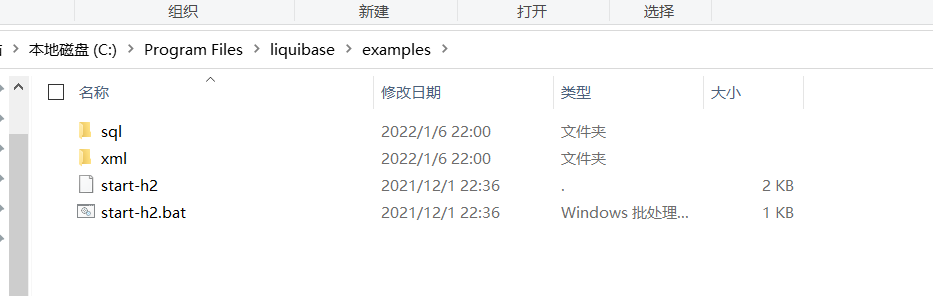
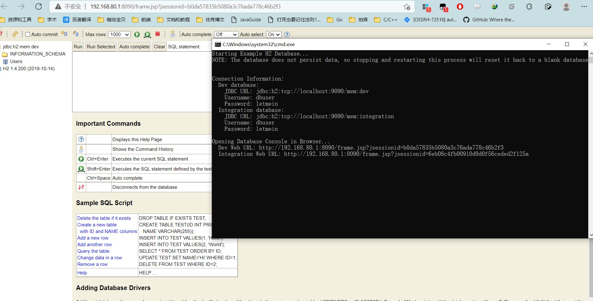
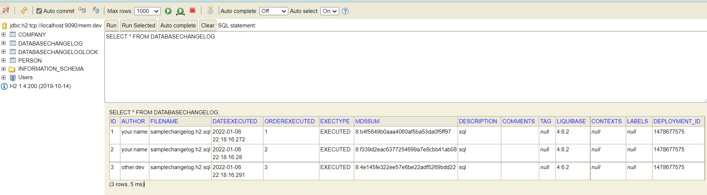
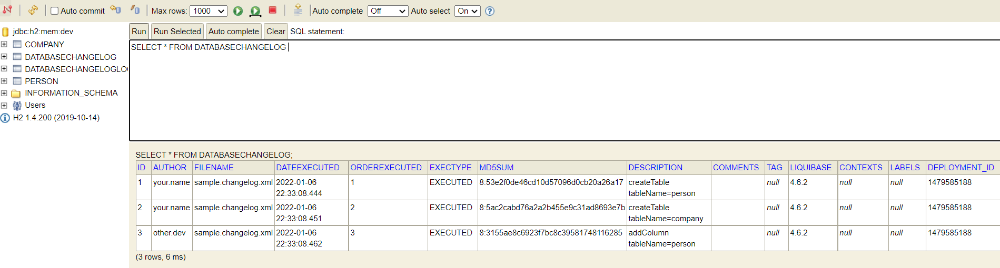
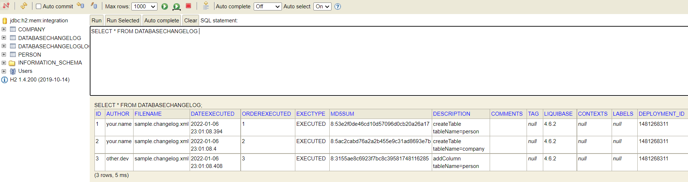

# Liquibase Installer

文档：https://docs.liquibase.com/concepts/installation/home.html

Liquibase Installer除了基本的liquibase功能，还包含了示例，能够帮助用户尽快熟悉Liquibase的使用。

下载：https://www.liquibase.org/download 大小是80多M（因为附带了jre，本体才6M），直接在windows上默认路径安装即可



## 示例：h2数据库的生成

安装好了之后，自带一个示例：数据库是h2的



- examples/sql 存放了用于生成数据库的SQL脚本
- examples/xml则是xml格式的liquibase changelog

sql脚本和xml在效果上是一样的，都能生成相同的数据库，只是格式不同。

由于是在C盘，需要管理员权限，为了便于操作，我们把这个examples目录拷贝到其他盘的目录下放着，然后进行后续操作。

启动示例H2数据库，运行 ：examples/start-h2.bat

出现的界面如下：



8090端口是这个前端界面、9090是h2数据库的端口

cmd命令行上说了，提供了两个数据库jdbc链接，说明一下这两个数据库的用途：

- dev数据库是用于先执行liquibase的changelog的，相当于开发环境的数据库
- integration数据库是用于集成的，相当于测试或是生成环境下的数据库

我们先用第一个

http://localhost:8090

输入url: jdbc:h2:tcp://localhost:9090/mem:dev

输入用户名：dbuser

输入密码：letmein

### 基于sql脚本的数据库生成

cmd执行：

```cmd
cd D:\temp\liquibase\examples\sql
liquibase update
# 输入n,因为暂时不需要 Liquibase Hub
```

因为D:\temp\liquibase\examples\sql目录下有个samplechangelog.h2.sql，而且里面内容写着：

```sql
--liquibase formatted sql

--changeset your.name:1
create table person (
    id int primary key,
    name varchar(50) not null,
    address1 varchar(50),
    address2 varchar(50),
    city varchar(30)
)

--changeset your.name:2
create table company (
    id int primary key,
    name varchar(50) not null,
    address1 varchar(50),
    address2 varchar(50),
    city varchar(30)
)

--changeset other.dev:3
alter table person add column country varchar(2)


```


会看到生成了四张表：person、company、以及Liquibase自带的两个表：databasechangelog和databsechangeloglock



从表中数据可以看出databasechangelog记录了操作，databsechangeloglock相当于锁，应该是防止并发生成数据库。

此外，

看看D:\temp\liquibase\examples\sql\liquibase.properties中的内容：

配置了jdbc数据库连接字符串、用户名和密码,changeLogFile的位置，还有reference数据库的连接信息

```properties
####     _     _             _ _
##      | |   (_)           (_) |
##      | |    _  __ _ _   _ _| |__   __ _ ___  ___
##      | |   | |/ _` | | | | | '_ \ / _` / __|/ _ \
##      | |___| | (_| | |_| | | |_) | (_| \__ \  __/
##      \_____/_|\__, |\__,_|_|_.__/ \__,_|___/\___|
##                  | |
##                  |_|
##
##      The liquibase.properties file stores properties which do not change often,
##      such as database connection information. Properties stored here save time
##      and reduce risk of mistyped command line arguments.
##      Learn more: https://www.liquibase.org/documentation/config_properties.html
####
####
##   Note about relative and absolute paths:
##      The liquibase.properties file requires paths for some properties.
##      The classpath is the path/to/resources (ex. src/main/resources).
##      The changeLogFile path is relative to the classpath.
##      The url H2 example below is relative to 'pwd' resource.
####
# Enter the path for your changelog file.
changeLogFile=samplechangelog.h2.sql

#### Enter the Target database 'url' information  ####
liquibase.command.url=jdbc:h2:tcp://localhost:9090/mem:dev

# Enter the username for your Target database.
liquibase.command.username: dbuser

# Enter the password for your Target database.
liquibase.command.password: letmein

#### Enter the Source Database 'referenceUrl' information ####
## The source database is the baseline or reference against which your target database is compared for diff/diffchangelog commands.

# Enter URL for the source database
liquibase.command.referenceUrl: jdbc:h2:tcp://localhost:9090/mem:integration

# Enter the username for your source database
liquibase.command.referenceUsername: dbuser

# Enter the password for your source database
liquibase.command.referencePassword: letmein

# Logging Configuration
# logLevel controls the amount of logging information generated. If not set, the default logLevel is INFO.
# Valid values, from least amount of logging to most, are:
#   OFF, ERROR, WARN, INFO, DEBUG, TRACE, ALL
# If you are having problems, setting the logLevel to DEBUG and re-running the command can be helpful.
# logLevel: DEBUG

# The logFile property controls where logging messages are sent. If this is not set, then logging messages are
# displayed on the console. If this is set, then messages will be sent to a file with the given name.
# logFile: liquibase.log


#### Liquibase Pro Key Information ####
# Learn more, contact support, or get or renew a Pro Key at https://www.liquibase.com/protrial
# liquibase.pro.licensekey:

#### Liquibase Hub Information ####
# Liquibase Hub is a free secure SaaS portal providing status reporting, monitoring & insights
# into your Liquibase database release automation.
# https://hub.liquibase.com

## Add your free Hub API key here
# liquibase.hub.apikey:
# liquibase.hub.mode:all


##  Get documentation at docs.liquibase.com       ##
##  Get certified courses at learn.liquibase.com  ##
##  Get support at liquibase.com/support         ##

liquibase.hub.mode=off

```


### 基于xml的数据库生成

```cmd
cd D:\temp\liquibase\examples\xml
liquibase update
# 输入n,因为暂时不需要 Liquibase Hub
```

效果是相同的：



xml的内容：

```xml
<?xml version="1.0" encoding="UTF-8"?>

<databaseChangeLog
        xmlns="http://www.liquibase.org/xml/ns/dbchangelog"
        xmlns:xsi="http://www.w3.org/2001/XMLSchema-instance"
        xmlns:pro="http://www.liquibase.org/xml/ns/pro"
        xsi:schemaLocation="http://www.liquibase.org/xml/ns/dbchangelog http://www.liquibase.org/xml/ns/dbchangelog/dbchangelog-4.6.xsd
    http://www.liquibase.org/xml/ns/pro http://www.liquibase.org/xml/ns/pro/liquibase-pro-4.6.xsd ">

    <changeSet id="1" author="your.name">
        <createTable tableName="person">
            <column name="id" type="int">
                <constraints primaryKey="true"/>
            </column>
            <column name="name" type="varchar(50)">
                <constraints nullable="false"/>
            </column>
            <column name="address1" type="varchar(50)"/>
            <column name="address2" type="varchar(50)"/>
            <column name="city" type="varchar(30)"/>
        </createTable>
    </changeSet>

    <changeSet id="2" author="your.name">
        <createTable tableName="company">
            <column name="id" type="int">
                <constraints primaryKey="true"/>
            </column>
            <column name="name" type="varchar(50)">
                <constraints nullable="false"/>
            </column>
            <column name="address1" type="varchar(50)"/>
            <column name="address2" type="varchar(50)"/>
            <column name="city" type="varchar(30)"/>
        </createTable>
    </changeSet>

    <changeSet id="3" author="other.dev">
        <addColumn tableName="person">
            <column name="country" type="varchar(2)"/>
        </addColumn>
    </changeSet>
</databaseChangeLog>

```

后续自己的练习，也可以基于这个H2数据库进行操作


## 命令行下使用Liquibase一般步骤

**第一步**：写changelog，sql、xml、yaml、json这四种格式都行

**第二步**：执行liquibase update

**第三步**：执行liquibase --url=jdbc:h2:tcp://localhost:9090/mem:integration status --verbose

这一步是为了查看h2的integration 数据库中状态：是否含有没有执行的changelog，结果为：

```
Starting Liquibase at 22:43:09 (version 4.6.2 #886 built at 2021-11-30 16:20+0000)
Liquibase Version: 4.6.2
Liquibase Community 4.6.2 by Liquibase
3 change sets have not been applied to DBUSER@jdbc:h2:tcp://localhost:9090/mem:integration
     sample.changelog.xml::1::your.name
     sample.changelog.xml::2::your.name
     sample.changelog.xml::3::other.dev
Liquibase command 'status' was executed successfully.
```

**第四步**：执行liquibase --url=jdbc:h2:tcp://localhost:9090/mem:integration updateSQL

这一步是为了查看h2的integration 数据库中需要执行的sql语句

```
Starting Liquibase at 22:44:51 (version 4.6.2 #886 built at 2021-11-30 16:20+0000)
Liquibase Version: 4.6.2
Liquibase Community 4.6.2 by Liquibase
-- *********************************************************************
-- Update Database Script
-- *********************************************************************
-- Change Log: sample.changelog.xml
-- Ran at: 22-1-6 涓嬪崍10:44
-- Against: DBUSER@jdbc:h2:tcp://localhost:9090/mem:integration
-- Liquibase version: 4.6.2
-- *********************************************************************

-- Create Database Lock Table
CREATE TABLE PUBLIC.DATABASECHANGELOGLOCK (ID INT NOT NULL, LOCKED BOOLEAN NOT NULL, LOCKGRANTED TIMESTAMP, LOCKEDBY VARCHAR(255), CONSTRAINT PK_DATABASECHANGELOGLOCK PRIMARY KEY (ID));

-- Initialize Database Lock Table
DELETE FROM PUBLIC.DATABASECHANGELOGLOCK;

INSERT INTO PUBLIC.DATABASECHANGELOGLOCK (ID, LOCKED) VALUES (1, FALSE);

-- Create Database Lock Table
CREATE TABLE PUBLIC.DATABASECHANGELOGLOCK (ID INT NOT NULL, LOCKED BOOLEAN NOT NULL, LOCKGRANTED TIMESTAMP, LOCKEDBY VARCHAR(255), CONSTRAINT PK_DATABASECHANGELOGLOCK PRIMARY KEY (ID));

-- Initialize Database Lock Table
DELETE FROM PUBLIC.DATABASECHANGELOGLOCK;

INSERT INTO PUBLIC.DATABASECHANGELOGLOCK (ID, LOCKED) VALUES (1, FALSE);

-- Create Database Lock Table
CREATE TABLE PUBLIC.DATABASECHANGELOGLOCK (ID INT NOT NULL, LOCKED BOOLEAN NOT NULL, LOCKGRANTED TIMESTAMP, LOCKEDBY VARCHAR(255), CONSTRAINT PK_DATABASECHANGELOGLOCK PRIMARY KEY (ID));

-- Initialize Database Lock Table
DELETE FROM PUBLIC.DATABASECHANGELOGLOCK;

INSERT INTO PUBLIC.DATABASECHANGELOGLOCK (ID, LOCKED) VALUES (1, FALSE);

-- Create Database Lock Table
CREATE TABLE PUBLIC.DATABASECHANGELOGLOCK (ID INT NOT NULL, LOCKED BOOLEAN NOT NULL, LOCKGRANTED TIMESTAMP, LOCKEDBY VARCHAR(255), CONSTRAINT PK_DATABASECHANGELOGLOCK PRIMARY KEY (ID));

-- Initialize Database Lock Table
DELETE FROM PUBLIC.DATABASECHANGELOGLOCK;

INSERT INTO PUBLIC.DATABASECHANGELOGLOCK (ID, LOCKED) VALUES (1, FALSE);

-- Create Database Lock Table
CREATE TABLE PUBLIC.DATABASECHANGELOGLOCK (ID INT NOT NULL, LOCKED BOOLEAN NOT NULL, LOCKGRANTED TIMESTAMP, LOCKEDBY VARCHAR(255), CONSTRAINT PK_DATABASECHANGELOGLOCK PRIMARY KEY (ID));

-- Initialize Database Lock Table
DELETE FROM PUBLIC.DATABASECHANGELOGLOCK;

INSERT INTO PUBLIC.DATABASECHANGELOGLOCK (ID, LOCKED) VALUES (1, FALSE);

-- Create Database Lock Table
CREATE TABLE PUBLIC.DATABASECHANGELOGLOCK (ID INT NOT NULL, LOCKED BOOLEAN NOT NULL, LOCKGRANTED TIMESTAMP, LOCKEDBY VARCHAR(255), CONSTRAINT PK_DATABASECHANGELOGLOCK PRIMARY KEY (ID));

-- Initialize Database Lock Table
DELETE FROM PUBLIC.DATABASECHANGELOGLOCK;

INSERT INTO PUBLIC.DATABASECHANGELOGLOCK (ID, LOCKED) VALUES (1, FALSE);

-- Create Database Lock Table
CREATE TABLE PUBLIC.DATABASECHANGELOGLOCK (ID INT NOT NULL, LOCKED BOOLEAN NOT NULL, LOCKGRANTED TIMESTAMP, LOCKEDBY VARCHAR(255), CONSTRAINT PK_DATABASECHANGELOGLOCK PRIMARY KEY (ID));

-- Initialize Database Lock Table
DELETE FROM PUBLIC.DATABASECHANGELOGLOCK;

INSERT INTO PUBLIC.DATABASECHANGELOGLOCK (ID, LOCKED) VALUES (1, FALSE);

-- Create Database Lock Table
CREATE TABLE PUBLIC.DATABASECHANGELOGLOCK (ID INT NOT NULL, LOCKED BOOLEAN NOT NULL, LOCKGRANTED TIMESTAMP, LOCKEDBY VARCHAR(255), CONSTRAINT PK_DATABASECHANGELOGLOCK PRIMARY KEY (ID));

-- Initialize Database Lock Table
DELETE FROM PUBLIC.DATABASECHANGELOGLOCK;

INSERT INTO PUBLIC.DATABASECHANGELOGLOCK (ID, LOCKED) VALUES (1, FALSE);

-- Create Database Lock Table
CREATE TABLE PUBLIC.DATABASECHANGELOGLOCK (ID INT NOT NULL, LOCKED BOOLEAN NOT NULL, LOCKGRANTED TIMESTAMP, LOCKEDBY VARCHAR(255), CONSTRAINT PK_DATABASECHANGELOGLOCK PRIMARY KEY (ID));

-- Initialize Database Lock Table
DELETE FROM PUBLIC.DATABASECHANGELOGLOCK;

INSERT INTO PUBLIC.DATABASECHANGELOGLOCK (ID, LOCKED) VALUES (1, FALSE);

-- Create Database Lock Table
CREATE TABLE PUBLIC.DATABASECHANGELOGLOCK (ID INT NOT NULL, LOCKED BOOLEAN NOT NULL, LOCKGRANTED TIMESTAMP, LOCKEDBY VARCHAR(255), CONSTRAINT PK_DATABASECHANGELOGLOCK PRIMARY KEY (ID));

-- Initialize Database Lock Table
DELETE FROM PUBLIC.DATABASECHANGELOGLOCK;

INSERT INTO PUBLIC.DATABASECHANGELOGLOCK (ID, LOCKED) VALUES (1, FALSE);

-- Lock Database
UPDATE PUBLIC.DATABASECHANGELOGLOCK SET LOCKED = TRUE, LOCKEDBY = 'DESKTOP-ULTBUSD (192.168.80.1)', LOCKGRANTED = '2022-01-06 22:44:51.472' WHERE ID = 1 AND LOCKED = FALSE;

-- Create Database Change Log Table
CREATE TABLE PUBLIC.DATABASECHANGELOG (ID VARCHAR(255) NOT NULL, AUTHOR VARCHAR(255) NOT NULL, FILENAME VARCHAR(255) NOT NULL, DATEEXECUTED TIMESTAMP NOT NULL, ORDEREXECUTED INT NOT NULL, EXECTYPE VARCHAR(10) NOT NULL, MD5SUM VARCHAR(35), DESCRIPTION VARCHAR(255), COMMENTS VARCHAR(255), TAG VARCHAR(255), LIQUIBASE VARCHAR(20), CONTEXTS VARCHAR(255), LABELS VARCHAR(255), DEPLOYMENT_ID VARCHAR(10));

-- Create Database Lock Table
CREATE TABLE PUBLIC.DATABASECHANGELOGLOCK (ID INT NOT NULL, LOCKED BOOLEAN NOT NULL, LOCKGRANTED TIMESTAMP, LOCKEDBY VARCHAR(255), CONSTRAINT PK_DATABASECHANGELOGLOCK PRIMARY KEY (ID));

-- Initialize Database Lock Table
DELETE FROM PUBLIC.DATABASECHANGELOGLOCK;

INSERT INTO PUBLIC.DATABASECHANGELOGLOCK (ID, LOCKED) VALUES (1, FALSE);

-- Create Database Lock Table
CREATE TABLE PUBLIC.DATABASECHANGELOGLOCK (ID INT NOT NULL, LOCKED BOOLEAN NOT NULL, LOCKGRANTED TIMESTAMP, LOCKEDBY VARCHAR(255), CONSTRAINT PK_DATABASECHANGELOGLOCK PRIMARY KEY (ID));

-- Initialize Database Lock Table
DELETE FROM PUBLIC.DATABASECHANGELOGLOCK;

INSERT INTO PUBLIC.DATABASECHANGELOGLOCK (ID, LOCKED) VALUES (1, FALSE);

-- Create Database Lock Table
CREATE TABLE PUBLIC.DATABASECHANGELOGLOCK (ID INT NOT NULL, LOCKED BOOLEAN NOT NULL, LOCKGRANTED TIMESTAMP, LOCKEDBY VARCHAR(255), CONSTRAINT PK_DATABASECHANGELOGLOCK PRIMARY KEY (ID));

-- Initialize Database Lock Table
DELETE FROM PUBLIC.DATABASECHANGELOGLOCK;

INSERT INTO PUBLIC.DATABASECHANGELOGLOCK (ID, LOCKED) VALUES (1, FALSE);

-- Create Database Lock Table
CREATE TABLE PUBLIC.DATABASECHANGELOGLOCK (ID INT NOT NULL, LOCKED BOOLEAN NOT NULL, LOCKGRANTED TIMESTAMP, LOCKEDBY VARCHAR(255), CONSTRAINT PK_DATABASECHANGELOGLOCK PRIMARY KEY (ID));

-- Initialize Database Lock Table
DELETE FROM PUBLIC.DATABASECHANGELOGLOCK;

INSERT INTO PUBLIC.DATABASECHANGELOGLOCK (ID, LOCKED) VALUES (1, FALSE);

-- Create Database Lock Table
CREATE TABLE PUBLIC.DATABASECHANGELOGLOCK (ID INT NOT NULL, LOCKED BOOLEAN NOT NULL, LOCKGRANTED TIMESTAMP, LOCKEDBY VARCHAR(255), CONSTRAINT PK_DATABASECHANGELOGLOCK PRIMARY KEY (ID));

-- Initialize Database Lock Table
DELETE FROM PUBLIC.DATABASECHANGELOGLOCK;

INSERT INTO PUBLIC.DATABASECHANGELOGLOCK (ID, LOCKED) VALUES (1, FALSE);

-- Create Database Lock Table
CREATE TABLE PUBLIC.DATABASECHANGELOGLOCK (ID INT NOT NULL, LOCKED BOOLEAN NOT NULL, LOCKGRANTED TIMESTAMP, LOCKEDBY VARCHAR(255), CONSTRAINT PK_DATABASECHANGELOGLOCK PRIMARY KEY (ID));

-- Initialize Database Lock Table
DELETE FROM PUBLIC.DATABASECHANGELOGLOCK;

INSERT INTO PUBLIC.DATABASECHANGELOGLOCK (ID, LOCKED) VALUES (1, FALSE);

-- Create Database Lock Table
CREATE TABLE PUBLIC.DATABASECHANGELOGLOCK (ID INT NOT NULL, LOCKED BOOLEAN NOT NULL, LOCKGRANTED TIMESTAMP, LOCKEDBY VARCHAR(255), CONSTRAINT PK_DATABASECHANGELOGLOCK PRIMARY KEY (ID));

-- Initialize Database Lock Table
DELETE FROM PUBLIC.DATABASECHANGELOGLOCK;

INSERT INTO PUBLIC.DATABASECHANGELOGLOCK (ID, LOCKED) VALUES (1, FALSE);

-- Create Database Lock Table
CREATE TABLE PUBLIC.DATABASECHANGELOGLOCK (ID INT NOT NULL, LOCKED BOOLEAN NOT NULL, LOCKGRANTED TIMESTAMP, LOCKEDBY VARCHAR(255), CONSTRAINT PK_DATABASECHANGELOGLOCK PRIMARY KEY (ID));

-- Initialize Database Lock Table
DELETE FROM PUBLIC.DATABASECHANGELOGLOCK;

INSERT INTO PUBLIC.DATABASECHANGELOGLOCK (ID, LOCKED) VALUES (1, FALSE);

-- Create Database Lock Table
CREATE TABLE PUBLIC.DATABASECHANGELOGLOCK (ID INT NOT NULL, LOCKED BOOLEAN NOT NULL, LOCKGRANTED TIMESTAMP, LOCKEDBY VARCHAR(255), CONSTRAINT PK_DATABASECHANGELOGLOCK PRIMARY KEY (ID));

-- Initialize Database Lock Table
DELETE FROM PUBLIC.DATABASECHANGELOGLOCK;

INSERT INTO PUBLIC.DATABASECHANGELOGLOCK (ID, LOCKED) VALUES (1, FALSE);

-- Create Database Lock Table
CREATE TABLE PUBLIC.DATABASECHANGELOGLOCK (ID INT NOT NULL, LOCKED BOOLEAN NOT NULL, LOCKGRANTED TIMESTAMP, LOCKEDBY VARCHAR(255), CONSTRAINT PK_DATABASECHANGELOGLOCK PRIMARY KEY (ID));

-- Initialize Database Lock Table
DELETE FROM PUBLIC.DATABASECHANGELOGLOCK;

INSERT INTO PUBLIC.DATABASECHANGELOGLOCK (ID, LOCKED) VALUES (1, FALSE);

-- Changeset sample.changelog.xml::1::your.name
CREATE TABLE PUBLIC.person (id INT NOT NULL, name VARCHAR(50) NOT NULL, address1 VARCHAR(50), address2 VARCHAR(50), city VARCHAR(30), CONSTRAINT PK_PERSON PRIMARY KEY (id));

INSERT INTO PUBLIC.DATABASECHANGELOG (ID, AUTHOR, FILENAME, DATEEXECUTED, ORDEREXECUTED, MD5SUM, DESCRIPTION, COMMENTS, EXECTYPE, CONTEXTS, LABELS, LIQUIBASE, DEPLOYMENT_ID) VALUES ('1', 'your.name', 'sample.changelog.xml', NOW(), 1, '8:53e2f0de46cd10d57096d0cb20a26a17', 'createTable tableName=person', '', 'EXECUTED', NULL, NULL, '4.6.2', '1480292069');

-- Changeset sample.changelog.xml::2::your.name
CREATE TABLE PUBLIC.company (id INT NOT NULL, name VARCHAR(50) NOT NULL, address1 VARCHAR(50), address2 VARCHAR(50), city VARCHAR(30), CONSTRAINT PK_COMPANY PRIMARY KEY (id));

INSERT INTO PUBLIC.DATABASECHANGELOG (ID, AUTHOR, FILENAME, DATEEXECUTED, ORDEREXECUTED, MD5SUM, DESCRIPTION, COMMENTS, EXECTYPE, CONTEXTS, LABELS, LIQUIBASE, DEPLOYMENT_ID) VALUES ('2', 'your.name', 'sample.changelog.xml', NOW(), 2, '8:5ac2cabd76a2a2b455e9c31ad8693e7b', 'createTable tableName=company', '', 'EXECUTED', NULL, NULL, '4.6.2', '1480292069');

-- Changeset sample.changelog.xml::3::other.dev
ALTER TABLE PUBLIC.person ADD country VARCHAR(2);

INSERT INTO PUBLIC.DATABASECHANGELOG (ID, AUTHOR, FILENAME, DATEEXECUTED, ORDEREXECUTED, MD5SUM, DESCRIPTION, COMMENTS, EXECTYPE, CONTEXTS, LABELS, LIQUIBASE, DEPLOYMENT_ID) VALUES ('3', 'other.dev', 'sample.changelog.xml', NOW(), 3, '8:3155ae8c6923f7bc8c39581748116285', 'addColumn tableName=person', '', 'EXECUTED', NULL, NULL, '4.6.2', '1480292069');

-- Release Database Lock
UPDATE PUBLIC.DATABASECHANGELOGLOCK SET LOCKED = FALSE, LOCKEDBY = NULL, LOCKGRANTED = NULL WHERE ID = 1;

Liquibase command 'updateSql' was executed successfully.
```

还可以运行命令来比较两个数据库差异，进而需要的更改，然后再保存和应用更改。

```cmd
liquibase --url=jdbc:h2:tcp://localhost:9090/mem:dev --referenceUrl=jdbc:h2:tcp://localhost:9090/mem:integration --referenceUsername=dbuser --referencePassword=letmein diff
```

源数据库：dev

目标数据库：integration

上面命令的意思是dev数据库中已经有数据库在之前的开发时生成好了，现在需要集成到生产环境的integration数据库，对比这两个数据库的差异。

执行的结果如下：

```
Starting Liquibase at 22:57:08 (version 4.6.2 #886 built at 2021-11-30 16:20+0000)
Liquibase Version: 4.6.2
Liquibase Community 4.6.2 by Liquibase

Diff Results:
Reference Database: DBUSER @ jdbc:h2:tcp://localhost:9090/mem:integration (Default Schema: PUBLIC)
Comparison Database: DBUSER @ jdbc:h2:tcp://localhost:9090/mem:dev (Default Schema: PUBLIC)
Compared Schemas: PUBLIC
Product Name: EQUAL
Product Version: EQUAL
Missing Catalog(s): NONE
Unexpected Catalog(s): NONE
Changed Catalog(s):
     INTEGRATION
          name changed from 'INTEGRATION' to 'DEV'
Missing Column(s): NONE
Unexpected Column(s):
     PUBLIC.COMPANY.ADDRESS1
     PUBLIC.PERSON.ADDRESS1
     PUBLIC.COMPANY.ADDRESS2
     PUBLIC.PERSON.ADDRESS2
     PUBLIC.DATABASECHANGELOG.AUTHOR
     PUBLIC.COMPANY.CITY
     PUBLIC.PERSON.CITY
     PUBLIC.DATABASECHANGELOG.COMMENTS
     PUBLIC.DATABASECHANGELOG.CONTEXTS
     PUBLIC.PERSON.COUNTRY
     PUBLIC.DATABASECHANGELOG.DATEEXECUTED
     PUBLIC.DATABASECHANGELOG.DEPLOYMENT_ID
     PUBLIC.DATABASECHANGELOG.DESCRIPTION
     PUBLIC.DATABASECHANGELOG.EXECTYPE
     PUBLIC.DATABASECHANGELOG.FILENAME
     PUBLIC.COMPANY.ID
     PUBLIC.DATABASECHANGELOG.ID
     PUBLIC.DATABASECHANGELOGLOCK.ID
     PUBLIC.PERSON.ID
     PUBLIC.DATABASECHANGELOG.LABELS
     PUBLIC.DATABASECHANGELOG.LIQUIBASE
     PUBLIC.DATABASECHANGELOGLOCK.LOCKED
     PUBLIC.DATABASECHANGELOGLOCK.LOCKEDBY
     PUBLIC.DATABASECHANGELOGLOCK.LOCKGRANTED
     PUBLIC.DATABASECHANGELOG.MD5SUM
     PUBLIC.COMPANY.NAME
     PUBLIC.PERSON.NAME
     PUBLIC.DATABASECHANGELOG.ORDEREXECUTED
     PUBLIC.DATABASECHANGELOG.TAG
Changed Column(s): NONE
Missing Foreign Key(s): NONE
Unexpected Foreign Key(s): NONE
Changed Foreign Key(s): NONE
Missing Index(s): NONE
Unexpected Index(s):
     PRIMARY_KEY_5 UNIQUE  ON PUBLIC.PERSON(ID)
     PRIMARY_KEY_6 UNIQUE  ON PUBLIC.COMPANY(ID)
     PRIMARY_KEY_D UNIQUE  ON PUBLIC.DATABASECHANGELOGLOCK(ID)
Changed Index(s): NONE
Missing Primary Key(s): NONE
Unexpected Primary Key(s):
     PK_COMPANY on PUBLIC.COMPANY(ID)
     PK_DATABASECHANGELOGLOCK on PUBLIC.DATABASECHANGELOGLOCK(ID)
     PK_PERSON on PUBLIC.PERSON(ID)
Changed Primary Key(s): NONE
Missing Schema(s): NONE
Unexpected Schema(s): NONE
Changed Schema(s): NONE
Missing Sequence(s): NONE
Unexpected Sequence(s): NONE
Changed Sequence(s): NONE
Missing Table(s): NONE
Unexpected Table(s):
     COMPANY
     DATABASECHANGELOG
     DATABASECHANGELOGLOCK
     PERSON
Changed Table(s): NONE
Missing Unique Constraint(s): NONE
Unexpected Unique Constraint(s): NONE
Changed Unique Constraint(s): NONE
Missing View(s): NONE
Unexpected View(s): NONE
Changed View(s): NONE
Liquibase command 'diff' was executed successfully.
```

**第五步**：将这些差异再写入一个新的changelog里，为的是使integration和dev数据库一样

**第六步**：对integration数据库执行update操作，由于我们的integration是空的，所以不需要写额外的changelog，上面的示例里自带的changelog就够用了，执行的cmd命令如下

```cmd
liquibase --url=jdbc:h2:tcp://localhost:9090/mem:integration update
```

结果：

```
Starting Liquibase at 23:01:07 (version 4.6.2 #886 built at 2021-11-30 16:20+0000)
Liquibase Version: 4.6.2
Liquibase Community 4.6.2 by Liquibase
Liquibase command 'update' was executed successfully.
```

integration数据库中的表也正常生成了



## 其他操作系统

https://docs.liquibase.com/concepts/installation/using-the-lb-installer-for-linux-unix-mac.html