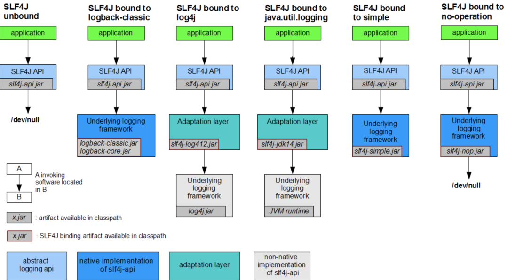
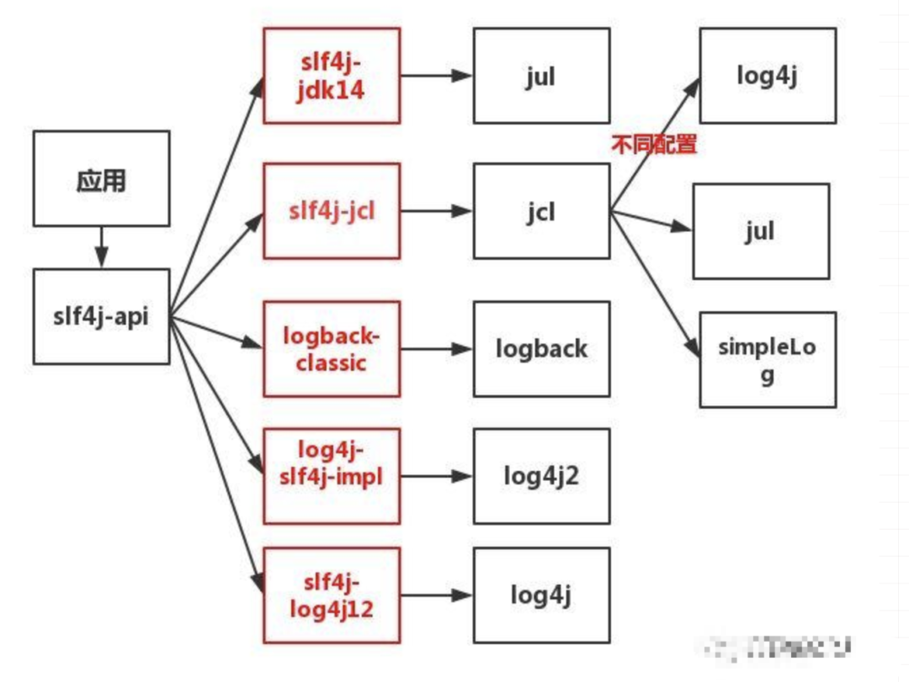
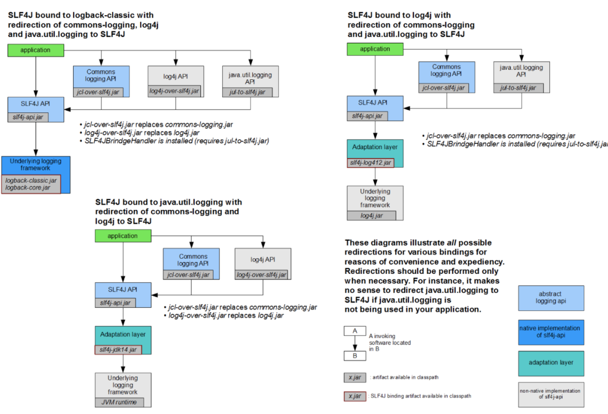
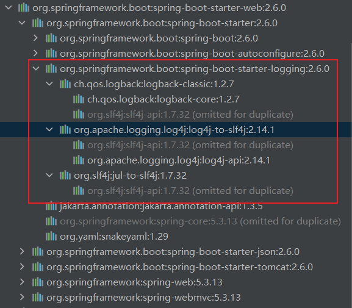
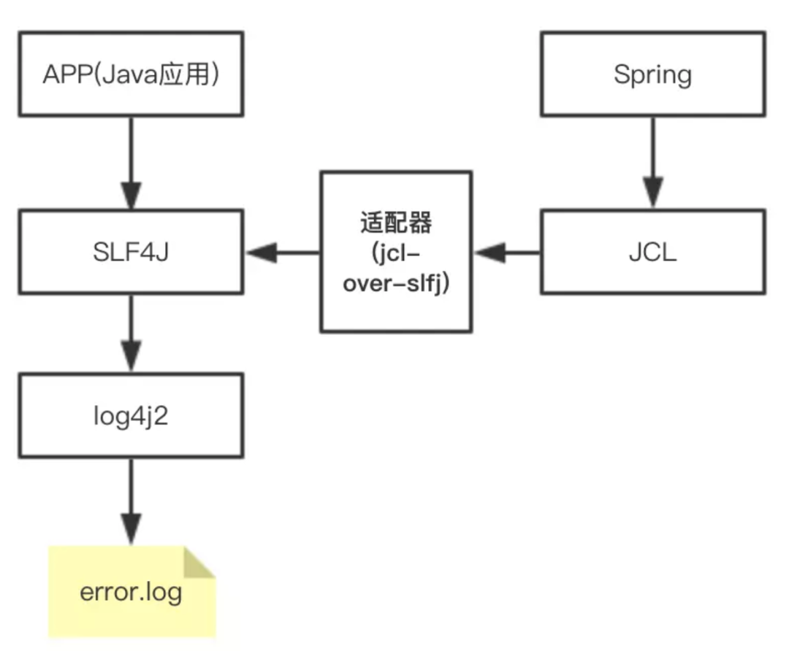
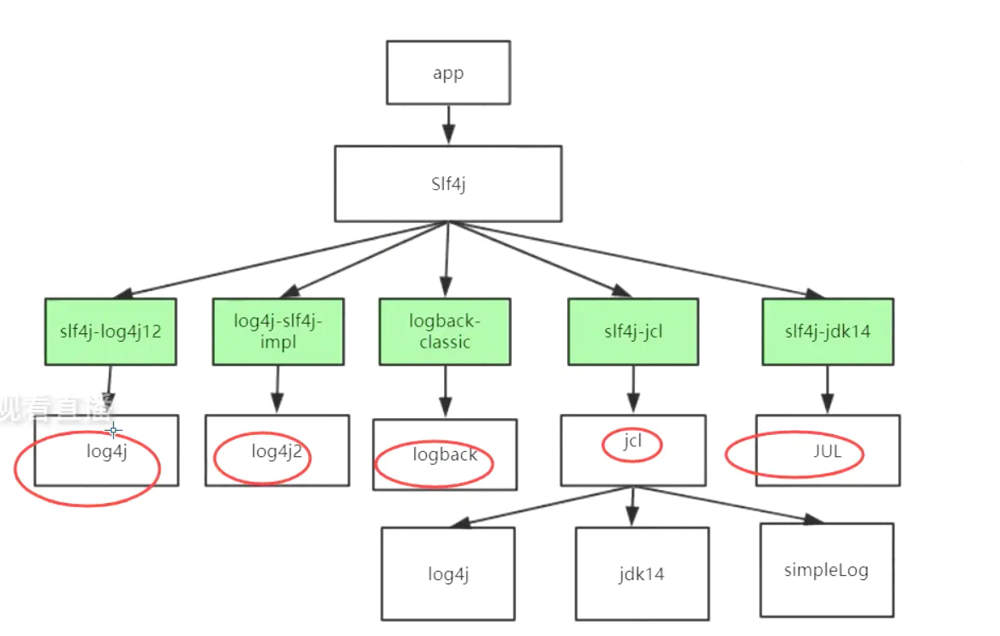

# 发展历史

参考来源来源：https://zhuanlan.zhihu.com/p/86249472

参考来源：https://blog.csdn.net/lixinkuan328/article/details/104113227

- **Java1.4之前**，JDK没有内置日志功能，只能通过再控制台上输出日志

```java
System.out.println();
System.err.println();
```

- **Ceki Gülcü开发了log4j**，并在Java社区得到广泛的使用，并成为了Apache的项目，此时是直接使用，没有啥日志门面。
- Apache要求把log4j并入到JDK，SUN公司拒绝，2004年，**Sun在JDK1.4中推出了自己的日志库J.U.L**(jdk-logging)。但基本上是模仿Log4j的实现。有点儿鸡肋，但最起码解决了有无的问题。
- **SimpleLog**，那时出现的另一款日志框架，也成为了Apache的项目

- 毕竟JUL是JDK自带的，因此JUL也有很多人用。同时还有其他日志组件，如SimpleLog等。这时如果有人想换成其他日志组件，如log4j换成JUL，因为api完全不同，就需要改动代码。
- 因为有了多种选择，所以导致了日志使用的混乱。所以**Apache推出了J.C.L(**Jakarta commons-logging)。它只是定义了一套日志接口，支持运行时动态加载[日志组件](https://www.zhihu.com/search?q=日志组件&search_source=Entity&hybrid_search_source=Entity&hybrid_search_extra={"sourceType"%3A"article"%2C"sourceId"%3A86249472})。应用层编写代码时，只需要使用J.C.L提供的统一接口来记录日志，在程序运行时会优先找系统是否集成Log4j，如果集成则使用Log4j做为日志实现，如果没找到则使用J.U.L做为日志实现。J.C.L的出现解决了多种日志框架共存的尴尬，也是面向接口编程思想的一种具体体现。
- 这样看上去也挺美好的，但是**log4j的作者觉得JCL不好用，自己开发出slf4j**，它跟JCL类似，本身不替供日志具体实现，只对外提供接口或门面。目的就是为了替代JCL。**同时，还开发出logback**，一个比log4j拥有更高性能的组件，目的是为了替代log4j。

- 2012年，**Apache参考了logback,并做了一系列优化，推出了log4j2**

  

# 日志框架的分类

参考来源：https://blog.csdn.net/lixinkuan328/article/details/104113227

## 门面型日志框架

- JCL：Apache基金会所属的项目，是一套Java日志接口，之前叫Jakarta Commons Logging，后更名为Commons Logging
- SLF4J：是一套简易Java日志门面，**本身并无日志的实现**。（Simple Logging Facade for Java，缩写Slf4j），推荐在项目代码中使用SLF4J，
  - SLF4J甚至可以和JCL进行结合，SLF4J作为门面，JCL作为中间商，再往下是具体的日志实现框架


**Java的日志体系太混乱了，还好有SLF4J这样的门面日志统一接管**


## 记录型日志框架

- JUL：JDK中的日志记录工具，也常称为JDKLog、jdk-logging，自Java1.4以来的官方日志实现。
- Log4j：一个具体的日志实现框架。
- Log4j2： 一个具体的日志实现框架，是LOG4J1的下一个版本，与Log4j 1发生了很大的变化，**Log4j2不兼容Log4j1**。
- Logback：一个具体的日志实现框架，和Slf4j是同一个作者，但其性能更好（**推荐使用**），而且也取代了log4j，但是Logback和Log4j2谁更好用，社区中还有争议。


# Slfj的适配

## 正向

因为当时Java的日志组件比较混乱繁杂，Ceki Gülcü推出slf4j后，也相应为行业中各个主流日志组件推出了slf4j的适配



图的意思为如果你想用slf4j作为日志门面的话，你如何去配合使用其他日志实现组件，这里说明一下（注意jar包名缺少了版本号，在找版本时也要注意版本之间是否兼容）

- slf4j + logback
  `slf4j-api.jar` + `logback-classic.jar` + `logback-core.jar`
- slf4j + log4j
  `slf4j-api.jar` + `slf4j-log4j12.jar` + `log4j.jar`
- slf4j + jul（jdk1.4开始加入）
  `slf4j-api.jar` + `slf4j-jdk14.jar` 
- 也可以只用slf4j无日志实现
  `slf4j-api.jar` + `slf4j-nop.jar`




## 反向

slf4j支持各种适配，无论你现在是用哪种日志组件，你都可以通过slf4j的适配器来使用上slf4j。

只要你切换到了slf4j，那么再通过slf4j用上实现组件，即上面说的。




其实总的来说，无论就是以下几种情况

- 你在用JCL
  使用`jcl-over-slf4j.jar`适配
- 你在用log4j
  使用`log4j-over-slf4j.jar`适配
- 你在用JUL
  使用`jul-to-slf4j.jar`适配

# SpringBoot中的日志

我们的 SpringBoot 程序都会加 spring-boot-starter 包, 而该包一个依赖项 spring-boot-starter-logging, 所以SpringBoot 程序不需要再显式增加 spring-boot-starter-logging 包依赖.



**最新版Springboot使用Slf4j作为日志门面，提供了logback(默认)、log4j2，jul这三个实现**




# 最佳实践

- **在项目代码中总是使用日志门面框架，而不是具体的日志实现框架**
- 只添加一个具体的日志实现框架
- 具体的日志实现框架依赖应该设置为 **optional**，并使用 **runtime scope**
  - 设为optional，依赖不会传递，这样如果你是个lib项目，然后别的项目使用了你这个lib，不会被引入不想要的Log Implementation 依赖；
  - Scope设置为runtime，是为了防止开发人员在项目中直接使用Log Implementation中的类，而不使用Log Facade中的类。
- 如果有必要, **排除依赖的第三方库中的Log Impementation依赖**
  - 这是很常见的一个问题，第三方库的开发者未必会把具体的日志实现或者桥接器的依赖设置为optional，然后你的项目继承了这些依赖——具体的日志实现未必是你想使用的，比如他依赖了Log4j，你想使用Logback，这时就很尴尬。另外，如果不同的第三方依赖使用了不同的桥接器和Log实现，也极容易形成环。
    这种情况下，推荐的处理方法，是使用exclude来排除所有的这些Log实现和桥接器的依赖，只保留第三方库里面对Log Facade的依赖。




阿里对代码中的日志规范：

【强制】应用中不可直接使用日志系统（Log4j、Logback）中的 API，而应依赖使用日志框架 **SLF4J** 中的 API，使用门面模式的日志框架，有利于维护和各个类的日志处理方式统一。
import org.slf4j.Logger;
import org.slf4j.LoggerFactory;
private static final Logger logger = LoggerFactory.getLogger(Abc.class);
