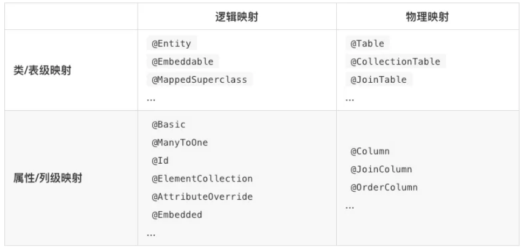
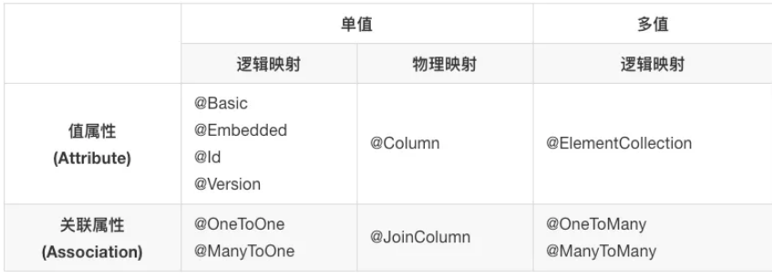

来源：[原创 | 使用JPA实现DDD持久化-O/R映射元数据：映射注解分组 (qq.com)](https://mp.weixin.qq.com/s?__biz=MjM5OTM0MjYxMw==&mid=2247484187&idx=1&sn=88ee9120bab08fa5cd9bfcaa2a74fd32&chksm=a73da461904a2d7759519896b3d54e6a6e20f95c274455d42c699f87e82f78d76f7a9f6149e9&cur_album_id=1452856605594320899&scene=189#rd)

## O/R映射元数据 

为了将实体、值对象以及它们的属性存储到数据库表和列，我们需要给`JPA`提供映射元数据。`JPA`实现框架使用我们提供的映射元数据，将实体和值对象的状态（属性值）持久化到指定的数据库表和列。

有两种形式的映射元数据：在持久化类（实体和值对象等）上添加的`Annotation`和独立存在的`XML`映射文件。至今为止`Annotation`是绝大多数人采用的映射方式。因此本教程只讲述`Annotation`形式的映射元数据。如果`Annotation`和`XML`两种映射元数据同时存在，`XML`优先。

映射元数据是`JPA`的重点，内容较多，下面分节讲述。

## 映射注解分组 

所有`Annotation`形式的映射元数据都位于`@javax.persistence`包里面，可以按两个正交的维度进行分组：

- 从`O/R`的维度，可划分为针对类的**逻辑注解**和针对数据库的**物理注解**;
- 从粒度维度，可划分为装对类/表的注解和针对属性/列的注解。

以上两个正交的维度将映射注解划分为四个象限，举例如下：

属性/列级的注解（包括逻辑注解和物理注解），又可以根据三个正交的维度进行分组：

- 从`O/R`的维度分组，可划分为针对类属性的**逻辑注解**和针对数据库列的**物理注解**；
- 从属性类型的维度分组，可划分针对值（简单值或值对象）类型属性的注解和针对关联（实体）类型属性的注解；
- 从属性基数的维度分组，可划分为针对单值类型属性的注解和针对多值（`List、Set、Map、Collection`、数组等）类型属性的注解。

以上三个正交的维度将属性/列级的映射注解划分为六个象限（多值属性没有对应的物理映射注解），举例如下：

