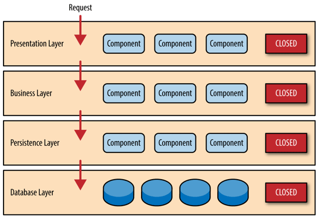

## 原始的分布式架构时代

## 单体架构时代

单体架构（Monolithic）

“单体”只是表明系统中主要的过程调用都是进程内调用，不会发生进程间通信，仅此而已。

分层架构（Layered Architecture），无论是单体还是微服务，抑或是其他架构风格，都会**对代码进行纵向层次划分**，收到的外部请求在各层之间以不同形式的数据结构进行流转传递，触及最末端的数据库后按相反的顺序回馈响应。对于这个意义上的“可拆分”，单体架构完全不会展露出丝毫的弱势，反而可能会因更容易开发、部署、测试而获得一些便捷性上的好处。

优点：更容易开发、部署、测试

缺点：拆分之后的**隔离与自治**能力上的欠缺，

## SOA架构时代

SOA 架构（Service-Oriented Architecture）

面向服务的架构是一次具体地、系统性地成功解决分布式服务主要问题的架构模式。

对大型的单体系统进行拆分，让每一个子系统都能独立地部署、运行、更新。

- [烟囱式架构](https://en.wikipedia.org/wiki/Information_silo)（Information Silo Architecture）：信息烟囱又名信息孤岛（Information Island）

  企业与部门的例子来说，两个部门真的完全不会发生任何交互

- 微内核架构（Microkernel Architecture）：微内核架构也被称为插件式架构（Plug-in Architecture）。

  具体的业务系统以插件模块（Plug-in Modules）的形式存在，这样也可提供可扩展的、灵活的、天然隔离的功能特性，即微内核架构

  

- [事件驱动架构](https://en.wikipedia.org/wiki/Event-driven_architecture)（Event-Driven Architecture）：为了能让子系统互相通信，一种可行的方案是在子系统之间建立一套事件队列管道

  

  

## 微服务时代

微服务架构（Microservices），微服务是一种通过**多个小型服务组合来构建单个应用的架构风格**，这些服务围绕业务能力而非特定的技术标准来构建。各个服务可以采用不同的编程语言，不同的数据存储技术，运行在不同的进程之中。服务采取轻量级的通信机制和自动化的部署机制实现通信与运维。

## 后微服务时代(云原生)

后微服务时代（Cloud Native）

从软件层面独力应对微服务架构问题，发展到软、硬一体，合力应对架构问题的时代，此即为“后微服务时代”。

虚拟化技术和容器化技术

传统 Spring Cloud 与 Kubernetes 提供的解决方案对比

|          | Kubernetes              | Spring Cloud          |
| -------- | ----------------------- | --------------------- |
| 弹性伸缩 | Autoscaling             | N/A                   |
| 服务发现 | KubeDNS / CoreDNS       | Spring Cloud Eureka   |
| 配置中心 | ConfigMap / Secret      | Spring Cloud Config   |
| 服务网关 | Ingress Controller      | Spring Cloud Zuul     |
| 负载均衡 | Load Balancer           | Spring Cloud Ribbon   |
| 服务安全 | RBAC API                | Spring Cloud Security |
| 跟踪监控 | Metrics API / Dashboard | Spring Cloud Turbine  |
| 降级熔断 | N/A                     | Spring Cloud Hystrix  |

## 无服务时代

无服务架构（Serverless）

如果说微服务架构是分布式系统这条路的极致，那无服务架构，也许就是“**不分布式**”的云端系统这条路的起点。

后端设施（Backend）和函数（Function）

- **后端设施**是指数据库、消息队列、日志、存储，等等这一类用于支撑业务逻辑运行，但本身无业务含义的技术组件，这些后端设施都运行在云中，无服务中称其为“后端即服务”（Backend as a Service，BaaS）。
- **函数**是指业务逻辑代码，这里函数的概念与粒度，都已经很接近于程序编码角度的函数了，其区别是无服务中的函数运行在云端，不必考虑算力问题，不必考虑容量规划（从技术角度可以不考虑，从计费的角度你的钱包够不够用还是要掂量一下的），无服务中称其为“函数即服务”（Function as a Service，FaaS）。

无服务的愿景是让开发者只需要纯粹地关注业务，不需要考虑技术组件，后端的技术组件是现成的，可以直接取用，没有采购、版权和选型的烦恼；不需要考虑如何部署，部署过程完全是托管到云端的，工作由云端自动完成；不需要考虑算力，有整个数据中心支撑，算力可以认为是无限的；也不需要操心运维，维护系统持续平稳运行是云计算服务商的责任而不再是开发者的责任。