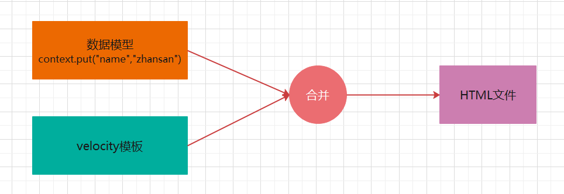
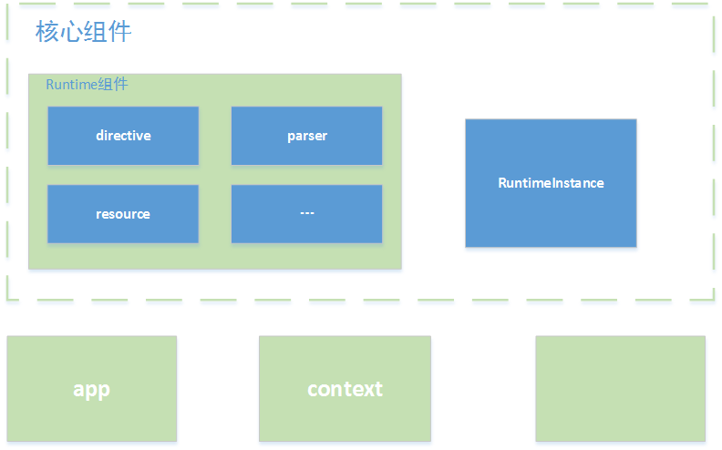
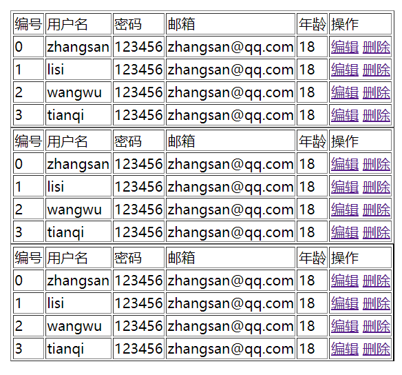
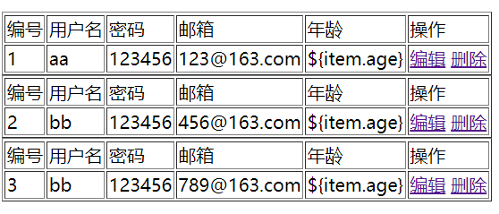

# 简介

Velocity是一个基于Java的模板引擎，可以通过特定的语法获取在java对象的数据 , 填充到模板中，从而实现界面和java代码的分离!



应用场景

- Web应用程序 : 作为为应用程序的视图, 展示数据。
- 源代码生成 : Velocity可用于基于模板生成Java源代码
- 自动电子邮件 : 网站注册 , 认证等的电子邮件模板
- 网页静态化 : 基于velocity模板 , 生成静态网页

velocity 组成结构



Velocity主要分为app、context、runtime和一些辅助util几个部分。

- app模块 : 主要封装了一些接口 , 暴露给使用者使用。主要有两个类，分别是Velocity(单例)和VelocityEngine。
- Context模块 : 主要封装了模板渲染需要的变量
- Runtime模块 : 整个Velocity的核心模块，Runtime模块会将加载的模板解析成语法树，Velocity调用mergeTemplate方法时会渲染整棵树，并输出最终的渲染结果。
- RuntimeInstance类为整个Velocity渲染提供了一个单例模式，拿到了这个实例就可以完成渲染过程了。

# 快速入门

## 需求分析

使用velocity定义html模板 , 将动态数据填充到模板中 , 形成一个完整的html页面

## 步骤分析

1. 创建项目(maven)
2. 引入依赖
3. 定义模板
4. 输出html

## 代码实现

```xml
<dependency>
  <groupId>org.apache.velocity</groupId>
  <artifactId>velocity-engine-core</artifactId>
  <version>2.3</version>
</dependency>
```

在resources目录下新建：vms/01-quickstart.vm

```html
<!DOCTYPE html>
<html lang="en">
<head>
    <meta charset="UTF-8">
    <title>Title</title>
</head>
<body>
hello,${name}!
</body>
</html>
```

写个单元测试

```java
import org.apache.velocity.Template;
import org.apache.velocity.VelocityContext;
import org.apache.velocity.app.Velocity;
import org.junit.jupiter.api.Test;

import java.io.FileWriter;
import java.io.IOException;
import java.util.Properties;

public class VelocityTest {
    @Test
    void test01() throws IOException {
        //1.设置 velocity 的资源加载器
        Properties properties = new Properties();
        properties.put("file.resource.loader.class", "org.apache.velocity.runtime.resource.loader.ClasspathResourceLoader");
        //2.初始化 velocity 引擎
        Velocity.init(properties);
        //3.创建 velocity 容器
        VelocityContext context = new VelocityContext();
        context.put("name", "zhangsan");
        //4.加载 velocity 模板文件
        Template template = Velocity.getTemplate("vms/01-quickstart.vm", "utf-8");
        //5.合并数据到模板
        FileWriter fw = new FileWriter("E:\\JavaEE\\spring-study\\模板引擎\\velocity\\velocity01\\src\\main\\resources\\html\\01-quickstart.html");
        template.merge(context,fw);
        //6.释放资源
        fw.close();
    }
}
```

结果：在resources/html目录下生成了01-quickstart.html

```html
<!DOCTYPE html>
<html lang="en">
<head>
    <meta charset="UTF-8">
    <title>Title</title>
</head>
<body>
hello,zhangsan!
</body>
</html>
```

# 基础语法

## VTL介绍

Velocity Template Language (VTL) , 是Velocity 中提供的一种模版语言 , 旨在提供最简单和最干净的方法来将动态内容合并到网页中。简单来说VTL可以将程序中的动态数展示到网页中

VTL的语句分为4大类：**注释** , **非解析内容  ,引用和指令**。

## VTL注释

**1. 行注释**

```
## 行注释内容
```

**2. 块注释**

```
#*
块注释内容1
块注释内容2
*#
```

**3. 文档注释**

```
#**
文档注释内容1
文档注释内容2
*#
```

## 非解析内容

所谓非解析内容也就是不会被引擎解析的内容。

```
#[[
非解析内容1
非解析内容2 
]]#
```


```html
<!DOCTYPE html>
<html lang="en">
<head>
    <meta charset="UTF-8">
    <title>Title</title>
</head>
<body>

hello,${name}!
<h1>非解析内容</h1>
#[[
${name}
非解析内容1
非解析内容2
]]#
</body>
</html>
```

输出：

```html
<!DOCTYPE html>
<html lang="en">
<head>
    <meta charset="UTF-8">
    <title>Title</title>
</head>
<body>


hello,zhangsan!
<h1>非解析内容</h1>

${name}
非解析内容1
非解析内容2

</body>
</html>
```

## 引用

### 变量引用

引用语句就是对引擎上下文对象中的属性进行操作。语法方面分为常规语法(`$属性`)和正规语法(${属性})。

```
$变量名, 若上下文中没有对应的变量，则输出字符串"$变量名"
${变量名},若上下文中没有对应的变量，则输出字符串"${变量名}" 
$!变量名, 若上下文中没有对应的变量，则输出空字符串"" 
$!{变量名}, 若上下文中没有对应的变量，则输出空字符串""
```

```html
<!DOCTYPE html>
<html lang="en">
<head>
    <meta charset="UTF-8">
    <title>Title</title>
</head>
<body>
<h1>引用变量</h1>
常规语法 : $name
正规语法 : ${name}
## 如果获取的变量不存在, 表达式会原样展示 , 如果不想展示 , 可以使用 $!变量名
## 以下写法的含义代表么如果有变量, 那么获取变量值展示, 没有变量展示""
常规语法 : $!name
正规语法 : $!{name}
</body>
</html>
```


### 属性引用

```
$变量名.属性, 	若上下文中没有对应的变量，则输出字符串"$变量名.属性"
${变量名.属性}	若上下文中没有对应的变量，则输出字符串"${变量名.属性}"
$!变量名.属性	若上下文中没有对应的变量，则输出字符串""
$!{变量名.属性}	若上下文中没有对应的变量，则输出字符串""
```

```java
@Test
void test03() throws IOException {
    //1.设置 velocity 的资源加载器
    Properties properties = new Properties();
    properties.put("file.resource.loader.class", "org.apache.velocity.runtime.resource.loader.ClasspathResourceLoader");
    //2.初始化 velocity 引擎
    Velocity.init(properties);
    //3.创建 velocity 容器
    VelocityContext context = new VelocityContext();
    User user = new User();
    user.setUsername("zhangsan");
    user.setPassword("123456");
    user.setEmail("zhangsan@163.com");
    context.put("user", user);
    //4.加载 velocity 模板文件
    Template template = Velocity.getTemplate("vms/03-cite-field.vm", "utf-8");
    //5.合并数据到模板
    FileWriter fw = new FileWriter("E:\\JavaEE\\spring-study\\模板引擎\\velocity\\velocity01\\src\\main\\resources\\html\\03-cite-field.html");
    template.merge(context,fw);
    //6.释放资源
    fw.close();
}
```

```html
<!DOCTYPE html>
<html lang="en">
<head>
    <meta charset="UTF-8">
    <title>Title</title>
</head>
<body>
<h1>引用对象</h1>
常规语法 : $user.username ---- $user.password ---- $user.email
正规语法 : ${user.username} ---- ${user.password} ---- ${user.email}

常规语法 : $!user.username ---- $!user.password ---- $!user.email
正规语法 : $!{user.username} ---- $!{user.password} ---- $!{user.email}
</body>
</html>
```

生成：

```html
<!DOCTYPE html>
<html lang="en">
<head>
    <meta charset="UTF-8">
    <title>Title</title>
</head>
<body>
<h1>引用对象</h1>
常规语法 : zhangsan ---- 123456 ---- zhangsan@163.com
正规语法 : zhangsan ---- 123456 ---- zhangsan@163.com

常规语法 : zhangsan ---- 123456 ---- zhangsan@163.com
正规语法 : zhangsan ---- 123456 ---- zhangsan@163.com
</body>
</html>
```

### 方法引用

方法引用实际就是指方法调用操作，关注点**返回值**和**参数** , 方法的返回值将输出到最终结果中

```
$变量名.方法([入参1[, 入参2]*]?), 常规写法
${变量名.方法([入参1[, 入参2]*]?)}, 正规写法

$!变量名.方法([入参1[, 入参2]*]?), 常规写法
$!{变量名.方法([入参1[, 入参2]*]?)}, 正规写法
```

```java
@Test
void test04() throws IOException {
    //1.设置 velocity 的资源加载器
    Properties properties = new Properties();
    properties.put("file.resource.loader.class", "org.apache.velocity.runtime.resource.loader.ClasspathResourceLoader");
    //2.初始化 velocity 引擎
    Velocity.init(properties);
    //3.创建 velocity 容器
    VelocityContext context = new VelocityContext();
    context.put("str", "hello world velocity!");
    context.put("now", new Date());
    //4.加载 velocity 模板文件
    Template template = Velocity.getTemplate("vms/04-cite-method.vm", "utf-8");
    //5.合并数据到模板
    FileWriter fw = new FileWriter("E:\\JavaEE\\spring-study\\模板引擎\\velocity\\velocity01\\src\\main\\resources\\html\\04-cite-method.html");
    template.merge(context,fw);
    //6.释放资源
    fw.close();
}
```

```html
<!DOCTYPE html>
<html lang="en">
<head>
    <meta charset="UTF-8">
    <title>Title</title>
</head>
<body>
<h1>引用方法</h1>
常规语法 : $str.split(" ") ---- $now.getTime()
正规语法 : ${str} ---- ${now}
调用失败的情况：原样展示
常规语法 : $str.split1(" ") ---- $now.getTime1()
正规语法 : ${str.split1(" ")} ---- ${now.getTime1()}
调用失败的情况：空字符串
常规语法 : $!str.split1(" ") ---- $!now.getTime1()
正规语法 : $!{str.split1(" ")} ---- $!{now.getTime1()}
</body>
</html>
```

输出：

```html
<!DOCTYPE html>
<html lang="en">
<head>
    <meta charset="UTF-8">
    <title>Title</title>
</head>
<body>
<h1>引用方法</h1>
常规语法 : [hello, world, velocity!] ---- 1641196101493
正规语法 : hello world velocity! ---- Mon Jan 03 15:48:21 CST 2022
调用失败的情况：原样展示
常规语法 : $str.split1(" ") ---- $now.getTime1()
正规语法 : ${str.split1(" ")} ---- ${now.getTime1()}
调用失败的情况：空字符串
常规语法 :  ---- 
正规语法 :  ---- 
</body>
</html>
```

## 指令

指令主要用于定义重用模块、引入外部资源、流程控制。指令以 `#` 作为起始字符。

### 流程控制

#### #set

**作用 :** 在页面中声明定义变量

**语法：** `#set($变量 = 值)`

**示例 :**


```java
@Test
void test05() throws IOException {
    //1.设置 velocity 的资源加载器
    Properties properties = new Properties();
    properties.put("file.resource.loader.class", "org.apache.velocity.runtime.resource.loader.ClasspathResourceLoader");
    //2.初始化 velocity 引擎
    Velocity.init(properties);
    //3.创建 velocity 容器
    VelocityContext context = new VelocityContext();
    context.put("str", "hello world velocity!");
    context.put("now", new Date());
    //4.加载 velocity 模板文件
    Template template = Velocity.getTemplate("vms/05-instructions-set.vm", "utf-8");
    //5.合并数据到模板
    FileWriter fw = new FileWriter("E:\\JavaEE\\spring-study\\模板引擎\\velocity\\velocity01\\src\\main\\resources\\html\\05-instructions-set.html");
    template.merge(context,fw);
    //6.释放资源
    fw.close();
}
```

```html
<!DOCTYPE html>
<html lang="en">
<head>
    <meta charset="UTF-8">
    <title>Title</title>
</head>
<body>
<h1>set指令</h1>
#set($str="hello world")
#set($int=10)
#set($arr=[1,2,3,4])
#set($boolean=true)
#set($map={"key1":"value1","key2":"value2","key3":"value13"})
## 在声明数据的时候，可以引用之前定义过的变量
#set($name="zhangsan")
#set($str2="hello, how are you, $name !")
##获取set指令定义的变量
字符串：${str}
整型：${int}
数组：${arr}
布尔：${boolean}
map:${map.key1}--${map.key2}
${str2}

</body>
</html>
```

输出：

```html
<!DOCTYPE html>
<html lang="en">
<head>
    <meta charset="UTF-8">
    <title>Title</title>
</head>
<body>
<h1>set指令</h1>
字符串：hello world
整型：10
数组：[1, 2, 3, 4]
布尔：true
map:value1--value2
hello, how are you, zhangsan !

</body>
</html>
```


#### #if/#elseif/#else

**作用 :** 进行逻辑判断

**语法 :**

```
#if(判断条件)
  .........
#elseif(判断条件)
  .........
#else
  .........
#end 
```

```java
@Test
void test06() throws IOException {
    //1.设置 velocity 的资源加载器
    Properties properties = new Properties();
    properties.put("file.resource.loader.class", "org.apache.velocity.runtime.resource.loader.ClasspathResourceLoader");
    //2.初始化 velocity 引擎
    Velocity.init(properties);
    //3.创建 velocity 容器
    VelocityContext context = new VelocityContext();
    context.put("str", "hello world velocity!");
    context.put("now", new Date());
    //4.加载 velocity 模板文件
    Template template = Velocity.getTemplate("vms/06-instructions-if.vm", "utf-8");
    //5.合并数据到模板
    FileWriter fw = new FileWriter("E:\\JavaEE\\spring-study\\模板引擎\\velocity\\velocity01\\src\\main\\resources\\html\\06-instructions-if.html");
    template.merge(context,fw);
    //6.释放资源
    fw.close();
}
```

```html
<!DOCTYPE html>
<html lang="en">
<head>
    <meta charset="UTF-8">
    <title>Title</title>
</head>
<body>
<h1>if指令</h1>
#set($language="PHP")
#if($language.equals("JAVA"))
java开发工程师
#elseif($language.equals("PHP"))
php开发工程师
#else
开发工程师
#end

</body>
</html>
```

```html
<!DOCTYPE html>
<html lang="en">
<head>
    <meta charset="UTF-8">
    <title>Title</title>
</head>
<body>
<h1>if指令</h1>
php开发工程师

</body>
</html>
```

#### #foreach

**作用 :** 遍历循环数组或者集合

**格式：**

```
#foreach($item in $items)
    ..........
    [#break]
#end
```


```
> - $items : 需要遍历的对象或者集合
>   - 如果items的类型为map集合, 那么遍历的是map的value
> - $item : 变量名称, 代表遍历的每一项 
> - #break : 退出循环
> - 内置属性 : 
>   - $foreach.index  : 获取遍历的索引 , 从0开始
>   - $foreach.count : 获取遍历的次数 , 从1开始
```


```java
@Test
void test07() throws IOException {
    //1.设置 velocity 的资源加载器
    Properties properties = new Properties();
    properties.put("file.resource.loader.class", "org.apache.velocity.runtime.resource.loader.ClasspathResourceLoader");
    //2.初始化 velocity 引擎
    Velocity.init(properties);
    //3.创建 velocity 容器
    VelocityContext context = new VelocityContext();


    String[] hobbies = {"eat", "drink", "play", "happy"};
    context.put("hobbies", hobbies);

    List<User> users = new ArrayList<>();
    users.add(new User("aa","123456","123@163.com"));
    users.add(new User("bb","123456","456@163.com"));
    users.add(new User("bb","123456","789@163.com"));
    context.put("userList", users);

    Map<String, Object> map = new HashMap<>();
    map.put("key1", "value1");
    map.put("key2", "value2");
    map.put("key3", "value3");
    map.put("key4", "value4");
    context.put("map", map);

    //4.加载 velocity 模板文件
    Template template = Velocity.getTemplate("vms/07-instructions-foreach.vm", "utf-8");
    //5.合并数据到模板
    FileWriter fw = new FileWriter("E:\\JavaEE\\spring-study\\模板引擎\\velocity\\velocity01\\src\\main\\resources\\html\\07-instructions-foreach.html");
    template.merge(context,fw);
    //6.释放资源
    fw.close();
}
```


```html
<!DOCTYPE html>
<html lang="en">
<head>
    <meta charset="UTF-8">
    <title>Title</title>
</head>
<body>
<h1>遍历数组</h1>
  #foreach($str in $hobbies)
    ${foreach.index} -- ${str}  <br>
  #end

<h1>变量对象集合</h1>

  #foreach($user in $users)

  #end
<table>
    <tbody>
    <tr>
        <td>编号</td>
        <td>用户名</td>
        <td>密码</td>
        <td>邮箱</td>
        <td>年龄</td>
        <td>操作</td>
    </tr>
    <tr>
        <td>${foreach.index}</td>
        <td>${user.username}</td>
        <td>${user.password}</td>
        <td>${user.email}</td>
        <td>${user.age}</td>
        <td>
            <a href="">编辑</a>
            <a href="">删除</a>
        </td>
    </tr>
    </tbody>
</table>

<h1>遍历map集合</h1>
<h2>遍历值</h2>
  #foreach($value in $map)
    $value
  #end

<h2>遍历键值对</h2>
  #foreach($entry in $map.entrySet())
    $entry.key -- $entry.value
  #end
</body>
</html>
```

输出：

```html
<!DOCTYPE html>
<html lang="en">
<head>
    <meta charset="UTF-8">
    <title>Title</title>
</head>
<body>
<h1>遍历数组</h1>
    0 -- eat  <br>
    1 -- drink  <br>
    2 -- play  <br>
    3 -- happy  <br>

<h1>变量对象集合</h1>

<table>
    <tbody>
    <tr>
        <td>编号</td>
        <td>用户名</td>
        <td>密码</td>
        <td>邮箱</td>
        <td>年龄</td>
        <td>操作</td>
    </tr>
    <tr>
        <td>${foreach.index}</td>
        <td>${user.username}</td>
        <td>${user.password}</td>
        <td>${user.email}</td>
        <td>${user.age}</td>
        <td>
            <a href="">编辑</a>
            <a href="">删除</a>
        </td>
    </tr>
    </tbody>
</table>

<h1>遍历map集合</h1>
<h2>遍历值</h2>
    value1
    value2
    value3
    value4

<h2>遍历键值对</h2>
    key1 -- value1
    key2 -- value2
    key3 -- value3
    key4 -- value4
</body>
</html>
```

### 引入资源

#### #include

**作用 :** 引入外部资源 , 引入的资源不会被引擎所解析

**语法 :** `#include(resource)`

> - resource可以为**单引号或双引号的字符串**，也可以为**$变量**，内容为外部资源路径。
> - 注意 : 路径如果为相对路径，则以引擎配置的文件加载器加载路径作为参考


```html
<!DOCTYPE html>
<html lang="en">
<head>
    <meta charset="UTF-8">
    <title>Title</title>
</head>
<body>
#include("/vms/01-quickstart.vm")
</body>
</html>
```

输出：

```html
<!DOCTYPE html>
<html lang="en">
<head>
    <meta charset="UTF-8">
    <title>Title</title>
</head>
<body>
<!DOCTYPE html>
<html lang="en">
<head>
    <meta charset="UTF-8">
    <title>Title</title>
</head>
<body>
## 这是单行注释，注释的内燃不会被输出
#*
这是多行注释
 *#
#**
 * 这是文档注释
 *#
hello,${name}!
<h1>非解析内容</h1>
#[[
${name}
非解析内容1
非解析内容2
]]#
</body>
</html></body>
</html>
```

#### #parse

**作用 :** 引入外部资源 , 引入的资源将被引擎所解析

**语法 :** `#parse(resource)`

> - resource可以为**单引号或双引号的字符串**，也可以为**$变量**，内容为外部资源路径。
> - 注意 : 路径如果为相对路径，则以引擎配置的文件加载器加载路径作为参考系


```html
<!DOCTYPE html>
<html lang="en">
<head>
    <meta charset="UTF-8">
    <title>Title</title>
</head>
<body>
#parse("/vms/01-quickstart.vm")
</body>
</html>
```

输出：

```html
<!DOCTYPE html>
<html lang="en">
<head>
    <meta charset="UTF-8">
    <title>Title</title>
</head>
<body>
<!DOCTYPE html>
<html lang="en">
<head>
    <meta charset="UTF-8">
    <title>Title</title>
</head>
<body>


hello,zhangsan!
<h1>非解析内容</h1>

${name}
非解析内容1
非解析内容2

</body>
</html></body>
</html>
```

#### #define

**作用 :** `定义重用模块（不带参数）`

**语法 :**

```
#define($模块名称)
	模块内容
#end
```

```html
<!DOCTYPE html>
<html lang="en">
<head>
    <meta charset="UTF-8">
    <title>Title</title>
</head>
<body>
<h1>定义模块</h1>
    #define($table)
    <table border="1px" align="center">
        <tbody><tr>
            <td>编号</td>
            <td>用户名</td>
            <td>密码</td>
            <td>邮箱</td>
            <td>年龄</td>
            <td>操作</td>
        </tr>
        <tr>
            <td>0</td>
            <td>zhangsan</td>
            <td>123456</td>
            <td>zhangsan@qq.com</td>
            <td>18</td>
            <td>
                <a href="">编辑</a>
                <a href="">删除</a>
            </td>
        </tr>
        <tr>
            <td>1</td>
            <td>lisi</td>
            <td>123456</td>
            <td>zhangsan@qq.com</td>
            <td>18</td>
            <td>
                <a href="">编辑</a>
                <a href="">删除</a>
            </td>
        </tr>
        <tr>
            <td>2</td>
            <td>wangwu</td>
            <td>123456</td>
            <td>zhangsan@qq.com</td>
            <td>18</td>
            <td>
                <a href="">编辑</a>
                <a href="">删除</a>
            </td>
        </tr>
        <tr>
            <td>3</td>
            <td>tianqi</td>
            <td>123456</td>
            <td>zhangsan@qq.com</td>
            <td>18</td>
            <td>
                <a href="">编辑</a>
                <a href="">删除</a>
            </td>
        </tr>
        </tbody></table>
    #end

<h1>使用模块</h1>
    $table
    $table
    $table

</body>
</html>
```

结果：



#### #evaluate

**作用 :** 动态计算 , 动态计算可以让我们在字符串中使用变量

**语法 :** `#evalute("计算语句")`

**示例 :**

```java
@Test
void test11() throws IOException {
  //1.设置 velocity 的资源加载器
  Properties properties = new Properties();
  properties.put("file.resource.loader.class", "org.apache.velocity.runtime.resource.loader.ClasspathResourceLoader");
  //2.初始化 velocity 引擎
  Velocity.init(properties);
  //3.创建 velocity 容器
  VelocityContext context = new VelocityContext();
  context.put("code", "#set($language=\"PHP\") #if($language.equals(\"JAVA\")) java开发工程师 #elseif($language.equals(\"PHP\")) php开发工程师 #else 开发工程师 #end\n");
  //4.加载 velocity 模板文件
  Template template = Velocity.getTemplate("vms/11-reference-evaluate.vm", "utf-8");
  //5.合并数据到模板
  FileWriter fw = new FileWriter("E:\\JavaEE\\spring-study\\模板引擎\\velocity\\velocity01\\src\\main\\resources\\html\\11-reference-evaluate.html");
  template.merge(context,fw);
  //6.释放资源
  fw.close();
}
```

```html
<!DOCTYPE html>
<html lang="en">
<head>
    <meta charset="UTF-8">
    <title>Title</title>
</head>
<body>
<h1>动态计算</h1>
#set($name = "over")
#evaluate("#if($name=='over') over  #else  not over #end")
#if($name=='over')
over
#else
not over
#end
#evaluate($code)
</body>
</html>
```

输出

```html
<!DOCTYPE html>
<html lang="en">
<head>
    <meta charset="UTF-8">
    <title>Title</title>
</head>
<body>
<h1>动态计算</h1>
 over  over
  php开发工程师 
</body>
</html>
```

### 宏指令

**作用 :** 定义重用模块（可带参数）

**语法 :**

定义语法

```
#macro(宏名 [$arg]?)
   .....
#end
```

调用语法

```
#宏名([$arg]?)
```

```java
@Test
void test12() throws IOException {
    //1.设置 velocity 的资源加载器
    Properties properties = new Properties();
    properties.put("file.resource.loader.class", "org.apache.velocity.runtime.resource.loader.ClasspathResourceLoader");
    //2.初始化 velocity 引擎
    Velocity.init(properties);
    //3.创建 velocity 容器
    VelocityContext context = new VelocityContext();
    List<User> users = new ArrayList<>();
    users.add(new User("aa","123456","123@163.com"));
    users.add(new User("bb","123456","456@163.com"));
    users.add(new User("bb","123456","789@163.com"));
    context.put("users", users);
    //4.加载 velocity 模板文件
    Template template = Velocity.getTemplate("vms/12-macro.vm", "utf-8");
    //5.合并数据到模板
    FileWriter fw = new FileWriter("E:\\JavaEE\\spring-study\\模板引擎\\velocity\\velocity01\\src\\main\\resources\\html\\12-macro.html");
    template.merge(context,fw);
    //6.释放资源
    fw.close();
}
```


```html
<!DOCTYPE html>
<html lang="en">
<head>
    <meta charset="UTF-8">
    <title>Title</title>
</head>
<body>
<h1>定义宏</h1>
  #macro(table $list)
    #foreach($item in $list)
    <table border="1px">
        <tbody>
        <tr>
            <td>编号</td>
            <td>用户名</td>
            <td>密码</td>
            <td>邮箱</td>
            <td>年龄</td>
            <td>操作</td>
        </tr>
        <tr>
            <td>${foreach.count}</td>
            <td>${item.username}</td>
            <td>${item.password}</td>
            <td>${item.email}</td>
            <td>${item.age}</td>
            <td>
                <a href="">编辑</a>
                <a href="">删除</a>
            </td>
        </tr>
        </tbody>
    </table>
    #end

  #end

<h1>调用宏</h1>
  #table($users)
</body>
</html>
```

结果：



# 综合案例

## 需求分析

在实际项目开发过程中, 编写基础的CRUD操作代码, 往往会花费我们大量的时间 , 而且这些CRUD代码的基础结构基本上是固定的 , 如果能有一个代码生成器 , 能够帮助我们把这些代码生成出来 , 我们就可以节省出大量的时间关注核心业务代码的开发, 大大提高了我们的开发效率 !

需求 : 使用velocity实现一个简单的代码生成器 , 生成项目开发过程中的基础CRUD代码

## 步骤分析

1. 创建项目
2. 导入依赖
3. 编写模板
4. 生成代码

## 代码实现

```xml
<dependency>
  <groupId>org.apache.velocity</groupId>
  <artifactId>velocity-engine-core</artifactId>
  <version>2.3</version>
</dependency>
```

一般我们的项目开发将项目分为三层 , 我们的代码生成器就基于传统的三层架构生成代码 , 所以我们需要为每一层的每一个类创建模板 , 所以需要有如下模板 :

- Controller.java.vm : 控制层模板
- Service.java.vm : 业务层接口模板
- ServiceImpl.java.vm : 业务层实现模板
- Dao.java.vm : 数据服务层模板(数据访问层基于通用Mpper实现)

### Controller.java.vm

```java
package ${package}.controller;

import ${package}.pojo.${className};
import ${package}.service.${className}Service;
import ${package}.utils.Result;
import org.springframework.beans.factory.annotation.Autowired;
import org.springframework.web.bind.annotation.RequestBody;
import org.springframework.web.bind.annotation.RequestMapping;
import org.springframework.web.bind.annotation.RequestParam;
import org.springframework.web.bind.annotation.RestController;

import java.util.List;
import java.util.Map;

@RestController
@RequestMapping("/${classname}")
public class ${className}Controller {

    @Autowired
    private ${className}Service ${classname}Service ;


    /**
     * 查询列表
     * @return
     */
    @RequestMapping("/list")
    public Result list(){
        List<${className}>  ${classname}s = null;
        try {
                ${classname}s = ${classname}Service.list();
            return Result.ok(${classname}s);
        } catch (Exception e) {
            e.printStackTrace();
            return Result.error("查询数据异常");
        }
    }

    /**
     * 保存
     * @param ${classname}
     * @return
     */
    @RequestMapping("/save")
    public Result save(@RequestBody ${className} ${classname}){
        try {
                ${classname}Service.save(${classname});
            return Result.ok("新增数据成功");
        } catch (Exception e) {
            e.printStackTrace();
            return Result.error("新增数据异常");
        }
    }

    /**
     * 更新
     * @param ${classname}
     * @return
     */
    @RequestMapping("/update")
    public Result update(@RequestBody ${className} ${classname}){
        try {
                ${classname}Service.update(${classname});
            return Result.ok("修改数据成功");
        } catch (Exception e) {
            e.printStackTrace();
            return Result.error("修改数据异常");
        }
    }

    /**
     * 删除
     * @param ids
     * @return
     */
    @RequestMapping("/delete")
    public Result delete(@RequestBody Integer[] ids){
        try {
                ${classname}Service.delete(ids);
            return Result.ok("删除数据成功");
        } catch (Exception e) {
            e.printStackTrace();
            return Result.error("删除数据异常");
        }
    }
}
```

### Service.java.vm

```java
package ${package}.service;

import com.itheima.pojo.${className};

import java.util.List;
import java.util.Map;

public interface ${className}Service {

    /**
     * 查询数据列表
     * @return
     */
    List<${className}> list();

    /**
     * 保存数据
     * @param ${classname}
     */
    void save(${className} ${classname});

    /**
     * 更新数据
     * @param ${classname}
     */
    void update(${className} ${classname});

    /**
     * 删除数据
     * @param ids
     */
    void delete(Integer[] ids);
}

```

#### ServiceImpl.java.vm

```java
package ${package}.service.impl;

import ${package}.dao.${className}Dao;
import ${package}.pojo.${className};
import ${package}.service.${className}Service;
import org.springframework.beans.factory.annotation.Autowired;

import java.util.Arrays;
import java.util.List;
import java.util.stream.Stream;

public class ${className}ServiceImpl  implements ${className}Service {

    @Autowired
    private ${className}Dao ${classname}Dao ;

    public List<${className}> list() {
        return ${classname}Dao.selectAll();
    }

    public void save(${className} ${classname}) {
            ${classname}Dao.insert(${classname});
    }

    public void update(${className} ${classname}) {
            ${classname}Dao.updateByPrimaryKey(${classname});
    }

    public void delete(Integer[] ids) {
        Stream.of(ids).forEach(${classname}Dao::deleteByPrimaryKey);
    }
}

```

### Dao.java.vm

```java
package ${package}.dao;

import ${package}.pojo.${className};
import tk.mybatis.mapper.common.Mapper;

public interface ${className}Dao extends Mapper<${className}> {
}

```

### 生成代码

我们可以封装一个生成代码的工具类 , 后期生成代码运行工具类即可

```java
package com.potato.velocity02;

import org.apache.commons.io.IOUtils;
import org.apache.commons.lang3.StringUtils;
import org.apache.velocity.Template;
import org.apache.velocity.VelocityContext;
import org.apache.velocity.app.Velocity;
import org.apache.commons.lang3.*;
import java.io.File;
import java.io.IOException;
import java.io.StringWriter;
import java.util.ArrayList;
import java.util.List;
import java.util.Map;
import java.util.Properties;
import java.util.zip.ZipEntry;
import java.util.zip.ZipOutputStream;

/**
 * 代码生成器   工具类
 */
public class GenUtils {

    private static String currentTableName;

    public static List<String> getTemplates() {
        List<String> templates = new ArrayList<String>();
        templates.add("vms/Controller.java.vm");
        templates.add("vms/Service.java.vm");
        templates.add("vms/ServiceImpl.java.vm");
        templates.add("vms/Dao.java.vm");

        return templates;
    }


    /**
     * 生成代码
     */
    public static void generatorCode(Map<String, Object> data, List<String> templates, ZipOutputStream zip) {

        //设置velocity资源加载器
        Properties prop = new Properties();
        prop.put("file.resource.loader.class", "org.apache.velocity.runtime.resource.loader.ClasspathResourceLoader");
        Velocity.init(prop);

        //封装模板数据
        VelocityContext context = new VelocityContext(data);

        //获取模板列表
        for (String template : templates) {
            //渲染模板
            StringWriter sw = new StringWriter();
            Template tpl = Velocity.getTemplate(template, "UTF-8");
            tpl.merge(context, sw);

            try {
                //添加到zip
                zip.putNextEntry(new ZipEntry(getFileName(template, data.get("className").toString(), data.get("package").toString())));
                IOUtils.write(sw.toString(), zip, "UTF-8");
                IOUtils.closeQuietly(sw);
            } catch (IOException e) {
                e.printStackTrace();
            }
        }
    }


    /**
     * 获取文件名 , 每个文件所在包都不一样, 在磁盘上的文件名几路径也各不相同
     */
    public static String getFileName(String template, String className,String packageName) {
        String packagePath = "main" + File.separator + "java" + File.separator;
        if (StringUtils.isNotBlank(packageName)) {
            packagePath += packageName.replace(".", File.separator) + File.separator;
        }

        if (template.contains("Dao.java.vm")) {
            return packagePath + "dao" + File.separator + className + "Dao.java";
        }

        if (template.contains("Service.java.vm")) {
            return packagePath + "service" + File.separator + className + "Service.java";
        }

        if (template.contains("ServiceImpl.java.vm")) {
            return packagePath + "service" + File.separator + "impl" + File.separator + className + "ServiceImpl.java";
        }

        if (template.contains("Controller.java.vm")) {
            return packagePath + "controller" + File.separator + className + "Controller.java";
        }

        return null;
    }
}
```

### 运行测试

```java
package com.potato.velocity02;

import java.io.File;
import java.io.FileOutputStream;
import java.io.IOException;
import java.util.HashMap;
import java.util.Map;
import java.util.zip.ZipOutputStream;

public class GeneratorCodeTest {

    public static void main(String[] args) throws IOException {
        Map<String,Object> data = new HashMap<>();
        data.put("className","Product");
        data.put("classname","product");
        data.put("package","com.potato");

        File file = new File("C:\\Users\\20522\\Desktop\\code.zip");
        FileOutputStream outputStream = new FileOutputStream(file);
        ZipOutputStream zip = new ZipOutputStream(outputStream);

        GenUtils.generatorCode(data,GenUtils.getTemplates(),zip);

        zip.close();
    }
}
```

结果：在桌面生成code.zip