# gradle入门

Java作为一门世界级主流编程语言,有一款高效易用的项目管理工具是ava开发者共同追求的心愿和目标。先是2000年Ant,后有2004年 Maven两个工具的诞生,都在ava市场上取得了巨大的成功。但是二者都有一定的不足和局限性。2012年基于Ant和 Maven产生的 Gradle,弥补了Ant和 Maven的不足,帯来了一些更高效的特点。它使用一种基于 Groovy的特定领域语言(DSU)来声明项目设置,抛弃了基于XML的各种繁琐配置。面向Java应用为主。当前其支持的语言限于Java、 Groovy和 Scala,计划未来将支持更多的语言。

## gradle安装

官网下载 https://gradle.org/ 

解压

添加环境变量

新建系统变量 GRADLE_HOME 值为 F:\ShangGuiGuJavaEE\Environment\gradle-6.8.1

Path里面添加  %GRADLE_HOME%\bin;

验证安装成功：gradle -v

## IDEA中gradle使用

新建Gradle项目

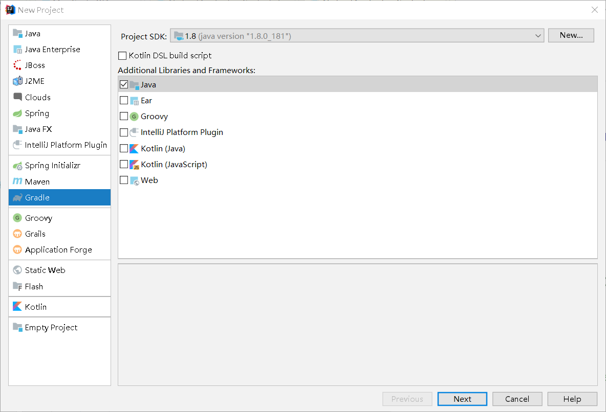

填写包名和项目名

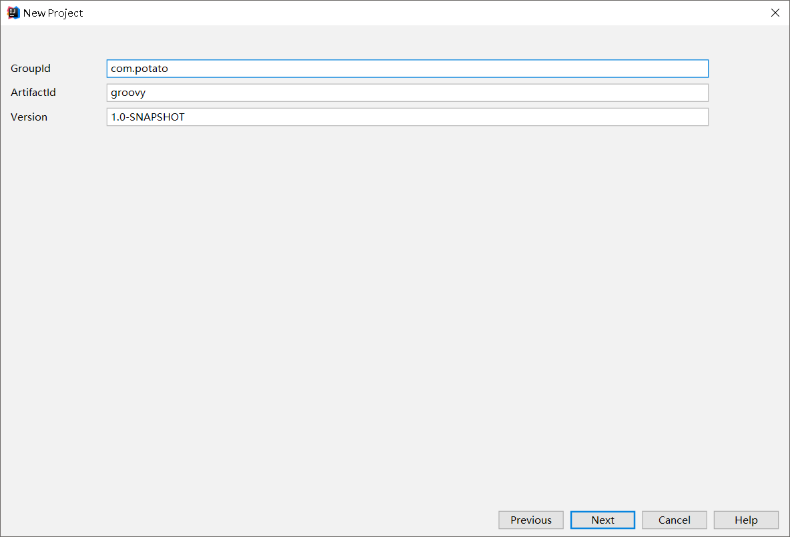


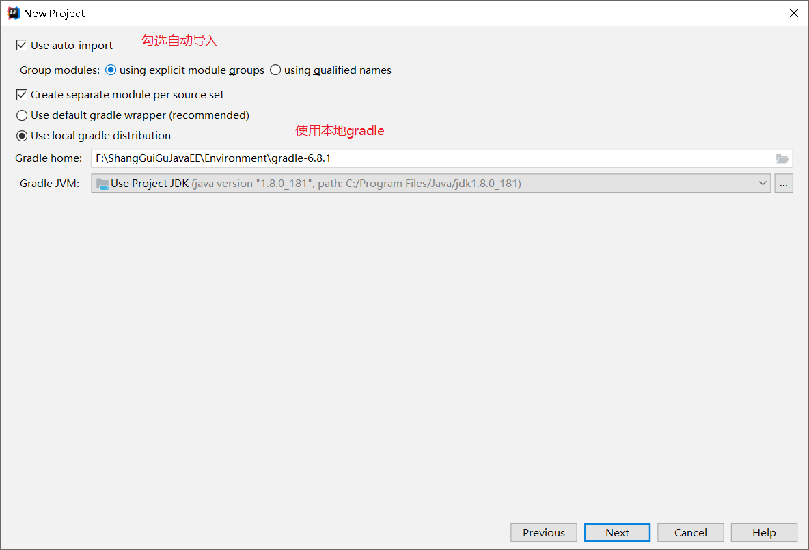

完成后生成的项目目录：

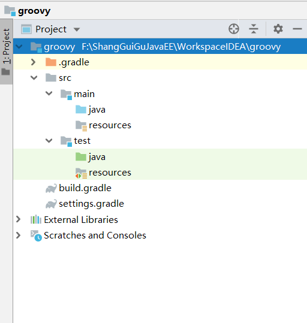

## Groovy编程快速入门

打开Groovy控制台

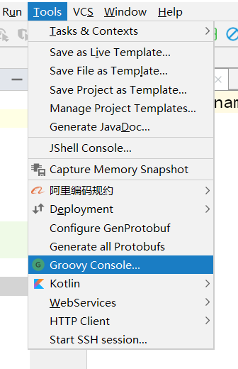

### 简单语法

**hello world**

```groovy
//介绍grovy编程语言
println("hello world");
//groovy中可以省略语句末尾的分号
println("hello world")
//groovy中可以省略括号
println "hello world"
```

**定义变量**

```groovy
//定义变量
//def是弱类型，groovy会自动根据情况来给变量赋予对应的类型
def i = 18
println i
def s = "xiaoming"  //单双引号都行
println s
```

**定义集合类型**

```groovy
//定义一个集合类型
def list = ['a','b']
//往list中添加元素
list << 'c'
//取出list中第3个元素
println list.get(2)

//定义一个map
def map = ['key1':'value1','key2':'value2']
//添加
map.key3 = 'value3'
println map.get("key3")

```

### 闭包

闭包就是一段代码块，在gradle中，我们主要把闭包当作参数来使用

**基本使用**

```groovy
def b1={
    println "hello b1"
}
//定义方法，方法里面需要闭包类型的参数
def method1(Closure closure){
    closure()
}
//调用方法
method1(b1)  //hello b1
```

**带参数的闭包**

```groovy
//定义一个带参数的闭包
def b2 = {
    v ->
        println "hello ${v}"
}
def method2(Closure closure){
    closure("xiaoma")
}
method2(b2)  //hello xiaoma
```

## build.gradle

```groovy
plugins {
    id 'java'
}

group 'com.potato'
version '1.0-SNAPSHOT'

sourceCompatibility = 1.8
/**
 * 指定所使用的仓库
 * mavenCentral()表示使用中央仓库，此刻项目中需要的jar包都会默认从中央仓库下载到本地指定目录
 * */
repositories {
    mavenCentral()
}
/**
 * gradle工程所有的jar包坐标都在dependencies属性放置
 * 每一个jar包都有三个基本元素组成
 * group,name,version
 * testCompile 表示该jar包在测试时起作用，该属性为jar包的作用域
 * 我们在gradle里面添加依赖是都要带上jar包的作用域
 */
dependencies {
    testCompile group: 'junit', name: 'junit', version: '4.12'
}
```

## gradle使用本地maven仓库

新建环境变量-系统变量

名称：GRADLE_USER_HOME

路径是本地maven参考路径：F:\ShangGuiGuJavaEE\Environment\maven-repository

可以删除C:\Users\123\\.gradle\caches下的所有文件了

重启IDEA,进入设置查看，发现已经变成本地仓库了

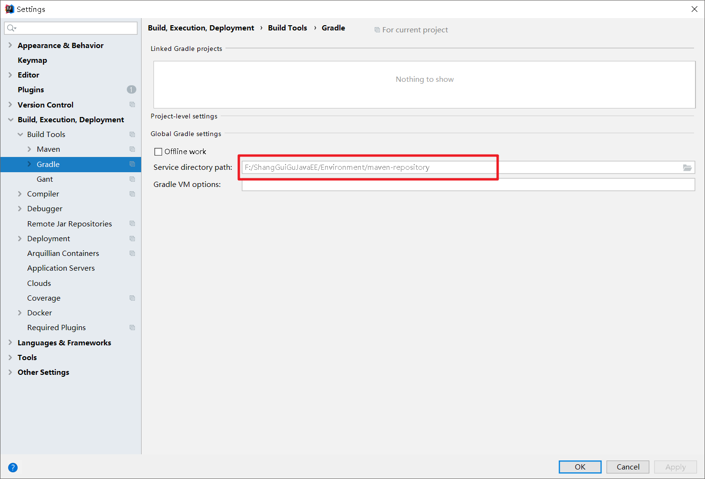

**配置文件加入本地仓库**

编辑build.gradle文件

```groovy
repositories {
    mavenLocal()  //放在前面，先在本地仓库找，找不到再去中央仓库
    mavenCentral()
}
```


# gradle入门2

## gradle构建脚本

### 编写脚本

buil.gradle

**例1**

```groovy
task firstgvy {
    doLast {
        println 'this is the first gradle'
    }
}
```

gradle -q firstgvy 执行

**例2**  大小写转换

```groovy
task upper {
    doLast {
        String expString = 'maxuan first gradle'
        println "Original: " + expString
        println "Upper case: " + expString.toUpperCase()
    }
}
```

gradle -q upper 

```
Original: maxuan first gradle
Upper case: MAXUAN FIRST GRADLE
```

**例4** 打印4次

下面的例子 4 次打印隐式参数 ( $it ) 的值

```groovy
task count {
    doLast {
        4.times {
            print "$it "
        }
        println ""
    }
}
```

gradle -q count

```
0 1 2 3
```

**例5** doLast的作用

```groovy
task t1 {
    println 'this is the 1111 gradle'
}

task t2 {
    doLast {
        println 'this is the 2222 gradle'
    }
}
```

执行gradle -q t1的结果：this is the 1111 gradle

执行gradle -q t2的结果：

this is the 1111 gradle

this is the 2222 gradle

可以看出：没有doLast的话，里面不指定，都会被执行

### build的三个阶段

gradle 构建的生命周期主要分为三个阶段，I**nitialization，Configuration，Execution**

- **Initialization** ：Gradle支持单个或多个工程的构建。在Initialization阶段，Gradle决定哪些工程将
  参与到当前构建过程，并为每一个这样的工程创建一个Project实例。一般情况下，参与构建的工程
  信息将在**settings.gradle**中定义。
- **Configuration** ：在这一阶段，配置project的实例。所有工程的构建脚本都将被执行。Task，
  configuration和许多其他的对象将被创建和配置。
- **Execution** ：在之前的configuration阶段，task的一个子集被创建并配置。这些子集来自于作为参
  数传入gradle命令的task名字，在execution阶段，这一子集将被依次执行。

**问题：doLast语句处于哪个阶段？**

doLast是Execution阶段

doLast之外的，是Configuration

```groovy
task t1 {
    println 'this is the 1111 gradle'
}
println 'this is the outer gradle'
task t2 {
    doLast {
        println 'this is the 2222 gradle'
    }
}
```

执行 

```bash
gradle
```

结果：doLast里面的没执行，说明gradle命令是运行**配置**阶段

```sh
> Configure project :
this is the 1111 gradle
this is the outer gradle
```

执行：

```sh
gradle -q t2
```

结果:所有都被执行了

```
this is the 1111 gradle
this is the outer gradle
this is the 2222 gradle
```

### Groovy的JDK方法

Groovy增加了很多有用的方法到标准的Java类。例如，从Java API可迭代实现它遍历Iterable接口的元素
的 each() 方法。

```groovy
task groovyJDKMethod {
    String myName = "maxuan";
    myName.each() {
        println "${it}"
    };
}
```

gradle –q groovyJDKMethod 执行

```
m
a
x
u
a
n
```

## Gradle任务

gradle最小执行单元是任务或称闭包

Gradle构建脚本描述一个或多个项目，每个项目都由不同的任务组成。
任务是构建执行的一项工作，可以是编译一些类，将类文件存储到单独的目标文件夹中，创建JAR，生成
Javadoc或将一些归档发布到存储库

-q quite 只显示错误日志

### 定义任务

```groovy
task maxuan {
    doLast {
        println 'maxuan course'
    }
}
```

**可以声明依赖于其他任务的任务**

```groovy
task maxuan {
    println 'maxuan course'
}
task maxuanNB(dependsOn: maxuan) {
    println "NB！" 
}
```

```sh
gradle -q maxuanNB
maxuan course
NB！
```

**task之间能否循环依赖？**

```groovy
task taskX(dependsOn: taskY) {
   println 'taskX'
}
task taskY(dependsOn: taskX){
   println 'taskY'
}
```

**不能，会报错**

### 定位任务

如果要查找在构建文件中定义的任务，则必须使用相应的标准项目属性。这意味着每个任务都可以作为
项目的属性，使用任务名称作为属性名称。
看看下面的代码访问任务作为属性。

```groovy
task maxuan
println maxuan.name
println project.maxuan.name
```

执行 ,打印了两个maxuan

```
gradle -q  maxuan
maxuan
maxuan
```

还可以通过任务集合使用所有属性。**所有的任务都放在tasks数组里面**

```groovy
task hello
task hello1
println tasks.hello.name
println tasks['hello'].name
println tasks['hello1'].name
```

执行

```
gradle -q  hello
hello
hello
hello1
```

### 向任务添加依赖关系

方式一：过使用**名称**添加对任务的依赖

```groovy
task taskX {
    println 'taskX'
}
task taskY(dependsOn: taskX) {
    println "taskY"
}
```

结果

```
gradle -q taskY
taskX
taskY
```

方式二：使用**Task对象**定义依赖性

```groovy
task taskY {
  doLast{
    println 'taskY'
  }
}
task taskX {
  doLast{
    println 'taskX'
  }
}
taskY.dependsOn taskX
```

结果：

```
gradle -q taskY
taskX
taskY
```

方法三：使用闭包来添加依赖

以下示例将任务中从 taskX 添加依赖项到项目中的所有任务，其名称以“ lib ”开头

```groovy
task taskX {
    doLast{
        println 'taskX'
    }
}
taskX.dependsOn {
    tasks.findAll {
        task -> task.name.startsWith('lib')
    }
}
task lib1 {
    doLast{
        println 'lib1'
    }
}
task lib2 {
    doLast{
        println 'lib2'
    }
}
task notALib {
    doLast{
        println 'notALib'
    }
}
```

结果：

```sh
gradle -q taskX
lib1
lib2
taskX
```

### 向任务添加描述

可以向任务添加描述。 执行 Gradle 任务时会显示此描述。 这可以通过使用 description 关键字。

```groovy
task copy(type: Copy) {
  description 'Copies the resource directory to the target directory.'
  from 'resources'
  into 'target'
  include('**/*.txt', '**/*.xml', '**/*.properties')
  println("description applied")  //运行后，只打印这句
}
```

### 跳过任务

如果用于跳过任务的逻辑不能用谓词表示，则可以使用 StopExecutionException 。 如果操作抛出此
异常，则会跳过此操作的进一步执行以及此任务的任何后续操作的执行, 构建继续执行下一个任务。

```groovy
task compile {
    doLast{
        println 'We are doing the compile.' //前置任务抛异常了，所以这句不会执行
    }
}
compile.doFirst {
    if (true) { throw new StopExecutionException() }//抛异常
}
task myTask(dependsOn: 'compile') {
    doLast{
        println 'I am not affected'  //不受影响
    }
}
```

结果：

```
gradle -q myTask
I am not affected
```

Gradle在处理任务时有不同的阶段, 首先，有一个配置阶段，其中直接在任务的闭包中指定的代码被执
行, 针对每个可用任务执行配置块，而不仅针对稍后实际执行的那些任务

## Gradle依赖管理

Gradle 构建脚本定义了构建项目的过程; 每个项目包含一些依赖项和一些发表项。依赖性意味着支持构
建项目的东西，例如来自其他项目的所需 JAR 文件以及类路径中的外部 JAR （如 JDBC JAR 或 Eh-cache
JAR ）。发布表示项目的结果，如测试类文件和构建文件，如 war 文件。

Gradle 负责构建和发布结果。 发布基于定义的任务。 可能希望将文件复制到本地目录，或将其上传到
远程Maven或lvy存储库，或者可以在同一个多项目构建中使用另一个项目的文件。 发布的过程称为发
布。

### 声明依赖关系

Gradle 遵循一些特殊语法来定义依赖关系。 以下脚本定义了两个依赖项，一个是 Hibernate core
5.4.21 ，第二个是 Junit 5.0 和更高版本。如下面的代码所示，可在 build.gradle 文件中使用此代
码。

```groovy
apply plugin: 'java'  //加了这句会多一堆东西，里面有大量的task
repositories {
    mavenCentral()
}
dependencies {
    compile group: 'org.hibernate', name: 'hibernate-core', version:
        '5.4.21.Final'
    testCompile group: 'junit', name: 'junit', version: '5.+'
}
```

对比maven配置

```xml
<dependencies>
    <dependency>
        <groupId>junit</groupId>
        <artifactId>junit</artifactId>
        <version>5.0</version>
        <scope>test</scope>
    </dependency>
</dependencies>
```

### 依赖关系配置

依赖关系配置只是定义了一组依赖关系。 您可以使用此功能声明从Web下载外部依赖关系。这定义了以
下不同的标准配置

- 编译 − 编译项目的生产源所需的依赖关系。

- 运行时 - 运行时生产类所需的依赖关系。 默认情况下，还包括编译时依赖项。

- 测试编译 - 编译项目测试源所需的依赖项。 默认情况下，它包括编译的产生的类和编译时的依赖。

- 测试运行时 - 运行测试所需的依赖关系。 默认情况下，它包括运行时和测试编译依赖项。

### 外部依赖

外部依赖是一种依赖。 这是对当前构建之外构建的一些文件的依赖，并且存储在某种类型的存储库中例如：Maven central，corporate Maven或lvy repository或本地文件系统中的目录。

```groovy
dependencies {
    compile group: 'org.hibernate', name: 'hibernate-core', version:'5.4.21.Final'
}
```

### 存储库

在添加外部依赖关系时， Gradle在存储库中查找它们。 存储库只是文件的集合，按分组，名称和版本
来组织构造。 默认情况下，Gradle不定义任何存储库。 **我们必须至少明确地定义一个存储库**。

一个Java工程通常会依赖于外部的jar包，Gradle可以使用Maven的仓库来获取或者发布相应的jar包。

**Gradle配置Maven中央仓库**

```groovy
repositories {
    mavenCentral()
}
```

下面的代码是定义远程 maven 。

```groovy
repositories {
    maven {
        url "http://repo.mycompany.com/maven2"
    }
}
```

### 发布文件

依赖关系配置也用于发布文件。 这些已发布的文件称为工件。 通常，我们使用插件来定义工件。 但是
需要告诉 Gradle 在哪里发布文件。可以通过将存储库附加到上传存档任务来实现此目的。 请查看以下
用于发布 Maven 存储库的语法。 执行时， Gradle 将根据项目需求生成并上传 pom.xml ， 在
build.gradle 文件中使用此代码。

```groovy
apply plugin: 'maven'
uploadArchives {
    repositories {
        mavenDeployer {
            repository(url: "file://localhost/tmp/myRepo/")
        }
    }
}
```

## Gradle插件

Gradle本身和初始的机器人一样，只是提供了基本的核心功能，其他的特性比如编译Java源码的能力等
等就需要通过插件来实现了。

### 插件类型

Gradle中有两种类型的插件：**脚本插件**和**二进制插件**

- 脚本插件是一个额外的构建脚本，它提供了一种声明性方法来操作构建，通常在构建中使用。
- 二进制插件是实现插件接口并采用编程方法来操作构建的类，二进制插件可以驻留在插件JAR中的
  一个构建脚本和项目层次结构或外部。

### 应用插件

Project.apply（）API方法用于应用特定的插件,可以多次使用相同的插件。

有两种类型的插件：一种是脚本插件，第二种是二进制插件。

#### 脚本插件

脚本插件可以从本地文件系统进行应用，文件系统位置相对于项目目录，而远程脚本位置指定 HTTP
URL 。
如下代码，它将 other.gradle 插件用于构建脚本， 在 build.gradle 文件中使用此代码如下。
新建other.gradle文件

```groovy
ext{
    verson='1.0'  //version是个关键字，所以这里用verson
    url='http://maxuan.cn'
}
```

应用该脚本插件

```groovy
apply from: 'other.gradle'
task test{
    doLast{
        println "version:$verson,url:$url"
    }
}
```

#### 二进制插件（对象插件）

每个插件由插件标识，一些核心插件是使用短名称来应用它，一些社区插件是使用插件ID的完全限定名
称，有时它允许指定一个插件类，**二进制插件就是实现了org.gradle.api.Plugin接口的插件**，它们可以
有Plugin id。
通常对象插件分2类：

##### 1、内部插件

gradle自带的

以下代码片段， 它显示如何使用应用Java插件， 在 build.gradle 文件中使用方式如下：

```groovy
apply plugin: JavaPlugin  //JavaPlugin 这个插件的id就是 java，在gradle源码里可以看到
```

以下代码，使用短名称应用核心插件

```groovy
plugins {
  id 'java'
}
```

以下代码，使用短名称应用社区（https://plugins.gradle.org/）插件,这上面托管了大量插件。 在 build.gradle 文件中使用此
代码如下所示。

```groovy
plugins {
    id "com.maxuan.bintray" version "0.1.0"
}
```

##### 2、第三方插件

第三方的对象插件通常是jar文件，要想让构建脚本知道第三方插件的存在，需要使用buildscrip来设置。

```groovy
buildscript {
    repositories {
        maven {
            url "https://plugins.gradle.org/m2/"
        }
    }
    dependencies {
        classpath "com.jfrog.bintray.gradle:gradle-bintray-plugin:1.8.4"
    }
}
apply plugin: "com.jfrog.bintray"
```

### 编写自定义插件

在创建自定义插件时，需要编写一个插件的实现， Gradle 实例化插件并使用 Plugin.apply（） 方法
调用插件实例。

以下示例包含一个简单的 hello 插件，它将一个问候任务添加到项目中，在 build.gradle 文件中使用
此代码。

```groovy
apply plugin: HelloPlugin
class HelloPlugin implements Plugin<Project> {
    void apply(Project project) {
        project.task('hello') {
            doLast{
                println "Hello from the HelloPlugin."
            }
        }
    }
}
```

使用以下代码执行上述脚本。

```
gradle -q hello
Hello from the HelloPlugin
```

### 自定义插件扩展

大多数插件需要从构建脚本中的配置获得支持， Gradle 项目有一个关联“ **ExtensionContainer** ”对
象，它有助于跟踪传递给插件的所有设置和属性。

我们在项目中添加一个简单的扩展对象，例如添加一个问候语扩展对象， build.gradle 文件中使用此
代码如下所示：

```groovy
//自定义插件扩展
class HelloPlugin implements Plugin<Project> {
    void apply(Project project) {
        // Add the 'greeting' extension object
        project.extensions.create("greeting", HelloPluginExtension)
        // Add a task that uses the configuration
        project.task('hello') {
            doLast{
                println project.greeting.message
            }
        }
    }
}
class HelloPluginExtension {
    String message
}
apply plugin: HelloPlugin
//两种使用方法
/** greeting{
  message="maxuan course"
} **/
greeting.message="maxuan course1"
```

使用以下代码执行上述脚本，得到结果如下

```
gradle -q hello
maxuan course
```

Gradle为每个扩展对象添加了一个配置闭包，因此可以将分组设置在一起，如下代码， 在

build.gradle 文件中使用此代码。

```groovy
apply plugin: GreetingPlugin
greeting {
    message = 'Hi'
    greeter = 'Gradle'
}
class GreetingPlugin implements Plugin<Project> {
    void apply(Project project) {
        project.extensions.create("greeting", GreetingPluginExtension)
        project.task('hello') {
            doLast{
                println "${project.greeting.message} from ${project.greeting.greeter}"
            }
        }
    }
}
class GreetingPluginExtension {
    String message
    String greeter
}
```

使用以下代码执行上述脚本，得到结果如下 

```
gradle -q hello
Hi from Gradle
```

### 标准Gradle插件

在 Gradle 分布中包含不同的插件。

#### 1）语言插件

这些插件的添加，让JVM在编译和执行时对各种语言支持。

| 插件Id | 自动应用         | 描述                                                         |
| ------ | ---------------- | ------------------------------------------------------------ |
| java   | java-base        | 向项目添加Java编译，测试和绑定的功能。它作为许多其他Gradle插件的基础。 |
| groovy | java,groovy-base | 添加对构建Groovy项目的支持                                   |
| scala  | java,scala-base  | 添加对构建Scala项目的支持                                    |
| antlr  | Java             | 添加了使用Antlr生成解析器的支持。                            |

#### 2）孵化语言插件

这些插件添加对各种语言的支持。

| 插件Id            | 自动应用 | 描述                                          |
| ----------------- | -------- | --------------------------------------------- |
| 汇编              | -        | 向项目添加本地汇编语言功能。                  |
| c                 | -        | 向项目添加C语言的源代码编译功能。             |
| cpp               | -        | 向项目添加C++语言的源代码编译功能。           |
| objective-c       | -        | 向项目添加objective-c语言的源代码编译功能。   |
| objective-cpp     | -        | 向项目添加Objective-C++语言的源代码编译功能。 |
| windows-resources | -        | 添加本机二进制文件包括Windows资源的支持。     |

### Gradle Java插件（重点）

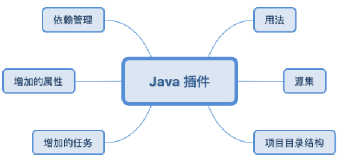

Java 插件是构建 JVM 项目的基础，它为项目增加了很多能力，例如编译，测试，打包，发布等等。
很多插件都是基于 Java 插件实现的，例如 Android 插件。

#### 1）用法

使用 id 应用插件

```groovy
plugins {
    id 'java'
}
```

#### 2）Source sets 源集

Java 插件引入了源集的概念，它在逻辑上表示一组用于编译执行的源文件，这些源文件可能包括源代码
文件和资源文件。

一个源集有一个相关联的编译类路径和运行时类路径。

Java 插件就是通过源集的概念来管理源代码目录的。

源集的一个用途是，把源文件进行逻辑上的分组，以描述它们的目的。
例如，你可能会使用一个源集来定义一个集成测试套件，或者你可能会使用单独的源集来定义你的项目
的 API 和实现类

Java 插件提供了两个标准源集：

- main 包含了项目的源代码，被用于编译和生成 JAR 文件

- test 包含单元测试源代码，它们将被编译并使用 JUnit 或 TestNG 来执行

源集提供了很多属性，我这里就列出几个重要的属性：

| 属性                    | 类型               | 默认值                                                       | 描述                                                         |
| ----------------------- | ------------------ | ------------------------------------------------------------ | ------------------------------------------------------------ |
| name - 只读             | String             | 非空                                                         | 源集的名字                                                   |
| output - 只读           | SourceSetOutput    | 非空                                                         | 源集的输出 文件，包括 它编译过的 类和资源。                  |
| output.classesDirs 只读 | FileCollection     | \$buildDir/classes/java/$name 例如：build/classes/java/main  | 源集编译过 的 class 文件 目录                                |
| java - 只读             | SourceDirectorySet | \${project.projectDir}/src/<br />${sourceSet.name}/java      | 源集的 Java 源代码 ，只 包含 .java 会 排除其他类 型。        |
| java.srcDirs            | Set                | src/$name/java,例如 src/main/java                            | 源集的 Java 源文件的源 目录。是一 个集合，可 以设置多个 源代码目 录，更改源 代码目录就 是更改这个 属性 |
| java.outputDir          | File               | \$buildDir/classes/java/$name, e.g. build/classes/java/main  | 源代码编译 的 class 文件 输出目录                            |
| resources - 只读        | SourceDirectorySet | \${project.projectDir}/src/<br />${sourceSet.name}/resources | 源集的资 源，只包含 资源。                                   |
| resources.srcDirs       | Set                | src/$name/resources                                          | 源集的资源 目录，是一 个集合，可 以指定多个                  |

#### 3）定义一个新的源集

源集的位置也很重要，不要在 dependencies 下面，否则对源集的依赖就将不起作用

````groovy
sourceSets {
    other
}
````

#### 4）访问源集

sourceSets 是 Java 插件为 Project 增加的一个属性，可以直接使用。

```groovy
task outSourceSet {
    doLast {
        //遍历
        sourceSets.all {
            println "$name -> "
        }
        println "-----split-----"
        //单个的
        println "${sourceSets.main.name} -> "
        println "${sourceSets['main'].name} -> "
        //一些属性
        println " java.srcDirs -->${sourceSets.main.java.srcDirs}"
        println " resource.srcDirs -->${sourceSets.main.resources.srcDirs}"
    }
}
```

#### 5）为源集添加依赖

```groovy
dependencies {
    // This dependency is used by the application.
    implementation 'com.google.guava:guava:27.1-jre'
    // Use JUnit test framework
    testImplementation 'junit:junit:4.12'
    //为 other 源集添加依赖
    otherImplementation 'com.google.code.gson:gson:2.8.5'
}
```

#### 6）将源集打成一个 JAR 包

创建一个 otherJar 任务，将源集的输出作为任务的文件来源。
执行这个任务即可生成 JAR 包。

```groovy
/**
* 为 other 源集打个 jar 包 * 默认输出目录是 build/libs
* 默认名字是 [archiveBaseName]-[archiveAppendix]-[archiveVersion]-
[archiveClassifier].[archiveExtension]
*/
task otherJar(type:Jar){
    archiveBaseName = sourceSets.other.name
    archiveVersion = '0.1.0'
    destinationDirectory = file("${project.projectDir}/jar")
    from sourceSets.other.output
}
```

#### 7）为源集生成 doc

创建一个任务将源集的所有 Java 文件作为源文件。
执行这个任务即可生成 doc 文件。

```groovy
task otherDoc(type:Javadoc){
    destinationDir = file("${project.projectDir}/doc")
    source sourceSets.other.allJava
    title sourceSets.other.name
}
```

#### 8）项目结构

Java 插件的默认目录结构如下所示, 无论这些文件夹中有没有内容, Java 插件都会编译里面的内容, 并处
理没有的内容。
这个目录结构也是 Java 世界标准的项目目录。

| 目录                        | 描述                                      |
| --------------------------- | ----------------------------------------- |
| src/main/java               | Java 源文件目录                           |
| src/main/resources          | 资源文件目录，例如 xml 和 properties 文件 |
| src/test/java               | Java 测试源文件目录                       |
| src/test/resources          | 测试资源目录                              |
| src/**sourceSet**/java      | 给定源集的源代码目录                      |
| src/**sourceSet**/resources | 给定源集的资源目录                        |

#### 9）更改默认目录

这里以更改 main 源集的源代码和资源目录为例

```groovy
sourceSets { 
    main {
        java {
            srcDirs = ['src/java'] 
        }resources { 
            srcDirs = ['src/resources'] 
        } 
    }
}
```

## Gradle运行构建

Gradle提供了一个命令行来执行构建脚本， 它可以一次执行多个任务，在这里将介绍如何使用不同的选
项来执行多个任务。

### 1、执行多个任务

Gradle 可以从单个构建文件执行多个任务。使用 gradle 命令处理构建文件。此命令将按列出的顺序编译每个任务，并使用不同的选项执行每个任务以及依赖关系。

**示例** - 假设有四个任务 - task1 ， task2 ， task3 和 task4 。 task3 和 task4 取决于 task1 和 task2 。 看看下面的图表。

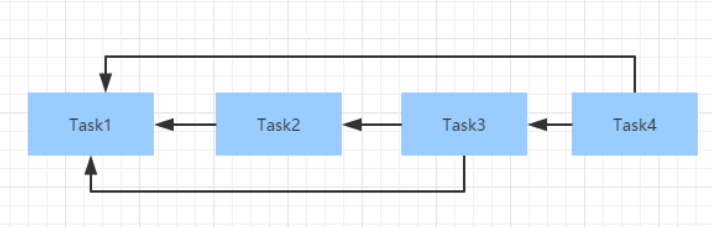

在上面的四个任务是相互依赖的，用一个箭头符号表示。 看看下面的代码。 将其复制并粘贴到

build.gradle 文件中。

```groovy
task task1 { 
    doLast{ 
        println 'compiling source #1' 
    } 
}
task task2(dependsOn: task1) { 
    doLast{ 
        println 'compiling unit tests #2' 
    } 
}
task task3(dependsOn: [task1, task2]) { 
    doLast{ 
        println 'running unit tests #3' 
    }
}task task4(dependsOn: [task1, task3]) { 
    doLast{ 
        println 'building the distribution #4' 
    } 
}
1234
```

使用以下代码来编译和执行上述任务，重复依赖的任务只执行一次，如果命令执行成功，将获得以下输出

```groovy
gradle -q task4 
compiling source #1 
compiling unit tests #2 
running unit tests #3 
building the distribution #4
```

### 2、排除任务

要执行中排除某个任务时，可以在 gradle 命令中使用 -x 选项，并指出要排除的任务的名称。
使用以下命令用于从上面的脚本中排除 task1 这个任务。
使用以下代码来编译和执行上述任务。如果命令执行成功，将获得以下输出 -

```groovy
D:\mypro\gvy>gradle task4 -x task1 

> Task :task2 
compiling unit tests #2 

> Task :task3 
running unit tests #3 

> Task :task4 
building the distribution #4 

BUILD SUCCESSFUL in 1s 
3 actionable tasks: 3 executed
```

### 3、选择执行哪些构建

当运行gradle命令时，它在当前目录中查找构建文件。我们也可以使用 **-b** 选项选择指定的构建文件的路
径。以下示例显示在 subdir/ 子目录中创建一个新文件 newbuild.gradle ，并创建一个名称为
hello 任务。创建的 newbuild.gradle 文件的代码内容如下

```groovy
task hello { 
    doLast{ 
        println "Use File:$buildFile.name in '$buildFile.parentFile.name'." 
    } 
}
```

使用以下代码来编译和执行上述任务。如果命令执行成功，将获得以下输出 

```
gradle -q -b subdir/newbuild.gradle hello 
Use File：newbuild.gradle in 'subdir'.
```

### 4、获取构建信息

Gradle提供了几个内置任务来检索有关任务和项目的详细信息，这对理解构建的结构和依赖性以及调试
一些问题很有用，可使用项目报告插件向项目中添加任务，来生成这些报告。

#### 1）列出项目

可以使用 gradle -q projects 命令来列出所选项目及其子项目的项目层次结构。下面是一个列出构建

文件中的所有项目的示例 

```
D:\mypro\gvy>gradle -q projects
------------------------------------------------------------ 
Root project 
------------------------------------------------------------ 
Root project 'gvy' 
No sub-projects 
To see a list of the tasks of a project, run gradle <project-path>:tasks For example, try running gradle :task
```

报告显示每个项目的描述（如果有指定的话），可以使用以下命令指定描述将其粘贴到 build.gradle
文件中。例如：在build.gradle文件中加上 description 'this is the first project'
再一次执行命令，得到以下结果：

```
D:\mypro\gvy>gradle -q projects 

------------------------------------------------------------ 

Root project - this is the first project 

------------------------------------------------------------ 

Root project 'gvy' - this is the first project 

No sub-projects 

To see a list of the tasks of a project, run gradle <project-path>:tasks For example, try running gradle :tasks
```

#### 2）列出任务

```
使用以下命令列出属于多个项目的所有任务。如下所示

D:\mypro\gvy>gradle -q tasks --all 

------------------------------------------------------------ 

All tasks runnable from root project - The shared API for the application 

------------------------------------------------------------ 

Build Setup tasks 

----------------- 

init - Initializes a new Gradle build. [incubating] 

wrapper - Generates Gradle wrapper files. [incubating] 

Help tasks 

---------- 

buildEnvironment - Displays all buildscript dependencies declared in root 

project 'script'. 

components - Displays the components produced by root project 'script'. 

[incubating] 

dependencies - Displays all dependencies declared in root project 'script'. 

dependencyInsight - Displays the insight into a specific dependency in root 

project 'script'. 

help - Displays a help message. 

model - Displays the configuration model of root project 'script'. [incubating] 

projects - Displays the sub-projects of root project 'script'. 

properties - Displays the properties of root project 'script'. 

tasks - Displays the tasks runnable from root project 'script'. 

Other tasks 

----------- 

task1 

task2 

task3 

task4
```

以下是其它一些命令及其说明的列表

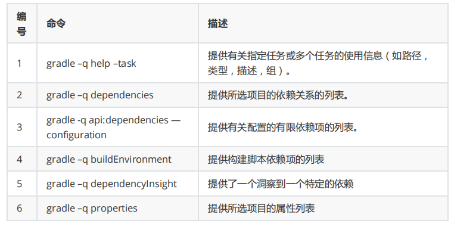

## Gradle构建JAVA项目

本章介绍如何使用Gradle构建文件来构建一个Java项目， 首先，我们必须向构建脚本中添加Java插件，
因为它提供了编译Java源代码，运行单元测试，创建Javadoc和创建JAR文件的任务。
在 build.gradle 文件中使用以下代码行：

```groovy
apply plugin: 'java'
```

### 1、Java默认的项目布局

每当添加一个插件到构建中，它会假设一个特定的Java项目设置（类似于Maven）。看看下面的目录结
构。

- src/main/java 目录包含Java源代码；
- src/test/java 目录包含测试用的源代码；

如果遵循上面设置，以下构建文件足以编译，测试并捆绑Java项目。
要启动构建，请在命令行上键入以下命令

```
gradle build
```

SourceSets可用于指定不同的项目结构。
例如，指定源代码存储在 src 文件夹中，而不是在 src/main/java 中，例如下面的目录结构：

```groovy
apply plugin: 'java' 
sourceSets { 
    main { 
        java { 
            srcDir 'src' 
        } 
    }
    test { 

        java { 
            srcDir 'test' 
        } 
    } 
}

```

### 2、初始化任务执行

Gradle还不支持多个项目模板。但它提供了一个init来初始化任务来创建一个新的Gradle项目的结构。
如果没有指定其他参数，任务将创建一个Gradle项目，其中包含gradle包装器文件， build.gradle 和 settings.gradle 文件。

当使用 java-library 作为值并添加 --type 参数时，将创建一个java项目结构， build.gradle 文件包
含带有Junit的某个Java模板。 看看下面 build.gradle 文件的代码。

```groovy
apply plugin: 'java' 

repositories { 
    jcenter() 
}
dependencies { 
    compile 'org.slf4j:slf4j-api:1.7.12' 
    testCompile 'junit:junit:4.12' 
}
```

在仓库( repositories )这部分中，它定义了要从哪里找到依赖，Jcenter是为了解决依赖问题， 依赖关
系（ dependencies ）部分用于提供有关外部依赖关系的信息。

### 3、指定Java版本

通常，Java项目要有一个版本和一个目标JRE，在其上编译它。 version 和 sourceCompatibility 属性
可以在 build.gradle 文件中设置。

```groovy
version = 0.1.1 
sourceCompatibility = 1.8 
targetCompatibility = 1.8
```

如果这是一个可执行的Java应用程序， MANIFEST.MF 文件必须要指定具有 main方 法的类

```groovy
apply plugin: 'java' 

jar {
    manifest { 
        attributes "Manifest-Version": 1.0,
            'Main-Class': 'com.maxuan.App' 
    } 
}
```


## Gradle测试

测试任务会自动检测和执行测试源集合中的所有单元测试，它还会在测试执行完成后生成报告，JUnit和
TestNG都是支持的API。

### 1、测试检测

测试任务通过检查编译的测试类来检测哪些类是测试类， 默认情况下，它扫描所有 .class 文件，不过
也可以设置自定义包含/排除，只有那些类才会被扫描。
根据所使用的测试框架（ JUnit / TestNG ），测试类检测使用不同的标准。
如果不想使用测试类检测，可以通过将 scanForTestClasses 设置为 false 来禁用它。

```groovy
test{ 
    //默认使用junit 
    useJUnit{} 
    //使用testNG 
    useTestNG() 
}

```

### 2、包括和排除指定测试

Test 类有一个 include 和 exclude 方法。这些方法可以用于指定哪些测试应该运行。

禁用测试

```groovy
test {
    enabled = false 
}
```

只运行包含的测试

```groovy
test {
    include 'com/maxuan*/*'
}
```

跳过排除的测试

```groovy
test {
    exclude 'com/maxuan*/*'
}
```

以下代码中所示的 build.gradle 示例文件显示了不同的配置选项。

```groovy
apply plugin: 'java' 
// adds 'test' task 
test { 
    // enable TestNG support (default is JUnit) 
    useTestNG() 
    //scanForTestClasses = false 
    // set a system property for the test JVM(s) 
    systemProperty 'some.prop', 'value' 
    // explicitly include or exclude tests 
    include 'com/maxuan/**' 
    exclude 'com/maxuan1/**' 
    // show standard out and standard error of the test JVM(s) on the console 
    testLogging.showStandardStreams = true 
    // set heap size for the test JVM(s) 
    minHeapSize = "64m" 
    maxHeapSize = "512m" 
    // set JVM arguments for the test JVM(s) 
    jvmArgs '-XX:MaxPermSize=256m' 
    // listen to events in the test execution lifecycle 
    beforeTest { 
        descriptor -> logger.lifecycle("Running test: " + descriptor) 
    }
    // listen to standard out and standard error of the test JVM(s)
    onOutput { 
        descriptor, event -> logger.lifecycle 
        ("Test: " + descriptor + " produced standard out/err: " 
         + event.message ) 
    } 
}
```

可以使用以下命令语法来执行一些测试任务。

```
gradle <someTestTask> --debug-jvm
```

## Gradle多项目构建

Gradle 可以轻松处理各种大小规模的项目，小项目由一个单一的构建文件和一个源代码树构成，大项
目可以将其拆分成更小的，相互依赖的模块，以便更容易理解，Gradle完美支持这种多项目构建的场
景。

### 1、多项目构建的结构

这种构建有各种形状和大小，但它们都有一些共同的特点 

- 在项目的根目录或主目录中都有一个 settings.gradle 文件。

- 根目录或主目录都有一个 build.gradle 文件。

- 具有自己的 *.gradle 构建文件的子目录（某些多项目构建可能会省略子项目构建脚本）。

要列出构建文件中的所有项目，可以使用以下命令。

```
gradle -q projects
```

如果命令执行成功，将获得以下输出。

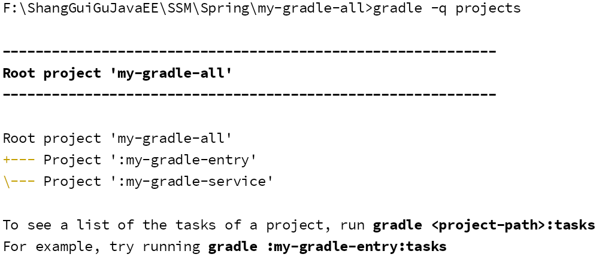


报告将显示每个项目的描述（如果指定）,可以使用以下命令指定描述,将其粘贴到 build.gradle 文件
中。

```
description = 'The shared API for the application'
```

### 2、指定常规构建配置allprojects和subprojects

在根项目中的 build.gradle 文件中，常规配置可以应用于所有项目或仅应用于子项目。

```groovy
allprojects { //适合所有的模块
    group = 'com.potato'
    version = '0.1.0'
}
subprojects {  //适合子模块,不包括父模块
    apply plugin: 'java'
}
```

这指定了一个公共 com.maxuan 组和一个 0.1.0 版本到所有项目， subprojects 闭合所有应用对子项
目通用配置，但不对根项目应用，如： allprojects 闭合。

### 3、项目指定配置和依赖关系

核心 my-gradle-entry 和 my-gradle-service 子项目也可以有自己的 build.gradle 文件，如果它们有
特定的需求，那么一般不会应用根项目配置。

例如，my-gradle-service项目通常具有对核心项目的依赖性,所以在my-gradle-m1项目中需要有配置自
己的 build.gradle 文件来指定这个依赖。

```groovy
dependencies {
    compile project(':core')
    compile 'log4j:log4j:1.2.17'
}
```

项目依赖项可使用项目方法指定

### 4、Gradle多项目构建的示例

#### 1）定义公共行为

让我们看看下面的一个例子的项目树。这是一个多项目构建，其中包含一个名为 my-gradle-all 的根项
目和一个名称为 my-gradle-entry 和 my-gradle-service 的子项目。

多项目树 - my-gradle-all 和 my-gradle-entry 和 my-gradle-service 项目的构建布局如下图所示

```groovy
Root project 'my-gradle-all'
  build.gradle
  settings.gradle
+--- Project ':my-gradle-entry'
\--- Project ':my-gradle-service'
```

首先，创建一个文件 settings.gradle 并写入以下代码内容（自动写入）

```groovy
include 'my-gradle-service'
include 'my-gradle-entry'
```

在根项目的 build.gradle 并写入以下代码：

```groovy
allprojects { 
    task hello { 
        doLast{ 
            task -> println "I'm $task.project.name" 
        } 
    } 
}

```

并执行 gradle -q hello 输出结果如下 -

```
gradle -q hello 
I'm my-gradle-all 
I'm my-gradle-entry 
I'm my-gradle-service
```

这是如何工作的？ Project API提供了一个属性 allprojects ，它返回当前项目及其下面所有子项目的
列表。 如果使用闭包调用 allprojects ，则闭包的语句将委派给与所有项目相关联的项目，当然也可
以通过 allprojects.each 进行迭代，但这将更冗长。

其他构建系统使用继承作为定义公共行为的主要方法，Gradle也为项目提供继承，但Gradle使用配置注
入作为定义公共行为的常用方式，这是一种非常强大和灵活的配置多项目构建的方式，共享配置的另一
种可能性是使用公共外部脚本

### 5、子项目配置

Project API 还提供了一个仅用于访问子项目的属性。

#### 1）定义公共行为

定义所有项目和子项目的公共行为，编辑 build.gradle 文件使用以下代码 -

```groovy
allprojects { 
    task hello { 
        doLast{ 
            task -> println "I'm $task.project.name" 
        } 
    } 
}
subprojects { 
    hello { 
        doLast{ 
            println "- I depend on my-gradle-all" 
        } 
    } 
}
```

并执行 gradle -q hello 输出结果如下 -

```
D:\mypro\IdeaProjects\my-gradle-all>gradle -q hello 
I'm my-gradle-all 
I'm my-gradle-entry 
- I depend on my-gradle-all 
I'm my-gradle-service 
- I depend on my-gradle-all 
```

注意两个代码片段引用“ hello ”任务, 第一个，它使用“ task ”关键字，构建任务并提供它的基本配置。
第二部分不使用“ task ”关键字，因为它进一步配置现有的“ hello ”任务,只能在项目中构建一次任务，但
可以添加任意数量的代码块以提供其他配置。

#### 2）添加指定行为

可以在常见行为之上添加指定的行为，要应用这个特定的行为，通常将项目特定的行为放在项目的构建
脚本中，我们可以为 bluewhale 项目添加项目特定的行为，如下所示：
编辑 build.gradle 文件使用以下代码：

```groovy
allprojects {  //所有模块
    task hello { 
        doLast{ 
            task -> println "I'm $task.project.name" 
        } 
    } 
}

subprojects { //所有子模块
    hello { 
        doLast{ 
            println "- I depend on my-gradle-all" 
        } 
    } 
}

project(':my-gradle-service').hello { //针对my-gradle-service 模块
    doLast{ 
        println "- I'm my-gradle-service and depends on my-gradle-all." 
    } 
}
```

正如上面所说的，通常把项目特定的行为放入这个项目的构建脚本中。

#### 3）定义 my-gradle-service 项目的具体行为

构建布局如下所示

```
my-gradle-all/ 
    build.gradle 
    settings.gradle 
    my-gradle-service/ 
    	build.gradle 
    my-gradle-entry/ 
    	build.gradle
```

settings.gradle 文件的内容:

```
rootProject.name = 'my-gradle-all' 
include 'my-gradle-service' 
include 'my-gradle-entry'
```

my-gradle-service/build.gradle 文件的内容 ： 

```groovy
hello.doLast { 
    println "- I'm the my-gradle-m1 module." 
}
```

my-gradle-entry/build.gradle 文件的内容 

```groovy
hello.doLast { 
    println "- I'm the my-gradle-entry module."
}
```

build.gradle 文件的内容 

```groovy
allprojects {  //所有模块
    task hello { 
        doLast{ 
            task -> println "I'm $task.project.name" 
        } 
    } 
}

subprojects { //所有子模块
    hello { 
        doLast{ 
            println "- I depend on my-gradle-all" 
        } 
    } 
}
```

并执行 gradle -q hello 输出结果如下 -

```
E:\mypro\IdeaProjects\my-gradle-all>gradle -q hello
I'm my-gradle-all
I'm my-gradle-entry
- I depend on my-gradle-all
I'm my-gradle-service
- I depend on my-gradle-all
- I'm the my-gradle-service module
```

## Gradle部署

Gradle提供了几种部署构建工件(artifacts)存储库的方法。将工件的签名部署到Maven仓库时，还需要签
署已发布的 POM 文件

### 使用Maven插件发布

Gradle默认提供 **maven-publish** 插件， 它用于发布 gradle 脚本， 看看下面的代码。

```groovy
apply plugin: 'java'
apply plugin: 'maven-publish' //使用maven插件来发布
publishing {
   publications {
       maven(MavenPublication) {
           from(components.java)
      }
  }
   repositories {
       maven {
           url "$buildDir/repo" //发布到编译的目录
      }
  }
}
```

当应用[Java]和 maven-publish 插件时，有几个发布选项， 看看下面的代码，它会将项目部署到远程仓
库。

```groovy
apply plugin: 'groovy'
apply plugin: 'maven-publish'
group 'com.maxuan'
version = '1.0.0'
publishing {
    publications {
        mavenJava(MavenPublication) {
            from components.java
        }
    }
    repositories {
        maven {          
            default credentials for a nexus repository manager
                credentials {
                    username 'admin' password 'mypasswd' 
                } // 发布maven存储库的url 
            url "http://localhost:8080/nexus/content/repositories/releases/" 
        } 
    } 
}            
```

### 2、将项目从Maven转换为Gradle

有一个特殊的命令用于将Apache Maven pom.xml 文件转换为 Gradle 构建文件，如果此任务已经知道
使用的所有 Maven 插件。

在本节中，以下 pom.xml 的 maven 配置将转换为 Gradle 项目。创建一个 D:/pom.xml 并使用下面的代
码。

```xml
<project xmlns = "http://maven.apache.org/POM/4.0.0"
         xmlns:xsi = "http://www.w3.org/2001/XMLSchema-instance" 
         xsi:schemaLocation = "http://maven.apache.org/POM/4.0.0 
                               http://maven.apache.org/xsd/maven-4.0.0.xsd"> 
    <modelVersion>4.0.0</modelVersion> 
    <groupId>com.example.app</groupId> 
    <artifactId>example-app</artifactId> 
    <packaging>jar</packaging>
    <version>1.0.0-SNAPSHOT</version> 
    <dependencies> 
        <dependency> 
            <groupId>junit</groupId> 
            <artifactId>junit</artifactId>
            <version>4.11</version>
            <scope>test</scope> 
        </dependency> 
    </dependencies> 
</project>
```

可以命令行上使用以下命令，然后生成以下 Gradle 配置内容

```sh
D:/> gradle init --type pom 
Starting a Gradle Daemon, 1 incompatible and 1 stopped Daemons could not be reused, use --status for details 
:wrapper 
:init 
Maven to Gradle conversion is an incubating feature. 
BUILD SUCCESSFUL 
Total time: 11.542 secs
```

init 任务依赖于包装器任务，因此它创建了一个 Gradle 包装器。

生成的 build.gradle 文件类似于以下内容。

```groovy
apply plugin: 'java'
apply plugin: 'maven'
group = 'com.maxuan'
version = '1.0.0-SNAPSHOT'
description = "this is reverse gradle project"
sourceCompatibility = 1.8
targetCompatibility = 1.8
repositories {
    maven { url "http://repo.maven.apache.org/maven2" }
}
dependencies {
    testCompile group: 'junit', name: 'junit', version:'4.11'
}
```

# Spring源码阅读环境搭建

## 版本

- 系统windows 10

- JDK 1.8 181

- Spring 5.2.9.RELEASE
- gradle 5.6.4-all  （all版本的带有源码，便于除了问题好排查）
- IDEA 2019.1

## 下载源码

目录：F:\ShangGuiGuJavaEE\WorkspaceIDEA

```sh
git clone -b v5.2.9.RELEASE https://github.com/spring-projects/spring-framework.git
```

## 开始构建

**gradle版本说明**

在cmd中进入源码根目录，输入gradlew.bat命令，脚本将自动下载gradle安装包，根据：

\spring-framework\gradle\wrapper\gradle-wrapper.properties里的配置的版本来下载，我们可以将此配置文件进行修改，修改成电脑里已经有的版本，这样就不用又去下载了：

```properties
# distributionUrl=https\://services.gradle.org/distributions/gradle-5.6.4-bin.zip
distributionUrl=file:///F:/ShangGuiGuJavaEE/Environment/gradle-5.6.4-all.zip
```

所以说gradle的版本是根据这里来决定的

**导入IDEA**

新建项目-从已有的源码-找到下载Spring源码的目录，然后第一个报错就来了：

```
Could not HEAD 'https://repo.spring.io/plugins-release/io/spring/gradle-enterprise-conventions/io.spring.gradle-enterprise-conventions.gradle.plugin/0.0.2/io.spring.gradle-enterprise-conventions.gradle.plugin-0.0.2.jar'. Received status code 401 from server: Unauthorized
```

浏览器里打开这个链接，发现需要用户名和密码进行登陆。。。。

解决方案：更换仓库地址

setting.gradle文件

```groovy
repositories {
    gradlePluginPortal()
    maven { url 'https://maven.aliyun.com/nexus/content/groups/public/' }
    maven { url 'https://maven.aliyun.com/nexus/content/repositories/jcenter' }
    maven { url 'https://maven.aliyun.com/nexus/content/repositories/google' }
    maven { url 'https://maven.aliyun.com/nexus/content/repositories/gradle-plugin' }
    maven { url 'https://repo.spring.io/plugins-release' }
}
```


在父模块的build.gradle下：文件开头加入

```groovy
buildscript {
	repositories {
		maven { url "https://repo.spring.io/plugins-release" }
		maven { url "https://maven.aliyun.com/repository/public" }
	}
}
```

将原有的仓库修改为：

```groovy
repositories {
    maven { url 'https://maven.aliyun.com/nexus/content/groups/public/' }
			maven { url 'https://maven.aliyun.com/nexus/content/repositories/jcenter' }
			mavenCentral()
			maven { url "https://repo.spring.io/libs-spring-framework-build" }
			maven { url "https://repo.spring.io/plugins-release" }
}
```

发现还是不行，先注释掉父模块build.gradle的

```
id 'io.spring.gradle-enterprise-conventions' version '0.0.2'
```


构建成功之后，找到 spring-context模块的

package org.springframework.context;

ApplicationContext 类，打开后，按下Ctrl+Alt+U键，如果出现下图所示类图界面说明构建成功了！(构建过程就是找依赖对象的
过程)

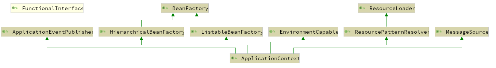

此时可以查看Spring的源码了，但是我们需要在源码的基础上面进行修改，开发，调试，添加注释等等
操作，所以需要将源码进行编译打包，下面就是将源码编译的过程。

## 编译源码

在构建完之后，根据import-into-idea.md文档查看编译步骤，文档里说有两个模块需要先编译

1.文档要求先编译spring-oxm下的compileTestjava，点击右上角gradle打开编译视图，找到spring-oxm模块，然后在Tasks-other下找到compileTestjava，双击即可！

控制台显示BUILD SUCCESSFUL就行

2.再编译spring-core模块，因为之后的spring-context依赖于core，方法同上。

3.都编译完成且成功之后，开始编译整个工程（这个过程非常耗时间，可能10-20分钟！）

​	打开顶层spring->build->build


## 源码测试

1、完成了上面的过程后，我们可以自己编写一个模块测试该**源码构建编译**过程是否真正成功完成！

在Spring中添加自己的module模块，同样选择gradle构建。名称为：spring-mytest

在自己的模块的build.gradle添加：

```groovy
dependencies {
    compile(project(":spring-context")) 
    compile(project(":spring-beans")) 
    compile(project(":spring-core")) 
    compile(project(":spring-aop"))
    testCompile group: 'junit', name: 'junit', version: '4.12'
}
```

再引入lombok

```
annotationProcessor 'org.projectlombok:lombok:1.18.16'
compileOnly 'org.projectlombok:lombok:1.18.16'
testAnnotationProcessor 'org.projectlombok:lombok:1.18.16'
testCompileOnly 'org.projectlombok:lombok:1.18.16'
```


## 问题

## 1、xxx找不到该类

比如：

Error:(354, 51) java: 找不到符号
符号: 变量 CoroutinesUtils
位置: 类 org.springframework.core.ReactiveAdapterRegistry.CoroutinesRegistrar

首先要确保前面构建完全没有报错的情况下。

看这个报错是哪个模块下的，找到这个模块的测试类目录，右键运行所有测试类，不管运行的结果如何，等一会全部运行完毕就行。

这是为了重新编译一下

然后在重新运行我们自己写的测试代码看看