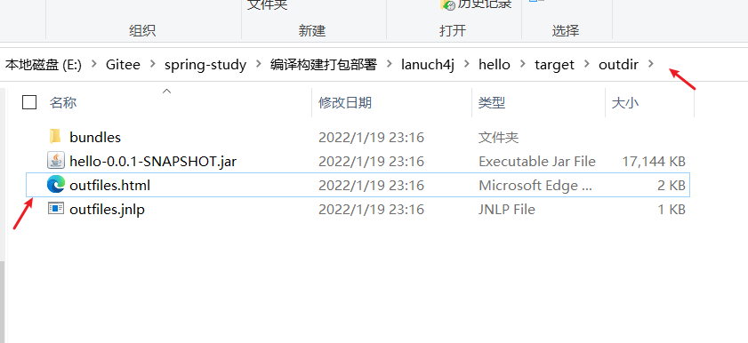

# javapackager

javapackager是JDK自带的打包命令

 -deploy  ：打包出可以独立运行的 exe （在windows平台上）,其实就是把jre打包进去


image: 直接解压好的带jre的

```
javapackager -deploy -native image -outdir outdir -outfile outfiles -srcfiles hello-0.0.1-SNAPSHOT.jar -appclass org.springframework.boot.loader.JarLauncher -name hello
```


exe ：打包成带jre的安装文件，默认安装位置：C:\Users\20522\AppData\Local\hello

```
javapackager -deploy -native exe -outdir outdir -outfile outfiles -srcfiles hello-0.0.1-SNAPSHOT.jar -appclass org.springframework.boot.loader.JarLauncher -name hello
```




## 命令帮助文档

```
用法: javapackager -command [-options]

其中 command 为以下项之一:
  -createjar
          打包程序根据其他参数生成 jar 档案。
  -deploy
          打包程序根据其他参数生成 jnlp 和 html
          文件。
  -createbss
          将 css 文件转换为二进制形式
  -signJar
          使用提供的证书为 jar 文件签名。
  -makeall
          将 compilation, createjar 和 deploy 步骤作为一个调用执行,
          在其中预定义大多数参数。源必须位于 "src"
          文件夹中, 生成的文件 (jar, jnlp, html) 将放入 "dist"
          文件夹中。此命令只能以最简单方式配置, 并且
          尽可能自动进行。

createjar 命令的选项包括:
  -appclass <application class>
          要执行的应用程序类的限定名称。
  -preloader <preloader class>
          要执行的预加载器类的限定名称。
  -paramfile <file>
          包含默认命名应用程序参数的属性文件。
  -argument arg
          JNLP 文件的 <fx:argument> 元素中要放入的未命名
          参数。
  -classpath <files>
          相关 jar 文件名列表。
  -manifestAttrs <manifest attributes>
          附加清单属性列表。语法: "name1=value1,
          name2=value2,name3=value3"。
  -noembedlauncher
          如果存在, 打包程序将不会向 jarfile 添加 JavaFX
          启动程序类。
  -nocss2bin
          在复制到 jar 之前, 打包程序不会将 CSS 文件转换为
          二进制形式。
  -runtimeversion <version>
          所需 JavaFX 运行时的版本。
  -outdir <dir>
          要将输出文件生成到的目录的名称。
  -outfile <filename>
          生成的文件的名称 (不带扩展名)。
  -srcdir <dir>
          待打包文件的基目录。
  -srcfiles <files>
          srcdir 中的文件的列表。如果省略, 将对 srcdir (在
          这种情况下是必需的参数) 中的所有文件进行打包。

deploy 命令的选项包括:
  -title <title>
          应用程序的标题。
  -vendor <vendor>
          应用程序的供应商。
  -description <description>
          应用程序的说明。
  -appclass <application class>
          要执行的应用程序类的限定名称。
  -preloader <preloader class>
          要执行的预加载器类的限定名称。
  -paramfile <file>
          包含默认命名应用程序参数的属性文件。
  -htmlparamfile <file>
          包含所生成小应用程序参数的属性文件。
  -width <width>
          应用程序的宽度。
  -height <height>
          应用程序的高度。
  -native <type>
          生成自包含的应用程序包 (如果可能)。
          如果指定了类型, 则只创建此类型的包。
          所支持类型的列表包括: installer, image, exe, msi, dmg, rpm 和 deb。
  -name <name>
          应用程序的名称。
  -embedjnlp
          如果存在, 会将 jnlp 文件嵌入 html 文档中。
  -embedCertificates
          如果存在, 会将证书嵌入 jnlp 文件中。
  -allpermissions
          如果存在, 应用程序将需要 jnlp 文件中的所有
          安全权限。
  -updatemode <updatemode>
          设置 jnlp 文件的更新模式。
  -isExtension
          如果存在, srcfile 将被视为扩展。
  -callbacks
          在生成的 HTML 中指定用户回调方法。格式为
          "name1:value1,name2:value2,..."
  -templateInFilename
          html 模板文件的名称。占位符格式为
          #XXXX.YYYY(APPID)#
  -templateOutFilename
          要将已填充的模板写入到的 html 文件的名称。
  -templateId
          用于模板处理的应用程序的应用程序 ID。
  -argument arg
          JNLP 文件的 <fx:argument> 元素中要放入的未命名
          参数。
  -outdir <dir>
          要将输出文件生成到的目录的名称。
  -outfile <filename>
          生成的文件的名称 (不带扩展名)。
  -srcdir <dir>
          待打包文件的基目录。
  -srcfiles <files>
          srcdir 中的文件的列表。如果省略, 将对 srcdir (在
          这种情况下是必需的参数) 中的所有文件进行打包。

createbss 命令的选项包括:
  -outdir <dir>
          要将输出文件生成到的目录的名称。
  -srcdir <dir>
          待打包文件的基目录。
  -srcfiles <files>
          srcdir 中的文件的列表。如果省略, 将对 srcdir (在
          这种情况下是必需的参数) 中的所有文件进行打包。

signJar 命令的选项包括:
  -keyStore <file>
          密钥库文件名。
  -alias
          密钥的别名。
  -storePass
          用于检查密钥库完整性或对密钥库取消锁定的口令。
  -keyPass
          用于恢复密钥的口令。
  -storeType
          密钥库类型, 默认值为 "jks"。
  -outdir <dir>
          要将输出文件生成到的目录的名称。
  -srcdir <dir>
          待签名文件的基目录。
  -srcfiles <files>
          srcdir 中的文件的列表。如果省略, 将对 srcdir (在
          这种情况下是必需的参数) 中的所有文件进行打包。

makeAll 命令的选项包括:
  -appclass <application class>
          要执行的应用程序类的限定名称。
  -preloader <preloader class>
          要执行的预加载器类的限定名称。
  -classpath <files>
          相关 jar 文件名列表。
  -name <name>
          应用程序的名称。
  -width <width>
          应用程序的宽度。
  -height <height>
          应用程序的高度。
  -v      启用详细输出。

示例用法:
--------------
javapackager -createjar -appclass package.ClassName
  -srcdir classes -outdir out -outfile outjar -v
          将类目录的内容打包到 outjar.jar,
          将应用程序类设置为 package.ClassName。
javapackager -deploy -outdir outdir -outfile outfile -width 34 -height 43
  -name AppName -appclass package.ClassName -v -srcdir compiled
          在由 package.ClassName 类启动且大小为 34x43 的
          应用程序 AppName 的 outdir 中生成
          outfile.jnlp 和对应的 outfile.html 文件。
javapackager -makeall -appclass brickbreaker.Main -name BrickBreaker
  -width 600 -height 600
          此命令执行包含编译在内的所有打包工作:
          compile, createjar 和 deploy。
```


