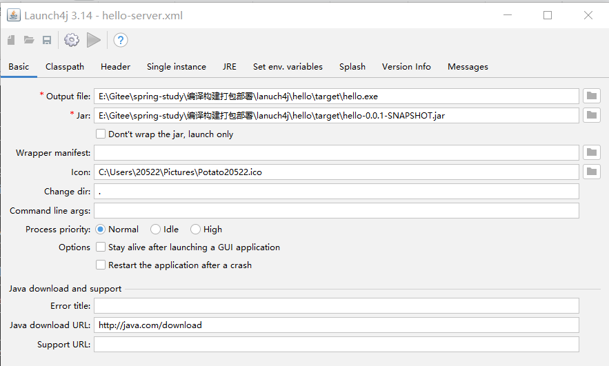
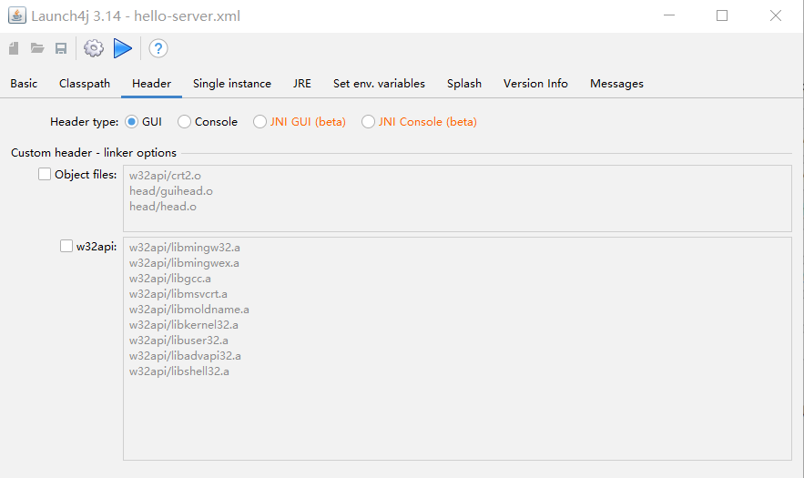
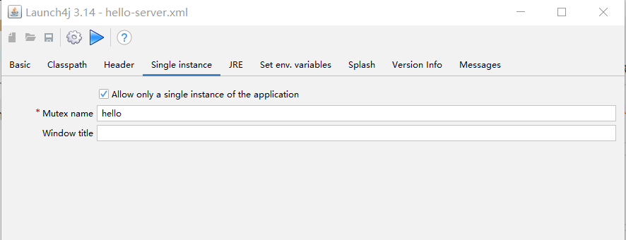
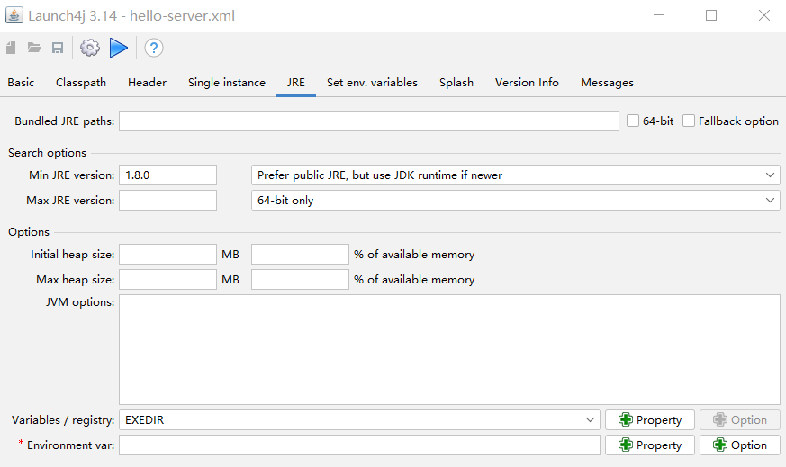
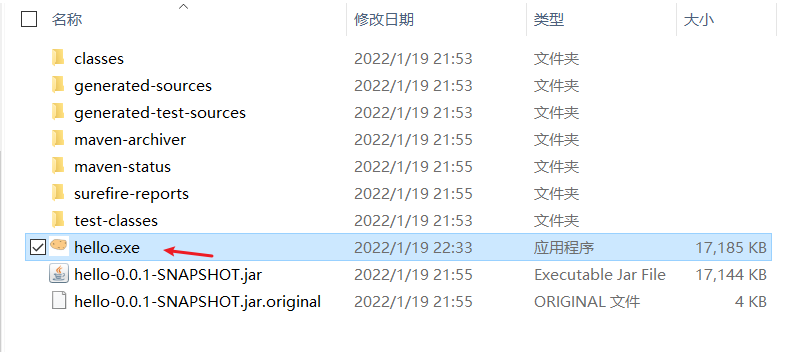
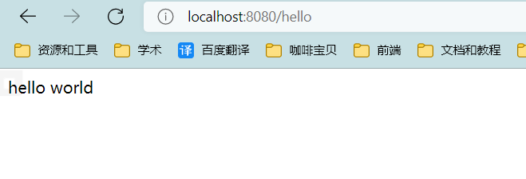

# Launch4j

可以将java程序转为exe程序，可以捆绑JRE

官网下载：http://launch4j.sourceforge.net/

## 基本使用

### 新建项目

新建SpringBoot项目,名字叫:hello，写一个Controller

```java
@RestController
public class HelloController {
    @GetMapping("hello")
    public String hello() {
        return "hello world";
    }
}
```

运行maven打包

### 配置launch4j



这里选gui而不是console，因为console会带cmd窗口，还不能关闭



设置程序不允许重复运行：（因为端口号会占用）



这里基本不用填，写个1.8就行：



其他的也不用写，默认就行。

**点击齿轮，进行exe打包**

### 结果



双击exe就行。

访问：



### 缺点

- 打包无法带上jre运行环境，需要我们自己手动复制jre到包里面，不方便
- 没有提供程序停止方式，只能在任务管理器里直接杀掉进程

### maven插件

launch4j-maven-plugin

百度上直接搜，配置挺繁琐的。
