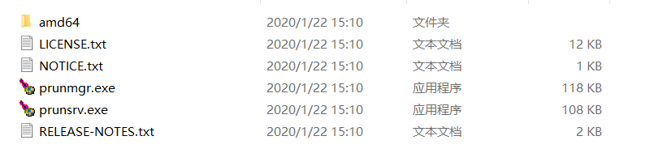

# procrun

apache commons daemon是用于给java应用制作守护进程的，可以将java应用注册为windows服务，tomcat就是用的这个。其实这个项目是就是从Tomcat 里分离出来的

在windows下，需要使用commons daemon下的procrun这个东西。

下载链接：https://downloads.apache.org/commons/daemon/binaries/windows/

教程：https://blog.csdn.net/qq_40585267/article/details/108507379

procrun文档：http://commons.apache.org/proper/commons-daemon/procrun.html

**commons-daemon-1.2.4-bin-windows.zip**   

压缩包不大，100多KB，解压后是这样：



- prunsrv.exe是待会用于注册服务用的，注意这里的prunsrv.exe是32位的，**64位的在amd64目录里**
- prunmgr.exe 是服务管理工具，在注册服务完成之后，可以运行这个，是一个gui界面

在linux下，使用jsvc就行，和procrun类似的，或者用docker

## 准备文件

准备如下文件，方便起见，放到同一个目录中

- prunsrv.exe(64位，从amd64目录中拷贝出来)
- prunmgr.exe

- 需要运行的Springboot JAR包：demo-0.0.1-SNAPSHOT.jar

prunmgr.exe 重命名为你的服务名，比如DemoService.exe

## 安装服务的脚本

新建 install.bat 和 uninstall.bat

install.bat

```bat
@echo off
 
rem 设置程序名称 （服务名）
set SERVICE_EN_NAME=DemoService
set SERVICE_CH_NAME=DemoService
 
rem 设置java路径,一般从环境变量读取,不用设置
::set JAVA_HOME=%C:\Program Files\Java\jdk1.8.0_162\bin%
 
rem 设置程序依赖及程序入口类
cd /d %~dp0
set BASEDIR=%CD%
set CLASSPATH=%BASEDIR%\demo-0.0.1-SNAPSHOT.jar
set MAIN_CLASS=org.springframework.boot.loader.JarLauncher
 
rem 设置prunsrv路径
set SRV=%BASEDIR%\prunsrv.exe

rem 设置日志路径及日志文件前缀
set LOGPATH=%BASEDIR%\ToolLogs
 
rem 输出信息
echo SERVICE_NAME: %SERVICE_EN_NAME%
echo JAVA_HOME: %JAVA_HOME%
echo MAIN_CLASS: %MAIN_CLASS%
echo prunsrv path: %SRV%
 
rem 设置jvm
if "%JVM%" == "" goto findJvm
if exist "%JVM%" goto foundJvm
:findJvm
set "JVM=%JAVA_HOME%\jre\bin\server\jvm.dll"
if exist "%JVM%" goto foundJvm
echo can not find jvm.dll automatically,
echo please use COMMAND to localation it
echo then install service

:foundJvm
echo Installing services...
rem 安装
"%SRV%" //IS//%SERVICE_EN_NAME% --DisplayName="%SERVICE_CH_NAME%" "--Classpath=%CLASSPATH%" "--Install=%SRV%" "--JavaHome=%JAVA_HOME%" "--Jvm=%JVM%" --Startup=auto --StartMode=java --StartClass=%MAIN_CLASS% --StartMethod=main --StopMode=java --StopClass=%MAIN_CLASS% --StopMethod=main --StopParams=  --LogPath=%LOGPATH% --StdOutput=auto --StdError=auto
echo Install service complete
```

有点繁琐，prunsrv有很多参数都有默认值，可以省略不写

```bat
prunsrv.exe //IS//%SERVICE_EN_NAME%
--DisplayName="%SERVICE_CH_NAME%" 默认是ServiceName，也就是%SERVICE_EN_NAME%
--Classpath=%CLASSPATH%
--Install=%SRV% 默认是procrun.exe //RS//ServiceName 我们不用写
--JavaHome=%JAVA_HOME% 默认JAVA_HOME，从环境变量里读取
--Jvm=%JVM% StartMode设置为java时，不需要指定,默认是auto
--Startup=auto 默认是manual，我们需要指定位auto
--StartMode=java 
--StartClass=%MAIN_CLASS% 
--StartMethod=main 默认是main
--StopMode=java 
--StopClass=%MAIN_CLASS% 一般的程序没提供stop方法，这个不指定
--StopMethod=main 默认是main 一般的程序没提供stop方法，这个不指定
--StopParams=  一般的程序没提供stop方法，这个不指定
--LogPath=%LOGPATH% 
--StdOutput=auto 
--StdError=auto
```

而且，//IS//%SERVICE_EN_NAME%这种写法很怪异，可以用 **install %SERVICE_EN_NAME%** 来代替

除了install，还有start、stop、update、delete等命令

最终，我们的安装服务命令简化为：

```bat
@echo off

rem 设置程序名称 （服务名）
set SERVICE_NAME=DemoService

rem 设置程序依赖及程序入口类
cd /d %~dp0
set BASEDIR=%CD%
set CLASSPATH=%BASEDIR%\demo-0.0.1-SNAPSHOT.jar
set MAIN_CLASS=org.springframework.boot.loader.JarLauncher
 
rem 设置prunsrv路径
set SRV=%BASEDIR%\prunsrv.exe

rem 设置日志路径及日志文件前缀
set LOGPATH=%BASEDIR%\ToolLogs

echo Installing services...
rem 安装
"%SRV%" //IS//%SERVICE_EN_NAME% ^
--Startup=auto ^
--StartMode=java ^
--StartClass=%MAIN_CLASS% ^
--LogPath=%LOGPATH% ^
--StdOutput=auto ^
--StdError=auto ^
echo Install service complete
```

