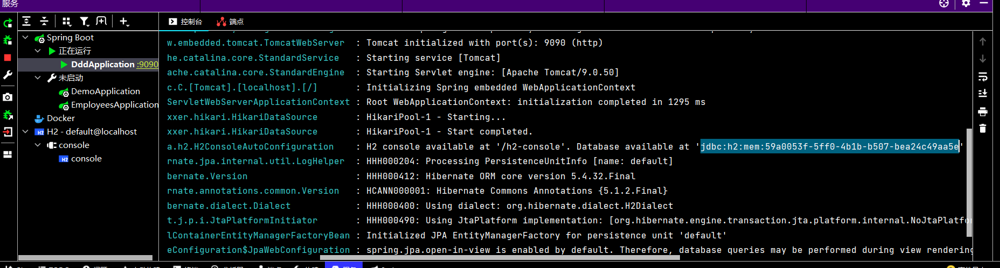
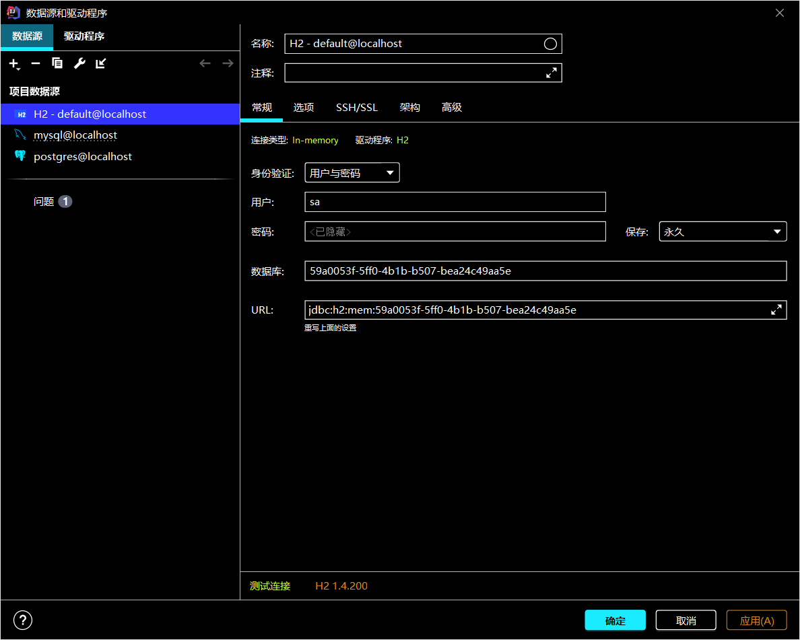
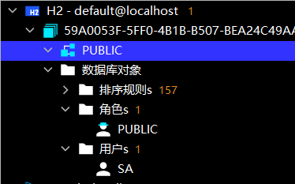
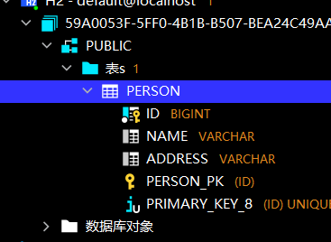
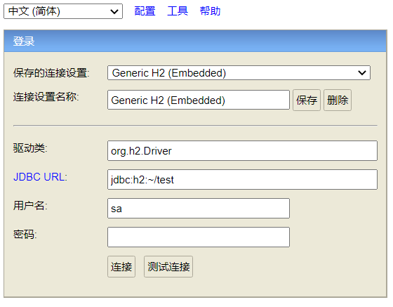

# H2

Springboot推荐的内存数据库

教程：[H2数据库攻略 - xuyatao - 博客园 (cnblogs.com)](https://www.cnblogs.com/xuyatao/p/7080095.html)

官网：http://www.h2database.com/

## 安装

不用安装，Springboot项目中直接加入依赖就行

```xml
<dependency>
    <groupId>com.h2database</groupId>
    <artifactId>h2</artifactId>
    <scope>runtime</scope>
</dependency>
```


## 默认情况

引入依赖后，啥也不设置，启动Springboot后，会看到这样的一条日志：



我们来尝试用IDEA侧边栏自带的数据库连接工具连接上去看看里面有啥。

默认情况下，**用户名为sa,不需要密码**

把日志里的那条jdbc信息复制过来：






创建一个表看看：



重启SpringBoot后，jdbc连接信息变了，之前的表都没了，因为h2是内存数据库

## 配置


可以配置用户名密码，以及连接信息,application.properties :

```properties
spring.datasource.url=jdbc:h2:mem:testdb
spring.datasource.driver-class-name=org.h2.Driver #默认，可以不用写
spring.datasource.username=sa #默认，可以不用写
spring.datasource.password=password #默认，可以不用写
spring.jpa.database-platform=org.hibernate.dialect.H2Dialect
```

还可以设置持久化到**文件**（推荐）：

```properties
spring.datasource.url=jdbc:h2:./user;AUTO_SERVER=TRUE
```

AUTO_SERVER=TRUE 表示启用**自动混合模式**

混合模式:本地连接或远程连接都可以连接

h2网页版客户端的配置：

```properties
spring.h2.console.path=/h2-console # 网页客户端的路径
spring.h2.console.settings.trace=false # 是否打印日志
spring.h2.console.settings.web-allow-others=false # 允许多用户连接
```

推荐连接：

```properties
spring.datasource.url=jdbc:h2:./user;AUTO_SERVER=TRUE;MODE=PostgreSQL;database_to_upper=false
```

database_to_upper=false ：禁用大写转换

## 客户端

可以开启h2的客户端界面：

```yaml
spring:
  h2:
    console:
      enabled: true # 默认是false
```

浏览器打开 http://localhost:8080/h2-consol  (端口号是Springboot的端口号)

是个jsp界面，挺丑的，可以设置中文



在这个界面里设置的内容，会在C:\Users\用户名\ 目录下生成.h2.server.properties文件进行保存

## 运行模式⭐

**1、在内存中运行**
数据库只在内存中运行，关闭连接后数据库将被清空，适合测试环境

连接字符串：

```
jdbc:h2:mem:DBName;DB_CLOSE_DELAY=-``1
```

如果不指定DBName，则以私有方式启动，只允许一个连接

**2、嵌入式**
数据库持久化存储为单个**文件**

连接字符串：

```
url: jdbc:h2:./DBName;AUTO_SERVER=TRUE

```

./DBName表示数据库文件的存储位置，如果第一次连接则会自动创建数据库


**3、服务模式**
H2支持三种服务模式：

- web server：此种运行方式支持使用浏览器访问H2 Console
- TCP server：支持客户端/服务器端的连接方式
- PG server：支持PostgreSQL客户端

启动tcp服务连接字符串示例：

```
jdbc:h2:tcp://localhost/~/test 使用用户主目录
jdbc:h2:tcp://localhost//data/test 使用绝对路径
```

**4、连接字符串参数**

- DB_CLOSE_DELAY：要求最后一个正在连接的连接断开后，不要关闭数据库
- MODE=MySQL：兼容模式，H2兼容多种数据库，该值可以为：DB2、Derby、HSQLDB、MSSQLServer、MySQL、Oracle、PostgreSQL
- AUTO_RECONNECT=TRUE：连接丢失后自动重新连接
- AUTO_SERVER=TRUE：启动自动混合模式，允许开启多个连接，该参数不支持在内存中运行模式
- TRACE_LEVEL_SYSTEM_OUT、TRACE_LEVEL_FILE：输出跟踪日志到控制台或文件， 取值0为OFF，1为ERROR（默认值），2为INFO，3为DEBUG
- SET TRACE_MAX_FILE_SIZE mb：设置跟踪日志文件的大小，默认为16M

**5、启动服务模式，打开H2 Console web页面**

启动服务，在命令行中执行

```
java -cp h2*.jar org.h2.tools.Server
```

执行如下命令，获取选项列表及默认值

```
java -cp h2*.jar org.h2.tools.Server -?
```

常见的选项如下：

- -web：启动支持H2 Console的服务
- -webPort \<port>：服务启动端口，默认为8082
- -browser：启动H2 Console web管理页面
- -tcp：使用TCP server模式启动
- -pg：使用PG server模式启动


## 兼容其他主流数据库语法

http://h2database.com/html/features.html#compatibility

H2默认支持的是 ANSI SQL标注语法

例子：

支持PostgreSQL

```
jdbc:h2:~/test;MODE=PostgreSQL;DATABASE_TO_LOWER=TRUE
```

支持mysql:

```
jdbc:h2:~/test;MODE=MySQL;DATABASE_TO_LOWER=TRUE;CASE_INSENSITIVE_IDENTIFIERS=TRUE
```

#  HSQLDB

HyperSQL Database

```xml
<dependency>
    <groupId>org.hsqldb</groupId>
    <artifactId>hsqldb</artifactId>
    <version>2.3.4</version>
</dependency>
```

连接配置：

```properties
driverClassName=org.hsqldb.jdbc.JDBCDriver
url=jdbc:hsqldb:mem:myDb
username=sa
password=sa
```

 Hibernate dialect:

```properties
hibernate.dialect=org.hibernate.dialect.HSQLDialect
```

# Derby

Apache Derby Database

```xml
<dependency>
    <groupId>org.apache.derby</groupId>
    <artifactId>derby</artifactId>
    <version>10.13.1.1</version>
</dependency>
```


```properties
driverClassName=org.apache.derby.jdbc.EmbeddedDriver
url=jdbc:derby:memory:myDb;create=true
username=sa
password=sa
hibernate.dialect=org.hibernate.dialect.DerbyDialect
```

# SQLite

```xml
<dependency>
    <groupId>org.xerial</groupId>
    <artifactId>sqlite-jdbc</artifactId>
    <version>3.16.1</version>
</dependency>
```


```properties
driverClassName=org.sqlite.JDBC
url=jdbc:sqlite:memory:myDb
username=sa
password=sa
```

Hibernate没有提供SQLite的数据库方言，需要我们自定义数据库方言